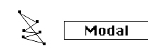

logseq-entity:: [[Logseq/Entity/Book/Section/Level 3]]
up:: [[Microfreak/06 Dig Osc/03 Types]]
prev:: [[Microfreak/06 Dig Osc/03 Types/11 Speech]]
next:: [[Microfreak/06 Dig Osc/03 Types/13 Noise]]
- # 06.03.12 Modal Resonator (Modal)
	- Modal Resonator Oscillator Model
		- 
	- **Description:** A modal resonator imitates how an object's shape amplifies some harmonics and dampens others when it vibrates. This lets it mimic instrument bodies such as woodwinds, strings, and drums. It needs an exciter signal to produce sound, as a real instrument needs a bow, drumstick, or breath. Its harmonic structure and the instrument shape it mimics can change as a knob turns or a Matrix source such as the LFO or Envelope modulates it.
	- The resonator also controls how quickly the sound fades. Its damping can change with a knob or a Matrix source.
	- **Inharm:** Sets inharmonicity, or material selection.
	- **Timbre:** Sets excitation brightness and dust density.
	- **Decay:** Sets damping and decay time, which controls energy absorption.
	- **Freaky idea:** The MicroFreak is paraphonic. Arpeggiate or sequence chords while modulating damping to selectively dampen steps in the sequence or arpeggio.
