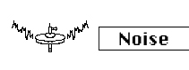

logseq-entity:: [[Logseq/Entity/Book/Section/Level 3]]
up:: [[Microfreak/06 Dig Osc/03 Types]]
prev:: [[Microfreak/06 Dig Osc/03 Types/12 Modal]]
next:: [[Microfreak/06 Dig Osc/03 Types/14 BASS]]
- # 06.03.13 Noise Oscillator (Noise)
	- Noise Oscillator Model
		- 
	- **Description:** This oscillator mixes a noise source with a sine, triangle, or sawtooth oscillator. Noise particles are tiny noise fragments that originate when noise is sampled down.
	- **Wave:** Selects the noise source, from particle noise through white noise to metallic noise. Turning the Wave knob clockwise morphs the resulting wave from particle noise to white noise to metallic noise.
	- **Timbre:** Applies sample-rate reduction to the noise and controls the pitch of square waves in metallic noise.
	- **Shape:** Crossfades from noise alone at 0%, through noise with sine at 33% and noise with triangle at 66%, to noise with square at 100%.
