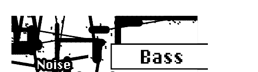

logseq-entity:: [[Logseq/Entity/Book/Section/Level 3]]
up:: [[Microfreak/06 Dig Osc/03 Types]]
prev:: [[Microfreak/06 Dig Osc/03 Types/13 Noise]]
next:: [[Microfreak/06 Dig Osc/03 Types/15 SAWX]]
- # 06.03.14 BASS Oscillator (Bass)
	- BASS Oscillator Model
		- 
	- **Description:** The BASS model is a quadrature oscillator with Sine and Cosine inputs. The Sine oscillator feeds a balanced modulator, and its output mixes with the modulated Cosine oscillator. Saturate, Fold, and Noise control the modulation model.
	- **Saturate:** Sets the saturation of the Cosine oscillator.
	- **Fold:** Applies a two-stage asymmetric fold that adds harmonics by folding parts of the wave that fall outside set boundaries back onto the wave. Don Buchla pioneered wavefolding in the early 1970s.
	- **Noise:** Sets the noise level. Noise phase-modulates the two oscillators in opposite phases and is added between the fold stages.
