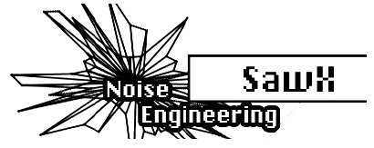

logseq-entity:: [[Logseq/Entity/Book/Section/Level 3]]
up:: [[Microfreak/06 Dig Osc/03 Types]]
prev:: [[Microfreak/06 Dig Osc/03 Types/14 BASS]]
next:: [[Microfreak/06 Dig Osc/03 Types/16 HARM]]
- # 06.03.15 SAWX Oscillator (Sawx)
	- SAWX Oscillator Model
		- 
	- **Description:** SAWX creates variations by manipulating a sawtooth wave. It extends the standard sawtooth's harmonic content by modulating its phase with subsampled white noise. Chorus then enhances the result by adding time-shifted copies of the sawtooth.
	- **Saw Mod:** Sets the gain of a modulus stage.
	- **Shape:** Sets the chorus amount.
	- **Noise:** Sets the amount of phase modulation from subsampled white noise.
