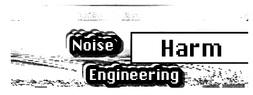

logseq-entity:: [[Logseq/Entity/Book/Section/Level 3]]
up:: [[Microfreak/06 Dig Osc/03 Types]]
prev:: [[Microfreak/06 Dig Osc/03 Types/15 SAWX]]
next:: [[Microfreak/06 Dig Osc/03 Types/17 WaveUser]]
- # 06.03.16 HARM Oscillator (Harm)
	- HARM Oscillator Model
		- 
	- **Description:** The HARM oscillator creates a waveform by adding harmonics or partials to a fundamental frequency.
	- **Spread:** Sets the relation between partials. At zero they are in unison; at maximum they are an octave apart. Intermediate positions interpolate linearly in frequency.
	- **Rectification:** Adjusts rectification of the individual partials, similar to a half fold.
	- **Noise:** Sets the amount of phase-modulated noise and the master clip level.
