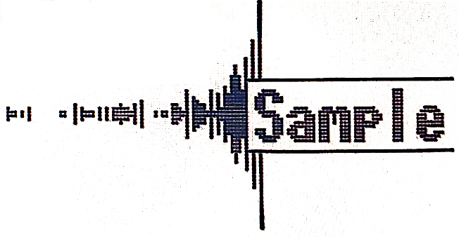
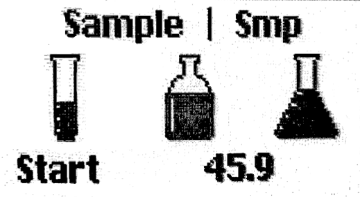

logseq-entity:: [[Logseq/Entity/Book/Section/Level 3]]
up:: [[Microfreak/06 Dig Osc/03 Types]]
prev:: [[Microfreak/06 Dig Osc/03 Types/17 WaveUser]]
- # 06.03.18 Sample
	- Sample Oscillator Model
		- 
	- **Description:** The Sample oscillator works like WaveUser, with user samples loaded through MIDI Control Center. The MicroFreak stores 128 samples, with up to 210 seconds of audio in total.
	- To browse samples, hold Shift and turn the Type knob. This opens the sample select menu for the unit's 128 slots; repeat the gesture to leave the menu.
	- > [[Note/Info]] When adjusting Sample parameters, `| Smp` at the top of the screen means the sample select menu is still open.
	- Sample display showing `| Smp` and the Start parameter
		- 
	- **Start:** The Wave knob sets the sample's starting point, from 0 at the beginning to 100 at the end.
	- **Length:** The Timbre knob sets sample length from -100 to 100. Negative values play the sample backward.
	- > [[Note/Info]] With Start at 100 and Length at -100, the sample plays backward from its end to its start.
	- **Loop:** After setting Start and End with Length, Loop crossfades between those positions. At 100, only a very short part at the end of the sample loops.
