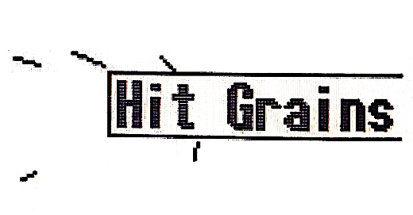

logseq-entity:: [[Logseq/Entity/Book/Section/Level 3]]
up:: [[Microfreak/06 Dig Osc/03 Types]]
prev:: [[Microfreak/06 Dig Osc/03 Types/20 Cloud Grains]]
next:: [[Microfreak/06 Dig Osc/03 Types/22 Vocoder]]
- # 06.03.21 Hit grains
	- Hit grains oscillator model
		- 
	- The Hit grains oscillator is a granular engine with a sharp volume envelope, designed for percussive patches.
	- **Start:** The Wave knob sets the grain start position.
	- **Density:** The Timbre knob sets how often a grain is generated.
	- **Shape:** The Shape knob sets grain size and envelope.
	- Sample browsing and parameter adjustment work like the [[Microfreak/06 Dig Osc/03 Types/18 Sample]].
