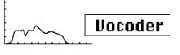

logseq-entity:: [[Logseq/Entity/Book/Section/Level 3]]
up:: [[Microfreak/06 Dig Osc/03 Types]]
prev:: [[Microfreak/06 Dig Osc/03 Types/21 Hit Grains]]
- # 06.03.22 Vocoder Oscillator (Vocoder)
	- Vocoder Oscillator Model
		- 
	- This oscillator acts as the Vocoder's carrier and provides waves rich in overtones. Select the waveform with the Wave encoder.
	- **Wave:** At 0%, it produces a sawtooth. Around 11%, it becomes a pulse wave with a 50% duty cycle. From there the pulse width increases clockwise until it reaches a 99% duty cycle at 90%. From 91% to 100%, it produces noise.
	- **Timbre:** Changes the frequency range used for analysis and resynthesis. Voice formants are frequency peaks; for example, a “U” often has peaks near 330 Hz and 1260 Hz, with variation across speakers and cultures. The synthesis filters recreate the input loudness contour in the selected range. Narrowing the range reduces the frequencies the Vocoder monitors, improving response time and frequency output.
	- **Shape:** Sets the bandwidth of the individual bandpass filters. Higher settings narrow the frequency response, emphasizing more pronounced harmonics.
	- > [[Note/Info]] Oscillator type cannot be modulated while the Vocoder oscillator is active.
