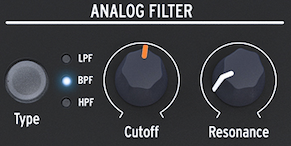

logseq-entity:: [[Logseq/Entity/Book/Section/Level 1]]
up:: [[Microfreak]]
prev:: [[Microfreak/06 Dig Osc]]
next:: [[Microfreak/08 LFO]]
- # 07 The Filter: sound in close-up
	- A filter emphasizes or suppresses harmonics in a sound, changing its timbre. It is traditionally paired with an oscillator; the MicroFreak's analog filter shapes the sound of its Digital Oscillator.
	- The Analogue Filter
		- 
	- Think of the Analog Filter as a searchlight moving over the oscillator's waveform, revealing its harmonic content. Its beam can be broad or focused; the focused width is called Q or resonance.
	- A sound contains sine-wave frequencies at different loudness levels. These frequencies often form families around a fundamental frequency, with related harmonics above it. The mix of odd and even harmonics largely determines a sound's character. A filter favors some frequencies and attenuates others.
	- {{embed [[Microfreak/07 Filter/01 Modifying Sound]]}}
	- {{embed [[Microfreak/07 Filter/02 Animating Sound]]}}
