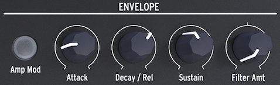

logseq-entity:: [[Logseq/Entity/Book/Section/Level 1]]
up:: [[Microfreak]]
prev:: [[Microfreak/08 LFO]]
- # 09 The Envelope Generator
	- The Envelope Generator is one of the MicroFreak's basic building blocks. It shapes a sound's overall loudness or timbre and can send modulation to any Matrix destination, including destinations you create.
	- The Envelope Generator
		- 
	- {{embed [[Microfreak/09 Envelope Gen/01 What an Envelope Does]]}}
	- {{embed [[Microfreak/09 Envelope Gen/02 Gates and Triggers]]}}
	- {{embed [[Microfreak/09 Envelope Gen/03 Envelope Stages]]}}
	- {{embed [[Microfreak/09 Envelope Gen/04 Filter Amount]]}}
	- {{embed [[Microfreak/09 Envelope Gen/05 Amp Mod Button]]}}
	- {{embed [[Microfreak/09 Envelope Gen/06 Cycling Envelope]]}}
	- {{embed [[Microfreak/09 Envelope Gen/07 Cycling Envelope Suggestions]]}}
