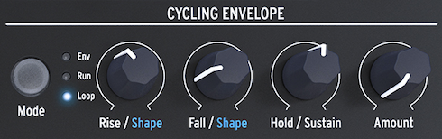

logseq-entity:: [[Logseq/Entity/Book/Section/Level 2]]
up:: [[Microfreak/09 Envelope Gen]]
prev:: [[Microfreak/09 Envelope Gen/05 Amp Mod Button]]
next:: [[Microfreak/09 Envelope Gen/07 Cycling Envelope Suggestions]]
- # 09.6 The Cycling Envelope Generator
	- Unlike a standard envelope that runs through its stages once, the Cycling Envelope can retrigger itself after its final stage. It can act as a complex LFO, producing wave shapes that a standard LFO cannot.
	- You can change the shapes of the Rise and Fall stages. The Rise, Fall, and Hold levels can be modulated, so the shape can change in real time.
	- The Cycling Envelope Generator
		- 
	- {{embed [[Microfreak/09 Envelope Gen/06 Cycling Envelope/01 Cycling Envelope Stages]]}}
	- {{embed [[Microfreak/09 Envelope Gen/06 Cycling Envelope/02 Changing Shapes]]}}
	- {{embed [[Microfreak/09 Envelope Gen/06 Cycling Envelope/03 Legato Options]]}}
