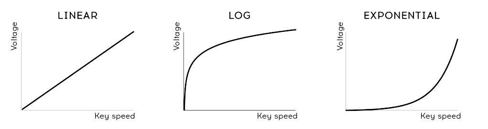

logseq-entity:: [[Logseq/Entity/Book/Section/Level 3]]
up:: [[Microfreak/09 Envelope Gen/06 Cycling Envelope]]
prev:: [[Microfreak/09 Envelope Gen/06 Cycling Envelope/01 Cycling Envelope Stages]]
next:: [[Microfreak/09 Envelope Gen/06 Cycling Envelope/03 Legato Options]]
- # 09.6.2 About Changing Shapes
	- Hold Shift and turn Rise or Fall to change that stage's shape. Turn left for a logarithmic curve, right for an exponential curve, or use the middle dead zone for a linear curve. The display shows “LINEAR” in that zone.
	- Velocity curves
		- 
	- A logarithmic curve rises quickly and slows near its endpoint. An exponential curve rises slowly, then speeds up. A linear curve changes at a steady rate.
	- An exponential Rise with a logarithmic Fall can make the envelope feel sluggish. A logarithmic Rise with an exponential Fall can make it start more sharply and end more reluctantly.
