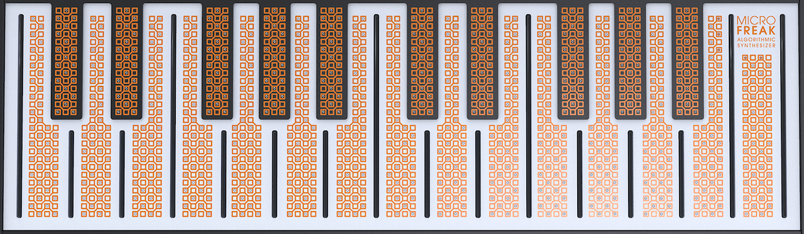
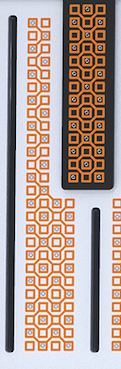

logseq-entity:: [[Logseq/Entity/Book/Section/Level 1]]
up:: [[Microfreak]]
prev:: [[Microfreak/09 Envelope Gen]]
- # 10 The Keyboard Section
	- One of the first capacitive keyboards appeared on the EMS Synthi AKS. In 1972, Don Buchla introduced the Buchla Easel, whose touch-sensitive keys did not move and could produce accurate pressure and voltage-controlled portamento. The capacitive keyboard became a hallmark of the Easel, though few people could afford one. Decades later, the Arturia MicroFreak brought the capacitive keyboard back.
	- The MicroFreak has 25 capacitive keys. Hundreds of copper-colored dots on the surface register touch as either aftertouch or velocity, according to the Utility setting at Preset → Press.
	- The Touch Capacitive Keyboard
		- 
	- A Key in Close-Up
		- 
	- A capacitive keyboard makes the player part of its electrical circuit. Changing how much skin touches a key changes its resistance and the pressure signal it sends. Finger contact alone can reach about 30% of the pressure range; pressing more of the finger onto the key can reach 100%. This touch response helps make the MicroFreak a performance instrument.
	- > [[Note/Info]] Very dry skin can make the keyboard respond poorly. Moisturizer or staying hydrated may help. Never put liquid on the MicroFreak.
	- The keyboard sends gate, pitch, and pressure signals. The Matrix can route these signals to any destination in its top row, and the outputs are also available on the back of the MicroFreak for modular gear or another synthesizer with voltage inputs.
	- **Tip:** Clean the keyboard occasionally with a soft, damp cloth. Avoid abrasives that could damage its surface. A dirty keyboard may produce unexpected musical results.
	- {{embed [[Microfreak/10 Keyboard/01 Gates and Triggers]]}}
	- {{embed [[Microfreak/10 Keyboard/02 Keyboard Responsiveness]]}}
	- {{embed [[Microfreak/10 Keyboard/03 Glide]]}}
	- {{embed [[Microfreak/10 Keyboard/04 Octave Buttons]]}}
	- {{embed [[Microfreak/10 Keyboard/05 LFO Speed Tutorial]]}}
