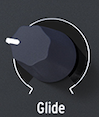

logseq-entity:: [[Logseq/Entity/Book/Section/Level 2]]
up:: [[Microfreak/10 Keyboard]]
prev:: [[Microfreak/10 Keyboard/02 Keyboard Responsiveness]]
next:: [[Microfreak/10 Keyboard/04 Octave Buttons]]
- # 10.3 Glide
	- The Glide knob controls how quickly pitch moves between notes. It smooths the abrupt pitch change from one key to another, with a time from off to about 10 seconds.
	- The Glide Knob
		- 
	- Glide appears in musical styles around the world. Indian vocal phrases and sitar string bends use it; in Western music, this kind of phrasing is called melisma.
	- > [[Note/Info]] Utility settings can make the Glide knob use a fixed time, a beat-synced value, or a rate tied to the Arp/Seq rate.
	- In Time mode, glide ranges from zero to 10 seconds. Synced mode offers 1/32T, 1/32, 1/16T, 1/16, 1/8T, 1/8, 1/4T, 1/4, 1/2T, 1/2, and 1/1. In Rate mode, the time to glide within an octave ranges from immediate at 0 ms to more gradual at 10 ms.
	- Pressure can modulate Glide: set Glide as a Matrix destination and Pressure as the source, then adjust the Matrix attenuator. Different LFO waveforms produce different glide intensity and slope. With LFO Sync on, each note gets a different glide shape; changing the LFO rate changes the synchronized rate and the glide speed.
	- **Tip:** The Sequencer's modulation tracks can also control Glide:
		- 1. Turn on the Sequencer with Shift + Arp | Seq.
		- 2. Select sequencer A or B.
		- 3. Press Record and step-record a melody. Recording stops automatically at the end of the sequence.
		- 4. Press Record again, then move the Glide knob where you want a glide effect in the sequence.
