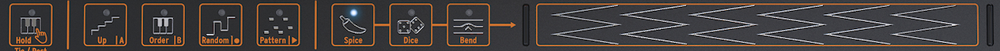

logseq-entity:: [[Logseq/Entity/Book/Section/Level 1]]
up:: [[Microfreak]]
prev:: [[Microfreak/10 Keyboard]]
next:: [[Microfreak/12 Arpeggiator]]
- # 11 Using the Icon Strip
	- Just above the keyboard, the Icon Strip has function icons and a touch strip.
	- The Icon Strip
		- 
	- The function icons on the left control the Arpeggiator and Sequencer. Their full functions are covered in their own chapters. This chapter covers the Hold button, the Spice, Dice, and Bend icons, and ways to use the touch strip to shape a performance.
	- {{embed [[Microfreak/11 Icon Strip/01 Key Hold Button]]}}
	- {{embed [[Microfreak/11 Icon Strip/02 Sequencer and Arpeggiator]]}}
	- {{embed [[Microfreak/11 Icon Strip/03 Touch Strip]]}}
