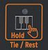

logseq-entity:: [[Logseq/Entity/Book/Section/Level 2]]
up:: [[Microfreak/11 Icon Strip]]
next:: [[Microfreak/11 Icon Strip/02 Sequencer and Arpeggiator]]
- # 11.1 The Key Hold Button
	- Key Hold locks a key or chord so both hands are free to adjust the MicroFreak's controls.
	- > [[Note/Info]] The HOLD state is not saved with the preset.
	- The Hold Icon
		- 
	- Pressing Hold once keeps the held keys active after the fingers lift. In paraphonic mode, playing additional notes adds them to the current chord.
	- In Arp mode, Hold keeps the arpeggiated notes playing after keys are released. Turning off Arp or Hold ends them. Playing new keys replaces the notes currently playing.
	- > [[Note/Info]] Hold does not work with external MIDI. To hold external MIDI notes, send the MicroFreak a Sustain message.
	- In Sequencer mode, the Hold Icon has alternate functions.
	- The alternative functions of the Hold Icon
		- 
	- In Step-record mode, Hold adds a tie or silence.
	- In Real-time recording mode, Hold clears the content as the sequence records.
	- With Seq Mod, Hold clears sequence modulation; with A or B, it clears the selected sequence.
	- When the Sequencer is disabled, Hold returns to its usual Key Hold function.
	- > [[Note/Info]] Key Hold can help create a generative, self-evolving patch. Modulating pitch with independent rates from sources such as the LFO and Cycling Envelope makes the pitch change continuously without a sequencer.
