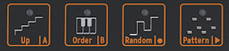

logseq-entity:: [[Logseq/Entity/Book/Section/Level 2]]
up:: [[Microfreak/11 Icon Strip]]
prev:: [[Microfreak/11 Icon Strip/01 Key Hold Button]]
next:: [[Microfreak/11 Icon Strip/03 Touch Strip]]
- # 11.2 Sequencer and Arpeggiator
	- Four buttons beside Hold control the Arpeggiator and Sequencer: Up | A, Order | B, Random | 0, and Pattern | >.
	- Arpeggio and Sequencer control icons
		- 
	- These buttons have extensive functions. Their dedicated chapters cover the Arpeggiator and Sequencer in detail.
