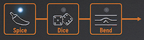

logseq-entity:: [[Logseq/Entity/Book/Section/Level 2]]
up:: [[Microfreak/11 Icon Strip]]
prev:: [[Microfreak/11 Icon Strip/02 Sequencer and Arpeggiator]]
- # 11.3 The Touch Strip
	- The touch strip has three functions. Select Spice, Dice, or Bend by pressing its corresponding icon.
	- Spice and Dice and Bend
		- 
	- {{embed [[Microfreak/11 Icon Strip/03 Touch Strip/01 Spice and Dice]]}}
	- {{embed [[Microfreak/11 Icon Strip/03 Touch Strip/02 Bend]]}}
