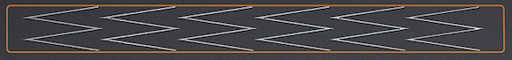

logseq-entity:: [[Logseq/Entity/Book/Section/Level 3]]
up:: [[Microfreak/11 Icon Strip/03 Touch Strip]]
prev:: [[Microfreak/11 Icon Strip/03 Touch Strip/01 Spice and Dice]]
- # 11.3.2 Bend
	- Pitch bending raises or lowers a note. Press the Bend icon to enable bending.
	- The Bend Strip
		- 
	- The center is neutral. Moving left lowers the pitch; moving right raises it. Touching another point jumps directly to that pitch.
	- In standard mode, pitch follows the strip's absolute position. In relative mode, finger movement is added to or subtracted from the current pitch, regardless of where the finger first touches. Enable relative mode at Utility > Misc > Relative bend.
	- > [[Note/Info]] Six W-shaped marks on the strip help guide accurate bends.
	- The default bend range is 24 chromatic steps: 12 to either side of center. Utility > Preset > Bend range sets the range, up to 48 steps (four octaves).
	- Tapping between two points can alternate pitches quickly. When the finger lifts, pitch returns to the center. Moving a finger slightly on the strip also creates vibrato.
	- > [[Note/Info]] Indian music and instruments such as the sarod and sitar offer examples of expressive pitch-bending traditions beyond Western music.
