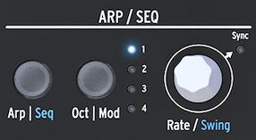

logseq-entity:: [[Logseq/Entity/Book/Section/Level 1]]
up:: [[Microfreak]]
prev:: [[Microfreak/11 Icon Strip]]
- # 12 The Arpeggiator
	- An arpeggiator breaks a chord into individual notes and plays them one by one.
	- Press **Arp | Seq** to activate the Arpeggiator; the button lights white in Arpeggio mode. Press it again to turn the Arpeggiator off.
	- A useful starting point is to press **Hold**, play a chord, then activate the Arpeggiator. It will play the held chord while you adjust the sound.
	- The four icons above the keyboard select how the notes are played:
		- **Up** plays notes from low to high, regardless of the order in which the keys were pressed.
		- **Order** plays the notes in the order the keys were pressed.
		- **Random** plays the notes in a random order.
		- **Pattern** generates a semi-random pattern from legato key presses.
	- The Arpeggiator
		- 
	- Arpeggiator pattern icons
		- 
	- {{embed [[Microfreak/12 Arpeggiator/01 Using Patterns]]}}
	- {{embed [[Microfreak/12 Arpeggiator/02 Gates and Triggers]]}}
	- {{embed [[Microfreak/12 Arpeggiator/03 Arpeggio Rate]]}}
	- {{embed [[Microfreak/12 Arpeggiator/04 Making it Swing]]}}
	- {{embed [[Microfreak/12 Arpeggiator/05 Arpeggio Range]]}}
	- {{embed [[Microfreak/12 Arpeggiator/06 Transfer to Seq]]}}
	- {{embed [[Microfreak/12 Arpeggiator/07 Arp Fun]]}}
