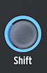

logseq-entity:: [[Logseq/Entity/Book/Section/Level 1]]
up:: [[Microfreak]]
- # 13. The Sequencer
	- The MicroFreak sequencer records and plays up to four notes at once in paraphonic mode. It captures pitch, velocity, and note duration, along with movements of up to four controls in modulation tracks.
	- It holds two patterns, A and B, which you can alternate during playback. Set their shared length from 4 to 64 steps in Utility > Preset > Seq Length. The same length applies to both patterns and their modulation tracks.
	- The Arpeggio and Sequencer Section
		- 
	- Hold Shift and press Arp | Seq to activate the sequencer.
	- The Shift Button
		- 
	- Record one step at a time to adjust each step's notes, velocity, and modulation, or record in real time. When routed through the modulation matrix, sequence steps can also provide pitch and velocity as modulation sources.
	- {{embed [[Microfreak/13 Sequencer/01 Use]]}}
