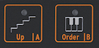
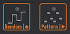

logseq-entity:: [[Logseq/Entity/Book/Section/Level 2]]
up:: [[Microfreak/13 Sequencer]]
- # 13.1. Using the Sequencer
	- The icon strip changes function with Arp | Seq. In arpeggiator mode, its icons control Hold, Order, Random, and Pattern. After Shift + Seq activates the sequencer, they control Tie/Rest, pattern A, pattern B, Record/Stop, and Play/Stop.
	- The Sequencer Controls
		- 
	- The Sequencer Controls: Stop and Start
		- 
	- The Tie/Rest Icon
		- 
	- **Tie/Rest:** During step recording, extend a note across steps or enter silence.
	- **A and B:** Select the pattern.
	- **Record (O):** Start step recording while playback is stopped. During playback, press Record to start real-time recording.
	- **Play (>):** Start or stop playback; also ends step recording.
	- > [[Note/Info]] During playback, the MicroFreak sends MIDI and analog clock signals. Starting or stopping playback also sends MIDI start or stop messages to external sequencers.
	- A preset can contain monophonic or paraphonic patterns. In paraphonic mode, the sequencer can play up to four voices; with Paraphony off, it plays only the lowest note of each step.
	- Keyboard notes take priority over sequence notes. If you hold two keys in four-voice paraphonic mode, two voices remain for the sequence, which plays its lowest two notes. Incoming MIDI notes have the same priority as keyboard notes; sequence notes have the lowest priority.
	- > [[Note/Info]] The pitch CV output sends the lowest note in a sequence step. During keyboard playing, it sends the most recently played note.
	- MIDI sends all notes in a played chord, including velocity and aftertouch, even when the chord has more than four notes.
	- {{embed [[Microfreak/13 Sequencer/01 Use/01 Select & Play]]}}
	- {{embed [[Microfreak/13 Sequencer/01 Use/02 Keyboard]]}}
	- {{embed [[Microfreak/13 Sequencer/01 Use/03 Record]]}}
