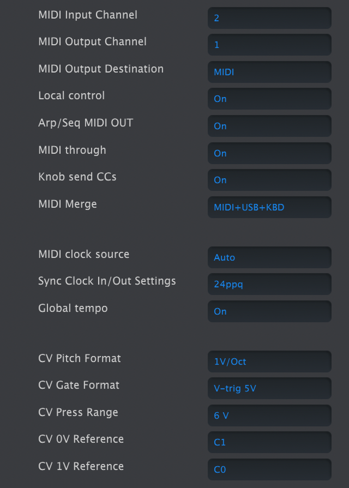
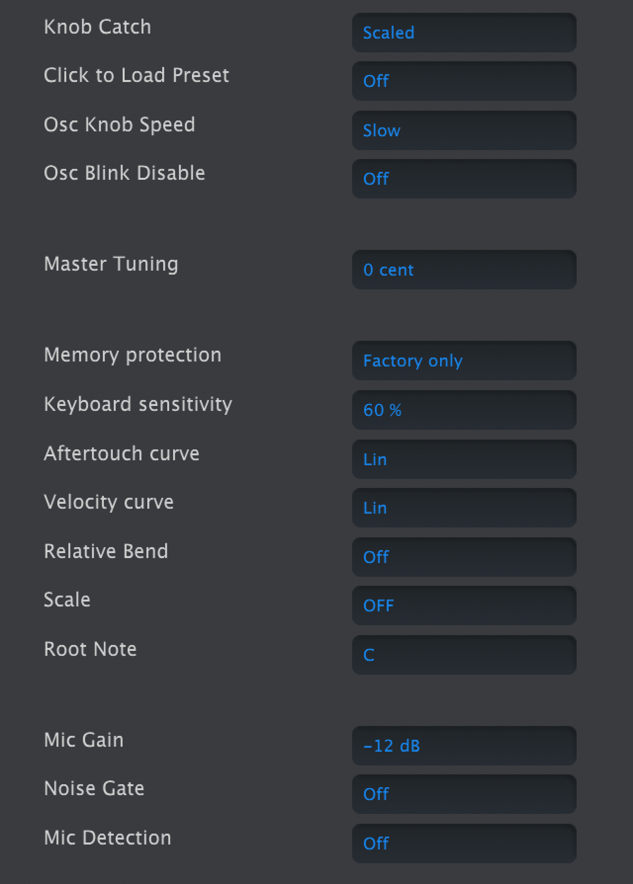

logseq-entity:: [[Logseq/Entity/Book/Section/Level 3]]
up:: [[Microfreak/14 Config/02 MIDI Control Center]]
next:: [[Microfreak/14 Config/02 MIDI Control Center/02 Wavetables Tab]]
- # 14.2.1 Device Tab
	- The Device tab contains MIDI and configuration settings for the MicroFreak.
	- Left column of MicroFreak Device Tab in MIDI Control Center
		- 
	- ## MIDI
		- **MIDI Input Channel**: All, 1–16, or None. Sets the receive channel on the MicroFreak's 16-channel MIDI port.
		- **MIDI Output Channel**: 1–16. Sets the transmit channel.
		- **MIDI Output Destination**: Off, USB, MIDI, or MIDI + USB. USB connects directly to a computer; MIDI cables can run over longer distances.
		- **Local control**: With Local Off, the keyboard and panel controls send MIDI but do not directly play the MicroFreak. In a DAW, this lets the selected track route MIDI back to the MicroFreak or to another instrument. The MicroFreak can also play recorded MIDI while its keyboard controls another instrument.
		- **Arp/Seq MIDI out**: On or Off. Sends arpeggiator and sequencer notes to another instrument or a DAW.
		- **MIDI through**: When On, incoming MIDI echoes to MIDI Out.
		- **Knob sends CCs**: On or Off. Sends knob control-change data to external synths.
		- **MIDI Merge**: USB+KBD, MIDI+KBD, or BOTH+KBD. Chooses how keyboard data merges into the MIDI stream.
	- ## Clock and sync
		- **MIDI clock source**: USB, MIDI, or Sync. USB is the built-in computer connection; MIDI uses the 5-pin DIN input.
		- **Sync Clock In/Out settings**: One Step, 2 PPQ, 24 PPQ, or 48 PPQ. The Sync port can connect to older, pre-MIDI devices such as Korg and Roland drum machines.
		- **Global Tempo**: When On, preset tempos are ignored and the most recently set tempo remains in use.
	- ## CV and gate
		- **CV pitch format**: 1 V/oct, Hz/V, or 1.2 V/oct. Sets the pitch CV output format; 1 V/oct is used by Eurorack, and 1.2 V/oct by Buchla.
		- **CV Gate format**: S-Trig, V-Trig 5 V, or V-Trig 12 V. Sets the Gate output format.
		- **CV Press range**: 1–10 V. Sets the Pressure output voltage range.
		- **CV 0 V reference**: C−1 to G8. Sets the note that outputs zero volts in volts-per-octave pitch formats.
		- **CV 1 V reference**: C−1 to G8. Sets the note that outputs one volt in Hz/V pitch format.
	- Right column of MicroFreak Device Tab in MIDI Control Center
		- 
	- ## Controls and browsing
		- **Knob Catch** sets how a knob's physical position meets its stored value when sending MIDI:
			- **Jump** sends the physical position as soon as the knob moves, possibly changing the value abruptly.
			- **Hook** waits until the knob passes the stored value before sending changes.
			- **Scaled** moves the stored value up or down with the knob, regardless of its position. This is the default. At a physical limit, the knob must turn back before it can continue changing the value in the desired direction.
		- **Click to Load Preset**: On requires an extra click to load a selected preset; Off loads it while scrolling.
		- **Osc Knob Speed**: Slow allows fine edits to Wave, Timbre, and Shape; Fast suits broad sweeps in performance.
		- **Oct LED Blink**: When Off, active octave-shift buttons glow steadily rather than blinking.
		- **Master Tuning**: Sets tuning deviation in cents.
		- **Memory protection**: Off allows all presets to be overwritten; Factory Only protects factory presets; All protects user presets too.
	- ## Keyboard response
		- **Keyboard sensitivity**: 10–100%. Sets the response of Pressure and Velocity.
		- **Aftertouch curve**: Linear, Logarithmic, or Exponential. Adjusts how aftertouch responds to playing force.
		- **Velocity curve**: Adjusts the keyboard's response to playing force:
			- **Linear** (default) has an even response across the dynamic range.
			- **Logarithmic** reaches louder notes with less force, but makes low-level dynamics harder to control.
			- **Exponential** gives finer control at low levels, but needs more force for high levels.
		- Velocity curve settings
			- 
		- **Relative Bend**: When Off, the bend strip's physical center is zero bend. When On, the first point of contact becomes zero, allowing a wider gesture such as a dive bomb.
	- ## Scale and microphone
		- **Scale**: Off plays the chromatic scale. Selecting a scale prevents notes outside it; see [[Microfreak/15 Using Scales]].
		- **Root Note**: Sets the key for the selected scale.
		- **Mic Gain**, **Noise Gate**, and **Mic Detection** control the 3.5 mm TRRS input used with the Vocoder Oscillator. They match the Utility settings for Vocoder configuration.
