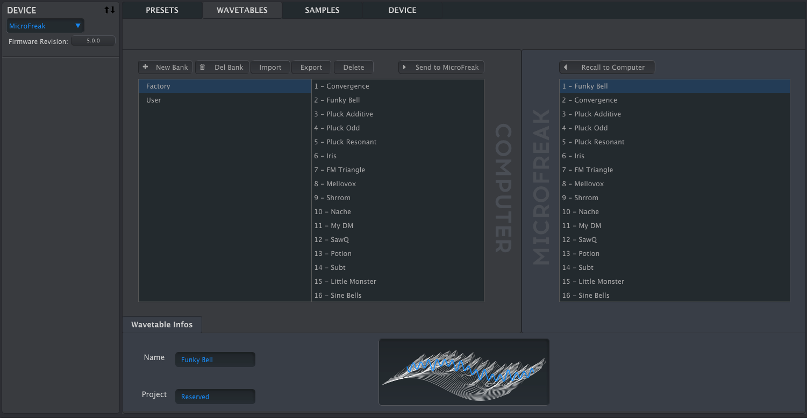

logseq-entity:: [[Logseq/Entity/Book/Section/Level 3]]
up:: [[Microfreak/14 Config/02 MIDI Control Center]]
prev:: [[Microfreak/14 Config/02 MIDI Control Center/01 Device Tab]]
next:: [[Microfreak/14 Config/02 MIDI Control Center/03 Samples Tab]]
- # 14.2.2 Wavetables Tab
	- The Wavetables tab appears when MCC detects a connected MicroFreak. It loads custom wavetables for the User Wavetable oscillator type; it does not change other oscillator types, including the factory Wavetable Oscillator.
	- Tab for loading user Wavetables
		- 
	- The left pane shows banks and wavetables on the computer; the right pane shows wavetables in the MicroFreak.
	- Below them, the information area shows the selected Bank and Wavetable names and a 3D animation of the wavetable. Click either name field to rename it.
	- > [[Note/Info]] Bank and Wavetable names can be at most 21 characters long.
	- {{embed [[Microfreak/14 Config/02 MIDI Control Center/02 Wavetables Tab/01 Management]]}}
	- {{embed [[Microfreak/14 Config/02 MIDI Control Center/02 Wavetables Tab/02 Dragging]]}}
