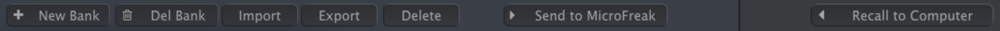
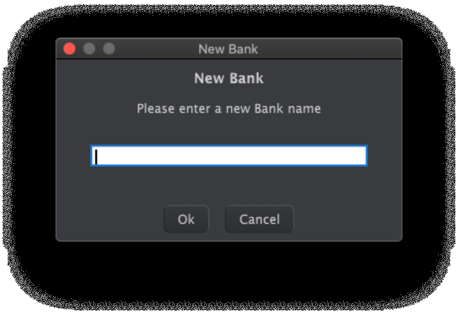
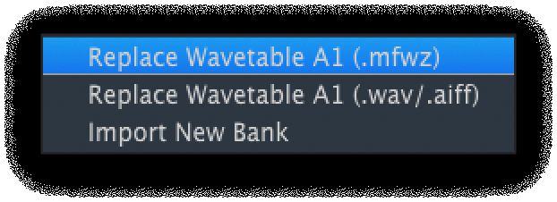

logseq-entity:: [[Logseq/Entity/Book/Section/Level 4]]
up:: [[Microfreak/14 Config/02 MIDI Control Center/02 Wavetables Tab]]
- # 14.2.2.1 Wavetable Management
	- The buttons above the computer and MicroFreak panes move and manage wavetables.
	- Wavetable management buttons
		- 
	- **New Bank** creates an empty bank on the computer and prompts for its name. Drag a wavetable over the new bank's name to add it; banks can combine wavetables from other banks.
	- New Bank name prompt
		- 
	- **Del Bank** deletes a bank after confirmation. Factory banks cannot be deleted.
	- **Import** opens three choices:
		- **Replace Wavetable (.mfw)** replaces the selected wavetable with a MicroFreak Wavetable file.
		- **Replace Wavetable (.wav/.aiff)** replaces it with a WAV or AIFF audio file.
		- **Import New Bank** imports an MFWB bank into the computer pane.
	- Import choices
		- 
	- When importing WAV or AIFF audio, MicroFreak converts it into an MFW wavetable of 32 cycles, each 2,048 samples long:
		- Each group of 2,048 source samples counts as a cycle.
		- The source's first and last cycles become cycles 1 and 32.
		- With more than eight source cycles, MicroFreak distributes them evenly across the wavetable and crossfades between them.
		- With fewer than eight source cycles, it spreads them across the slots so the Wave knob can reach every cycle.
	- An audio file can therefore become a usable wavetable without manually preparing each cycle.
	- **Export** saves a selected wavetable as MFW or a selected bank as MFWB.
