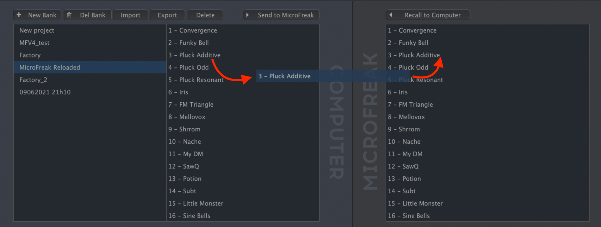

logseq-entity:: [[Logseq/Entity/Book/Section/Level 4]]
up:: [[Microfreak/14 Config/02 MIDI Control Center/02 Wavetables Tab]]
prev:: [[Microfreak/14 Config/02 MIDI Control Center/02 Wavetables Tab/01 Management]]
- # 14.2.2.2 More on Dragging and Dropping
	- Drag individual wavetables between the computer and MicroFreak in either direction. Shift-click or Command-click to select several before dragging.
	- A destination slot highlights blue when you hover over it. Releasing the wavetable there overwrites that slot.
	- Dragging a wavetable between computer and MicroFreak
		- 
	- Drag a wavetable within either pane to change its order. In the computer pane, drag a wavetable name over another bank's name to move it into that bank.
	- WAV and AIFF files can also be dragged from a file browser into either pane. Select several files with Shift-click or Command-click before dragging them together.
