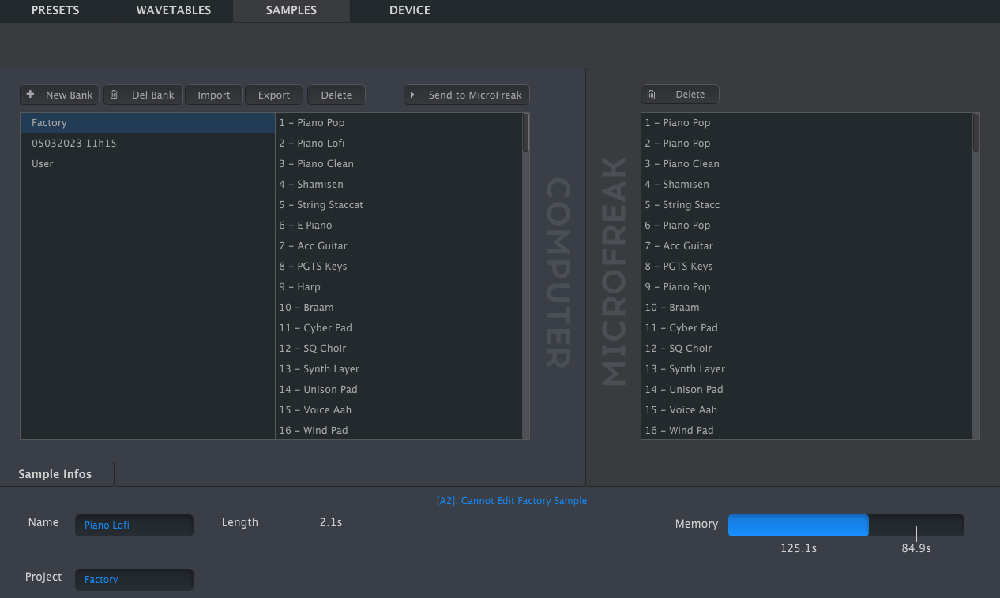
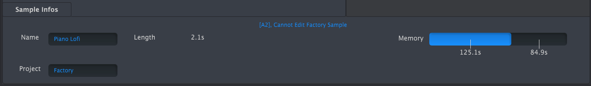

logseq-entity:: [[Logseq/Entity/Book/Section/Level 3]]
up:: [[Microfreak/14 Config/02 MIDI Control Center]]
prev:: [[Microfreak/14 Config/02 MIDI Control Center/02 Wavetables Tab]]
- # 14.2.3 Samples Tab
	- The Samples tab appears when MIDI Control Center detects a connected MicroFreak with current firmware. It loads user samples for the Sample oscillator and the Scan Grains, Cloud Grains, and Hit Grains oscillator types.
	- Tab for loading user samples
		- 
	- The left pane shows banks and samples on the computer; the right pane shows samples in the MicroFreak.
	- The information area shows the selected bank and sample names, sample length, total sample memory used, and remaining memory, with times displayed in seconds. Click a name field to rename the bank or sample.
	- Sample information area
		- 
	- > [[Note/Info]] Bank and sample names can be at most 21 characters long.
	- {{embed [[Microfreak/14 Config/02 MIDI Control Center/03 Samples Tab/01 Management]]}}
	- {{embed [[Microfreak/14 Config/02 MIDI Control Center/03 Samples Tab/02 Dragging]]}}
	- {{embed [[Microfreak/14 Config/02 MIDI Control Center/03 Samples Tab/03 Deleting]]}}
