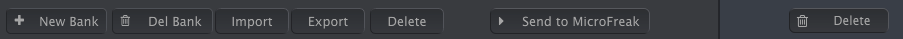
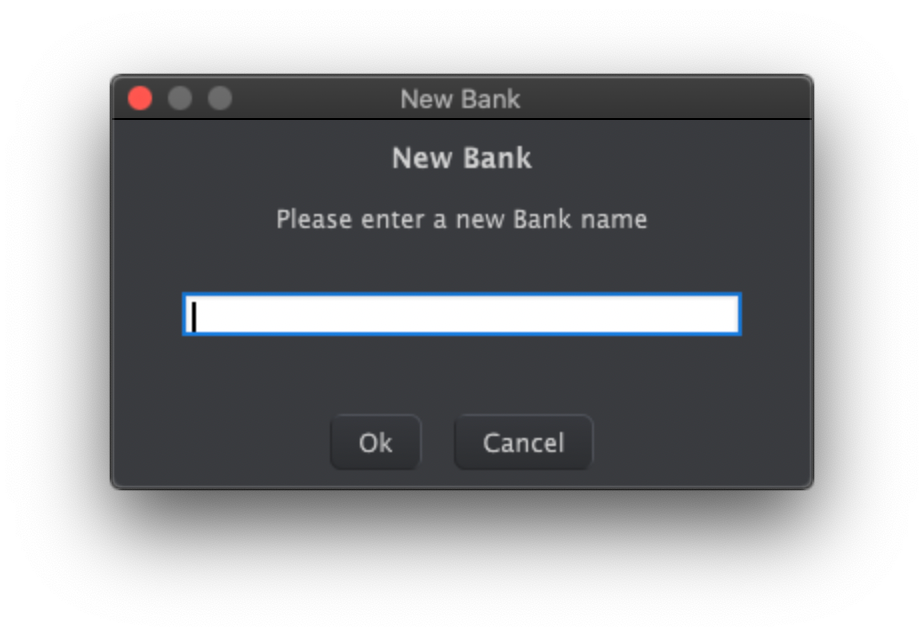
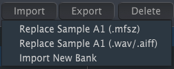
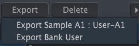
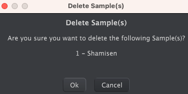
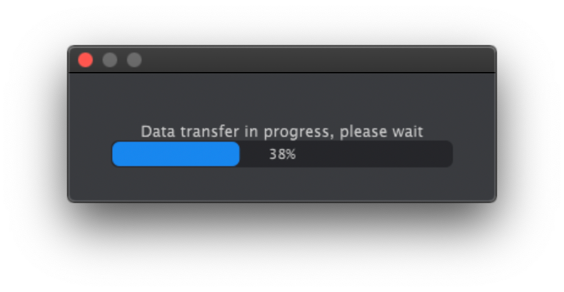

logseq-entity:: [[Logseq/Entity/Book/Section/Level 4]]
up:: [[Microfreak/14 Config/02 MIDI Control Center/03 Samples Tab]]
next:: [[Microfreak/14 Config/02 MIDI Control Center/03 Samples Tab/02 Dragging]]
- # 14.2.3.1 Sample Management
	- The buttons above the panes manage samples on the computer and in the MicroFreak.
	- Sample management buttons
		- 
	- **New Bank** creates an empty bank on the computer and prompts for a name. Drag samples from other banks over the new bank's name to combine them.
	- New Bank name prompt
		- 
	- **Del Bank** deletes a bank after confirmation. Factory banks cannot be deleted.
	- **Import** offers three choices:
		- **Replace Sample (.mfsz)** replaces the selected sample with a MicroFreak Sample file.
		- **Replace Sample (.wav/.aiff)** replaces it with a WAV or AIFF audio file.
		- **Import New Bank** adds an MFSBZ bank to the computer pane.
	- Import choices
		- 
	- > [[Note/Info]] The MicroFreak stores imported audio as 16-bit, 32 kHz mono samples. Audio beyond 24 seconds is cut off.
	- **Export** saves the selected sample as MFSZ or the selected bank as MFSBZ. Choose a location in the system save dialog.
	- Export choices
		- 
	- **Delete** removes a selected sample after confirmation and replaces it with an init sample.
	- Delete confirmation
		- 
	- **Send to MicroFreak** transfers the bank assembled in the computer pane to the MicroFreak for use by Sample, Scan Grains, Cloud Grains, and Hit Grains.
	- > [[Note/Warning]] This overwrites the samples in the MicroFreak. Do not turn its knobs while the transfer progress bar is visible.
	- Sample transfer progress
		- 
