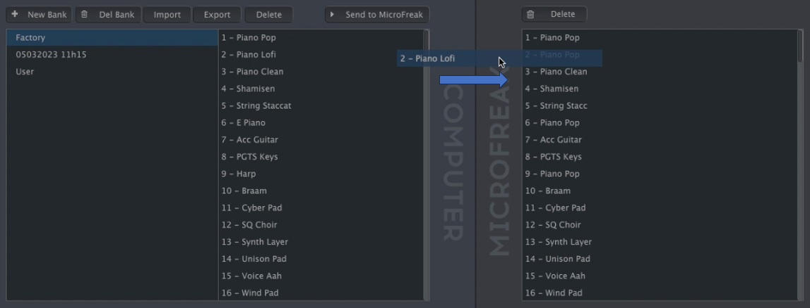

logseq-entity:: [[Logseq/Entity/Book/Section/Level 4]]
up:: [[Microfreak/14 Config/02 MIDI Control Center/03 Samples Tab]]
prev:: [[Microfreak/14 Config/02 MIDI Control Center/03 Samples Tab/01 Management]]
next:: [[Microfreak/14 Config/02 MIDI Control Center/03 Samples Tab/03 Deleting]]
- # 14.2.3.2 More on Dragging and Dropping
	- Drag individual samples between the computer and MicroFreak in either direction. The destination slot highlights blue when you hover over it; releasing the sample there overwrites that slot.
	- Dragging a sample between computer and MicroFreak
		- 
	- Drag samples within either pane to change their order. In the computer pane, drag a sample name over another bank's name to move it into that bank.
	- Shift-click or Command-click to select several samples before dragging them together.
