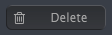
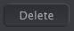

logseq-entity:: [[Logseq/Entity/Book/Section/Level 4]]
up:: [[Microfreak/14 Config/02 MIDI Control Center/03 Samples Tab]]
prev:: [[Microfreak/14 Config/02 MIDI Control Center/03 Samples Tab/02 Dragging]]
- # 14.2.3.3 Deleting Samples
	- Delete button in the computer pane
		- 
	- Delete button in the MicroFreak pane
		- 
	- Select a sample and use a Delete button at the top of the Samples tab or the keyboard's Delete key.
	- > [[Note/Info]] Factory samples cannot be deleted.
