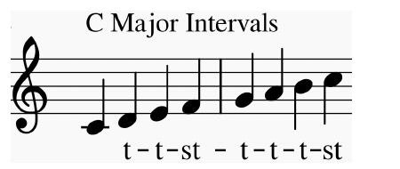
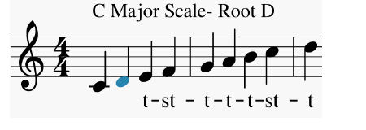
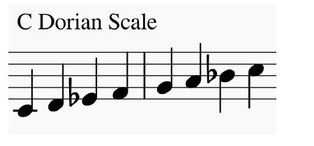

logseq-entity:: [[Logseq/Entity/Book/Section/Level 1]]
up:: [[Microfreak]]
prev:: [[Microfreak/14 Config]]
next:: [[Microfreak/16 Paraphonic Chord Mode]]
- # 15 Using Scales
	- Scales can shape the emotion of a melody. Adding chord notes from the melody's scale strengthens its character: major notes may sound forceful and happy, while minor notes may sound sad. Responses to major and minor scales vary across musical cultures.
	- The chromatic scale contains twelve notes: C, C♯, D, D♯, E, F, F♯, G, G♯, A, A♯, B. A scale selects notes from those twelve. Most scales use eight notes; pentatonic scales use five, and blues scales use six, combining five pentatonic notes with one chromatic note.
	- C major, also called C Ionian, uses the white piano keys: C, D, E, F, G, A, B. The gaps between selected notes are whole tones or semitones. From C to D is a whole tone; from E to F is a semitone.
	- C major follows the interval pattern tone, tone, semitone, tone, tone, tone, semitone.
	- C Major Intervals
		- 
	- Starting on D and playing only white keys gives the pattern tone, semitone, tone, tone, semitone, tone, tone. Applying that pattern from C produces a Dorian scale.
	- C Major Scale, Root D
		- 
	- C Dorian Scale
		- 
	- Starting a C major scale on its fifth step gives a Mixolydian scale. Building scales by starting on different steps creates the church modes, now widely used in western music.
	- {{embed [[Microfreak/15 Using Scales/01 Scale Settings]]}}
	- {{embed [[Microfreak/15 Using Scales/02 The Scale Root]]}}
