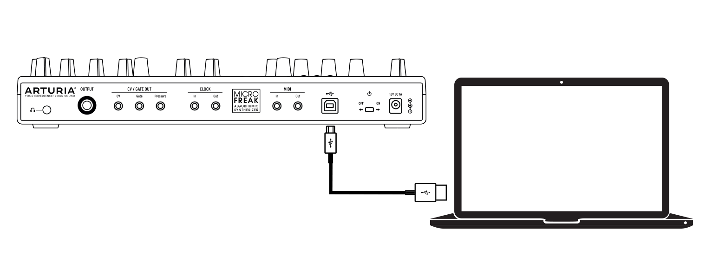
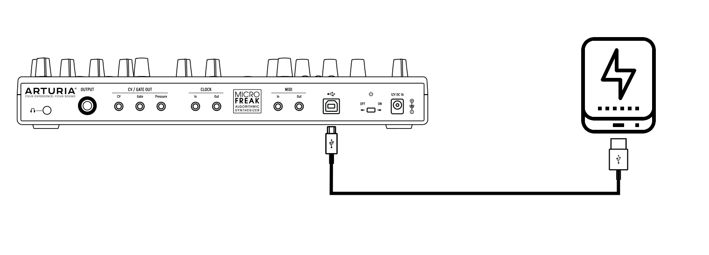
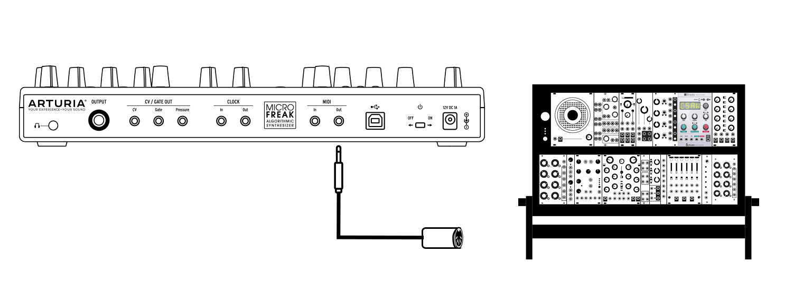

logseq-entity:: [[Logseq/Entity/Book/Section/Level 2]]
up:: [[Microfreak/17 Ext Gear]]
next:: [[Microfreak/17 Ext Gear/02 CV Gate]]
- # ...with a computer
	- MicroFreak-Computer connection
		- 
	- The MicroFreak is a USB class-compliant controller. Connect it to a computer to use it as an input device for applications or to work with MIDI Control Center, which provides a wide range of settings.
	- You can also use the MicroFreak without a computer. Power it with a standard USB phone charger or a power bank, and connect other equipment as shown below.
	- MicroFreak with power bank
		- 
	- > [[Note/Warning]] The MicroFreak's touch-capacitive keyboard must be grounded to work fully. Arturia recommends using the supplied three-pin wall plug.
	- Many devices have MIDI ports but no CV/Gate or USB connectors. The MicroFreak can send them notes and control them from its front panel with CC commands.
	- > [[Note/Info]] Use the supplied gray 1/8-inch TRS-to-5-pin DIN adapters to connect external MIDI devices to the MicroFreak.
	- The MicroFreak can also send and receive MIDI data through a computer's USB port.
	- MIDI to Modular
		- 
