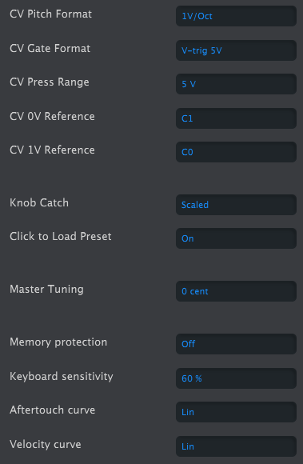
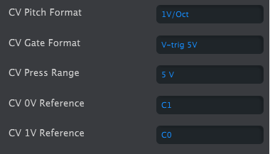

logseq-entity:: [[Logseq/Entity/Book/Section/Level 3]]
up:: [[Microfreak/17 Ext Gear/02 CV Gate]]
- # 17.1.1 Control voltages: Pitch, Gate and Pressure
	- When Sequence A or B is selected, or when you play the keyboard, notes are immediately converted to Control Voltage (CV) and Gate signals at the rear-panel outputs. In Paraphonic mode, notes played on the keyboard take priority over a running sequence.
	- CV Gate outputs
		- 
	- Each note sends three independent voltages: Pitch, Gate, and Pressure. Pressure can send velocity or pressure, depending on the Utility setting or MIDI Control Center.
	- Some analog synthesizers implement CV/Gate in ways that are not fully compatible with the MicroFreak. Check their specifications before buying to ensure they work together.
	- MIDI Control Center can configure the response of the CV/Gate jacks. By default, Pitch uses the 1 V per octave standard: an octave played on the keyboard raises the connected synthesizer or Eurorack module by one octave. Some synthesizers use Hz/V or 1.2 V per octave; choose the matching Pitch Format in Utility or MIDI Control Center.
	- CV Gate setting in the MIDI Control Center
		- 
	- Gate output can use S-Trig, V-Trig 5 V, or V-Trig 10 V, set in Utility or MIDI Control Center. Keyboard sensitivity adjusts the CV pressure range to match an external modular synthesizer.
	- The default 1 V per octave standard means that one volt raises an oscillator by one octave. It is the most common standard. If external oscillators do not track properly, check the external gear's documentation; changing the Volt/Octave setting may help.
	- The Pitch control voltage can use:
		- 1 V per octave (0–10 V)
		- Hertz per Volt, for systems where each volt change produces a fixed change in frequency rather than a fixed musical interval
		- 1.2 V per octave, a Buchla-specific standard
	- CV setting in the MIDI Control Center
		- 
