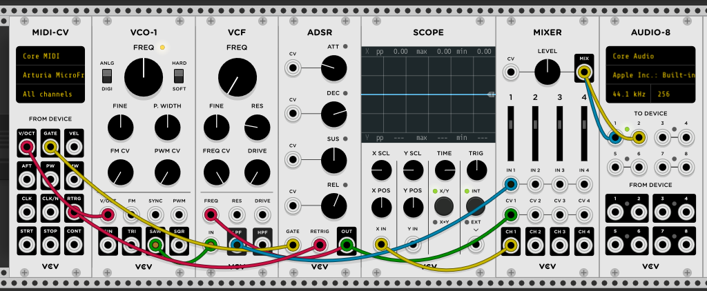

logseq-entity:: [[Logseq/Entity/Book/Section/Level 2]]
up:: [[Microfreak/17 Ext Gear]]
prev:: [[Microfreak/17 Ext Gear/07 MIDI Tutorial MINI V]]
next:: [[Microfreak/17 Ext Gear/09 MIDI CC Control]]
- # 17.7 Tutorial 2: Using MIDI to control modules on VCV Rack
	- This example uses the MicroFreak's arpeggiator to control an oscillator and envelope generator in VCV Rack, a free virtual modular system.
	- Connect the MicroFreak's USB output to the computer and open VCV Rack's demo patch.
	- In the first position, use a MIDI-CV module to send MicroFreak note values to an oscillator's pitch and velocity values to an ADSR envelope.
	- In the MIDI-CV module, change the input from computer keyboard to Core MIDI, then select Arturia MicroFreak as the device. The module can now receive pitch and velocity from the MicroFreak.
	- In the Audio-8 module, select the computer's audio output.
	- VCV Rack MIDI-CV patch
		- 
	- Press a MicroFreak key to hear VCV Rack. The keyboard, arpeggiator, and sequencer can now control VCV Rack oscillators and envelope generators.
