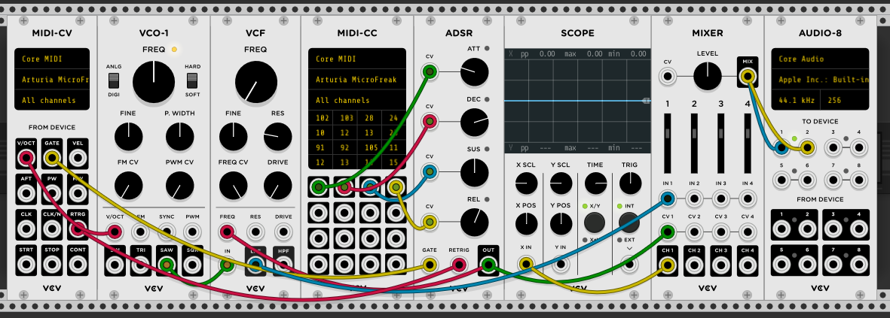

logseq-entity:: [[Logseq/Entity/Book/Section/Level 2]]
up:: [[Microfreak/17 Ext Gear]]
prev:: [[Microfreak/17 Ext Gear/09 MIDI CC Control]]
next:: [[Microfreak/17 Ext Gear/11 MIDI CC Values]]
- # 17.9 Tutorial 3: sending CC# codes from the MicroFreak
	- Turning a MicroFreak knob sends a CC# code. If you know the code for a dial, slider, or switch, you can use it to control an external parameter.
	- This tutorial links the MicroFreak's Cyclic Envelope to the ADSR envelope in VCV Rack's demo patch. It assumes the patch from [[Microfreak/17 Ext Gear/08 MIDI Tutorial VCV Rack]] is already set up to control VCO-1 and the ADSR.
	- In VCV Rack, click an empty area of the rack to open the module selector. Search for MIDI and add the MIDI-CC module.
	- In the MIDI-CC module, choose Arturia MicroFreak from the device list.
	- The module has 16 CC# controllers, numbered 0–15, that can link MicroFreak parameters to VCV Rack parameters. Sixteen patch points below the connection field correspond to its entries.
	- Select the first entry, 0; it changes to a dash. Turn the MicroFreak's Cyclic Envelope Rise knob. The first field displays 5, the Rise parameter's CC#.
	- Repeat for Fall, Hold, and Amount. Their CC# values appear in the connection fields.
	- VCV Rack MIDI-CC patch
		- 
	- Connect the patch points to the ADSR CV inputs:
		- First patch point to Attack
		- Second patch point to Decay
		- Third patch point to Sustain
		- Fourth patch point to Release
	- The Cyclic Envelope now controls the VCV Rack ADSR. Press the MicroFreak's ARP button, play a chord, and turn the Cyclic Envelope knobs to hear the result.
	- The VCV Rack MIDI-CC module can identify CC# codes. Select one of its 16 fields and turn a MicroFreak knob; the module displays the CC# if that knob sends one.
	- The connection works both ways: a VCV Rack output, sequencer, or modular system can control MicroFreak parameters. Use a module such as the Befaco VCMC to convert analog modular signals to MIDI CC# messages.
	- > [[Note/Info]] Like note and velocity values, CC# values range from 0 to 127.
