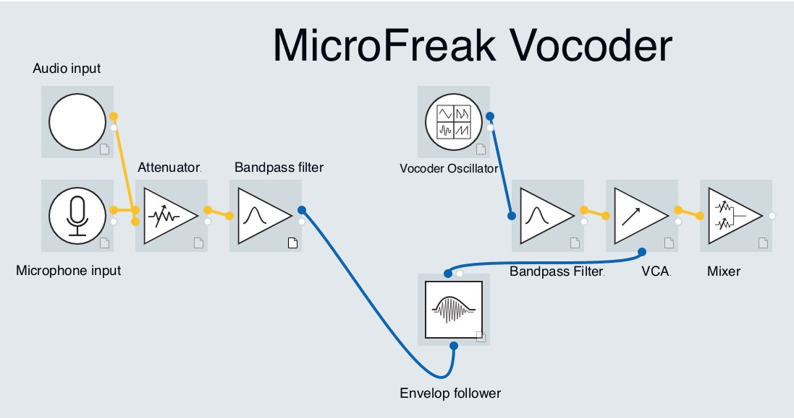

logseq-entity:: [[Logseq/Entity/Book/Section/Level 2]]
up:: [[Microfreak/19 Appendix B Vocoder]]
prev:: [[Microfreak/19 Appendix B Vocoder/01 Intro]]
next:: [[Microfreak/19 Appendix B Vocoder/03 Connect Mic]]
- # 19.2. How Does Vocoder Work?
	- The MicroFreak analyzes incoming sound with 16 tuned bandpass filters. As with the MicroFreak's own filter in BPF mode, each band emphasizes a limited range of frequencies.
	- An envelope follower tracks the loudness in each band. The resulting signals control matching filters on the carrier, allowing each formant peak to follow its own changing volume. The vocoder also recreates the overall loudness pattern at the end of the signal path.
	- MicroFreak Vocoder signal path
		- 
	- {{embed [[Microfreak/19 Appendix B Vocoder/02 How It Works/01 Resolution]]}}
	- {{embed [[Microfreak/19 Appendix B Vocoder/02 How It Works/02 Voice]]}}
	- {{embed [[Microfreak/19 Appendix B Vocoder/02 How It Works/03 Vocoder Osc]]}}
