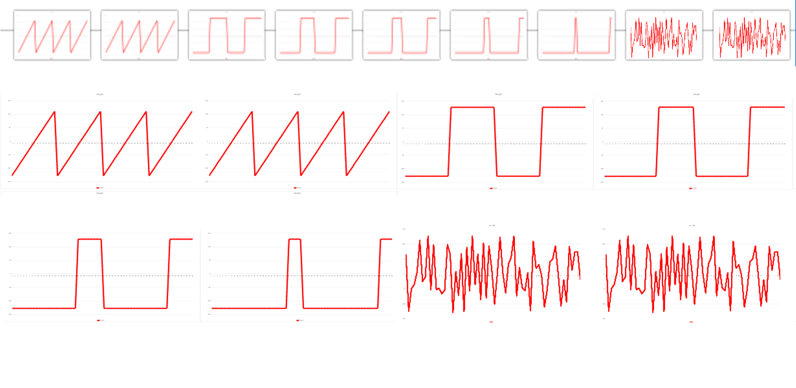

logseq-entity:: [[Logseq/Entity/Book/Section/Level 3]]
up:: [[Microfreak/19 Appendix B Vocoder/02 How It Works]]
prev:: [[Microfreak/19 Appendix B Vocoder/02 How It Works/02 Voice]]
- # 19.2.3. The Vocoder Oscillator
	- A carrier rich in overtones gives the vocoder more material to shape. Use the **Wave** knob to move through sawtooth, pulse width, and noise waves.
	- The Digital Oscillator
		- 
	- Wave positions
		- 0%: sawtooth.
		- Around 11%: pulse wave at 50% duty cycle.
		- From 11% to 90%: increasing pulse width, reaching 97% duty cycle.
		- 91–100%: noise.
	- Sawtooth, pulse-width, and noise waveforms
		- 
	- **Timbre** and **Shape** also control the Vocoder Oscillator.
	- > [[Note/Info]] Oscillator Type cannot be modulated while the Vocoder Oscillator is active.
	- {{embed [[Microfreak/19 Appendix B Vocoder/02 How It Works/03 Vocoder Osc/01 Timbre]]}}
	- {{embed [[Microfreak/19 Appendix B Vocoder/02 How It Works/03 Vocoder Osc/02 Shape]]}}
