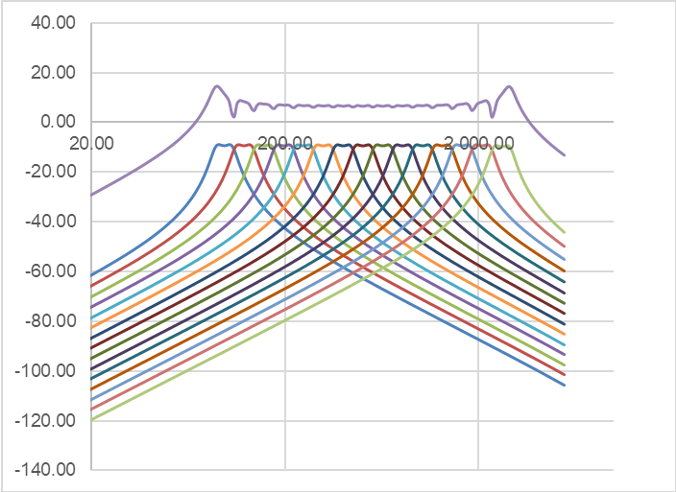

logseq-entity:: [[Logseq/Entity/Book/Section/Level 4]]
up:: [[Microfreak/19 Appendix B Vocoder/02 How It Works/03 Vocoder Osc]]
next:: [[Microfreak/19 Appendix B Vocoder/02 How It Works/03 Vocoder Osc/02 Shape]]
- # 19.2.3.1. Timbre Encoder
	- **Timbre** selects the frequency range used for analysis and resynthesis. Vowel formants peak at different frequencies: for example, a “u” may have peaks near 330 and 1260 Hz, with variation across voices.
	- Matching the range to the speaker, or to an instrument used as a modulator, helps the filters respond to the frequencies that matter. Monitoring fewer frequencies can improve response time and output.
	- Vocoder filter bands and frequency response
		- 
