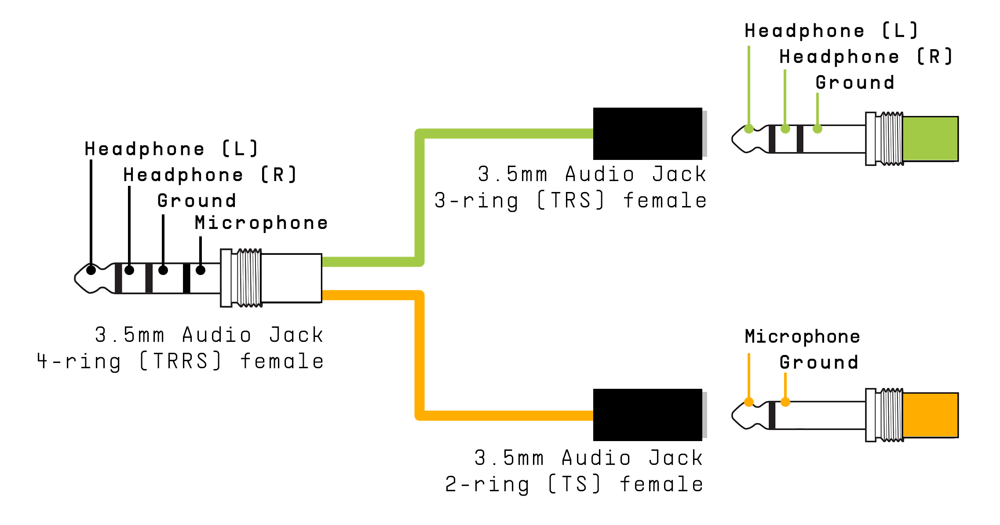
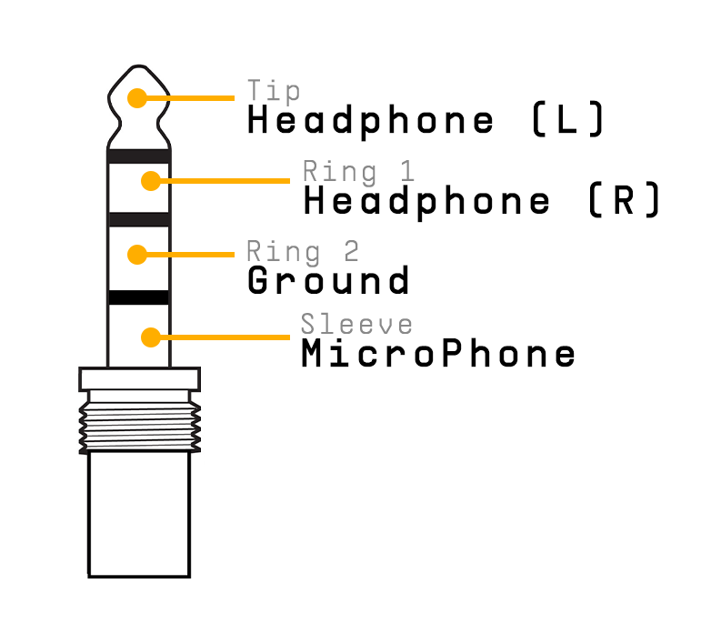

logseq-entity:: [[Logseq/Entity/Book/Section/Level 4]]
up:: [[Microfreak/19 Appendix B Vocoder/08 Global Settings/03 Set Gain]]
prev:: [[Microfreak/19 Appendix B Vocoder/08 Global Settings/03 Set Gain/02 Mic Detection]]
- # 19.8.3.3. Connecting external sources
	- An external audio source can modulate the vocoder, including a guitar, drum machine, phone, tablet, or Eurorack mixer. Match its output level to the MicroFreak input: these sources are usually much louder than a microphone.
	- Approximate output levels: microphones -60 to -40 dBU; guitar -20 dBU; phones and tablets -7.78 dBU; Eurorack +13 dBU.
	- Use a headphone/microphone splitter that connects the source to the mic contact of the MicroFreak’s 3.5 mm TRRS jack.
	- Headphone/Microphone Splitter
		- 
	- > [[Note/Info]] The input uses CTIA/AHJ wiring: tip = left audio, ring 1 = right audio, ring 2 = ground, sleeve = microphone.
	- CTIA/AHJ connector
		- 
	- > [[Note/Warning]] Do not connect a Eurorack module directly to the splitter. Its signal can overload or damage the MicroFreak. Use a mixer headphone or line-level output instead.
	- ## Connect the device
		- Turn off the MicroFreak and gently remove the gooseneck microphone.
		- Turn the external device’s output level all the way down to avoid clipping.
		- Plug the splitter into the MicroFreak headphone jack and the device signal into the splitter’s mic branch.
		- Turn on the MicroFreak.
		- Set **Utility > Mic Settings > Mic Detection** to Off and **Mic Gain** initially to -12 dB.
		- Select a vocoder preset, hold a key, and slowly raise Mic Gain. If there is no sound, slowly raise the source device’s output level.
