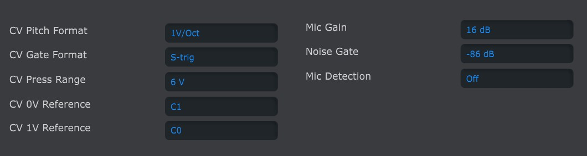

logseq-entity:: [[Logseq/Entity/Book/Section/Level 4]]
up:: [[Microfreak/19 Appendix B Vocoder/08 Global Settings/04 MIDI Control Center]]
- # 19.8.4.1. MIDI Control Center settings
	- The global Vocoder settings here match those in the MicroFreak Utility menu.
	- MIDI Control Center Vocoder settings
		- 
	- The software is available from [Arturia](https://www.arturia.com/).
