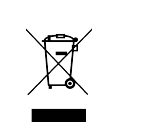

logseq-entity:: [[Logseq/Entity/Book/Section/Level 2]]
up:: [[Microfreak/22 Declaration of Conformity]]
prev:: [[Microfreak/22 Declaration of Conformity/05 RoHS]]
- # 22.6 WEEE
	- The crossed-out wheeled-bin symbol
		- 
	- This symbol indicates that the electrical and electronic equipment belongs at a collection point for treatment, recovery, and recycling, rather than in household waste. Follow national law and the WEEE Directive 2012/19/EU. For collection information, contact the local municipal office, household waste service, or the shop where the product was purchased.
