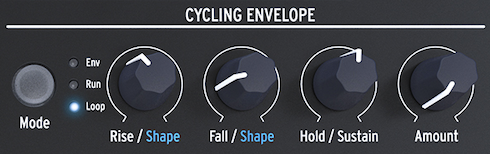

logseq-entity:: [[Logseq/Entity/Book/Section/Level 4]]
up:: [[Microfreak/UG/03 Overview/01 Front Panel/02 Middle Row]]
prev:: [[Microfreak/UG/03 Overview/01 Front Panel/02 Middle Row/03 Analog Filter]]
- # 03.01.02.04 Cycling Envelope
	- The Cycling Envelope generates modulation signals for destinations in the Matrix. Unlike a standard envelope, it can retrigger after its last stage finishes. [[Microfreak/UG/09 Envelope Gen]] covers its controls.
	- The Cycling Envelope Generator
		- 
