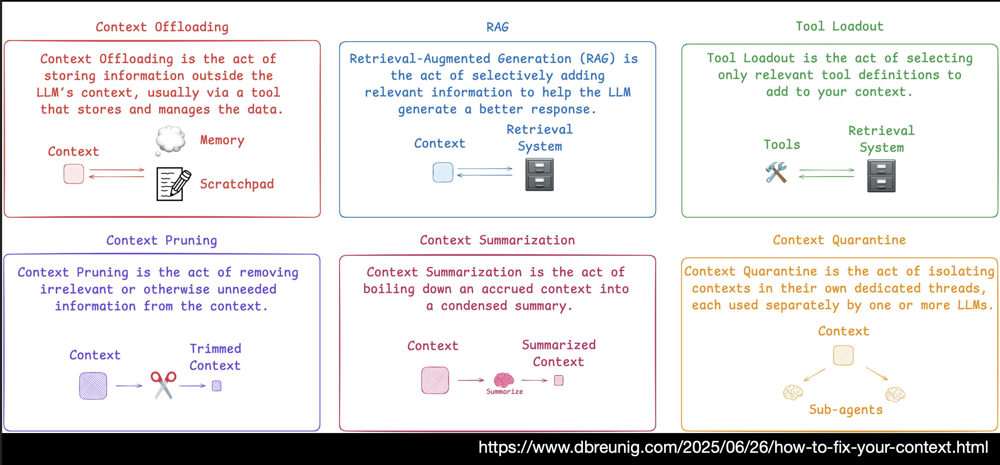

# [[Context Engineering]] – [[Person/Addy Osmani]]
	- ## Overview
		- **Duration**: 15 minutes
		- **Time**: 11:45
		- **Speaker**: [[Person/Addy Osmani]]
		- **Event**: [[OReilly/Event/25/09/AI Codecon]]
		- **Resources**: [PDF](https://on24static.akamaized.net/event/49/94/94/2/rt/1/documents/resourceList1757373124706/oreillycontextengineering1757373124706.pdf)
	- ## Description
		- Exploration of context engineering as "one small piece of an emerging thick layer of non-trivial software" that powers real LLM apps
		- Evolution of prompt engineering into a broader, more system-level approach
		- Practical, systems-based approach to structuring all the information an LLM needs to perform reliably and usefully
	- ## Key Topics
		- Dynamic assembly of task-specific context using data, instructions, tools, and memory
		- How good input design translates to better, more trustworthy output
		- Systems-level approach to LLM application development
		- Moving beyond simple prompt engineering
	- ## [[My Notes]]
		- "Context mismanagement is often a root cause of problems"
		- #Definition of [[Context Engineering]]
			- CONTEXT ENGINEERING
			   MEANS PROVIDING AN AI WITH ALL THE
			  INFORMATION AND TOOLS IT NEEDS TO
			  SUCCESSFULLY COMPLETE A TASK – NOT JUST A
			  CLEVERLY WORDED PROMPT.
		- 11:51 he has an example of [[IDE/Cline]] with a progress bar.
		- 11:51 he has a slide from [Prompting 101 | Code w/ Claude - YouTube](https://www.youtube.com/watch?v=ysPbXH0LpIE) by [[Anthropic]]
			- {{video https://www.youtube.com/watch?v=ysPbXH0LpIE}}
		- 11:55 he mentions he uses [[IDE/Cline]] quite a bit, and he talks about 50% of context window as a threshold
		- 11:58 even more examples from [[IDE/Cline]] of [[AI/Context/Compact]]
		- mentions [LangChain - Context Engineering](https://blog.langchain.com/context-engineering-for-agents/)
		- 11:59 he mentions [How to Fix Your Context](https://www.dbreunig.com/2025/06/26/how-to-fix-your-context.html) by [[Person/Drew Breunig]]
			- 
			- TODO follow him on [[Readwise]]
		- TODO follow [[Person/Addy Osmani]] in readwise
		-