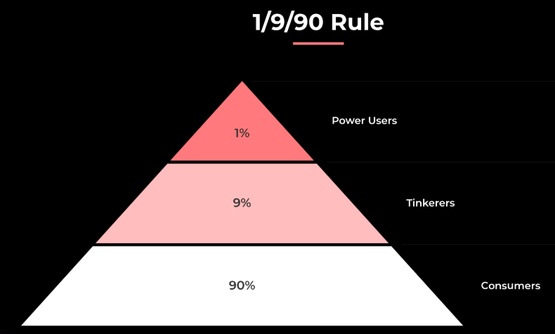
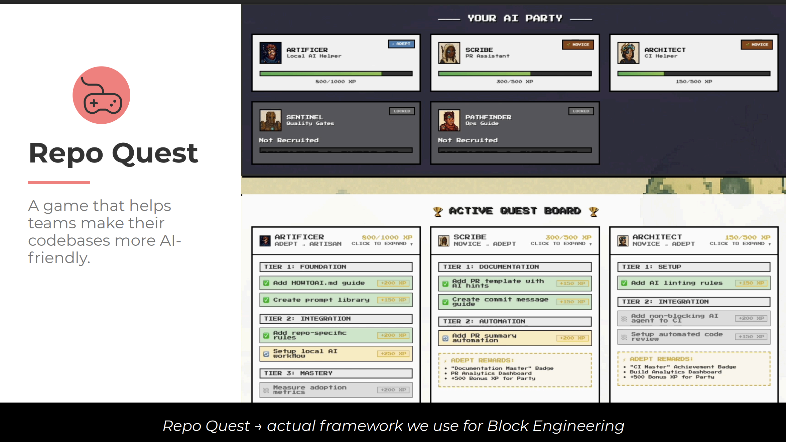

# Beyond Code Generation: Getting Real Work Done with AI Agents – [[Person/Angie Jones]]
	- ## Overview
		- **Duration**: 15 minutes
		- **Time**: 12:55
		- **Speaker**: [[Person/Angie Jones]]
		- **Event**: [[OReilly/Event/25/09/AI Codecon]]
		- **Resources**: [PDF](https://on24static.akamaized.net/event/49/94/94/2/rt/1/documents/resourceList1757129649118/angiejonesbeyondcodegeneration1757129649118.pdf)
	- ## Description
		- Exploration of how AI agents can go beyond simple code generation
		- Discussion of getting real work done through AI agent collaboration
		- Focus on practical applications and real-world productivity gains
	- ## Key Topics
		- Moving beyond basic code generation capabilities
		- Real-world productivity applications of AI agents
		- Practical strategies for effective AI agent collaboration
		- Achieving meaningful work outcomes with AI assistance
	- ## [[My Notes]]
		- 13:09 one of the key things here is "am I getting value from AI?"
		- 13:11 the 1/9/90 rule
			- **1% Power Users** – These are the early adopters and experts who push AI tools to their limits, often creating workflows and best practices.
			- **9% Tinkerers** – They experiment with AI, trying out features, but without deep or consistent usage.
			- **90% Consumers** – The vast majority, who mainly consume outputs from AI tools rather than driving or shaping how they are used
			- 
		- 13:13 it's really hard to make repo integration
			- so he turns it into an RPG
			- 
		- 13:16 Angie's trying to give us a blueprint or a mission for how to think about making repo-centric AI integration on teams as a way to
		- ## Levels of AI Maturity [[AI Notes]]
			- ### **1. AI-Curious**
				- AI can *discover and consume* information.
				- Tools are mostly used for understanding code, not changing it.
				- Typical prompts: *“Summarize this repo”*, *“Explain this function”*.
				- Value: learning and exploration, but little productivity gain
			- ### **2. AI-Ready**
				- AI can *contribute and maintain* code.
				- Agents start proposing PRs, generating tests, drafting documentation.
				- Teams may introduce **specialized subagents** like QA agents, security agents, or technical writer agents.
				- AI moves from passive to active assistance
			- ### **3. AI-Embedded**
				- AI can *be trusted* and share responsibility.
				- Guardrails are strong enough that AI contributions can be merged confidently.
				- AI is treated as a **teammate** with responsibilities.
				- Autonomous agents are integrated into workflows and may run **simultaneously** (e.g., handling maintenance, integrating with CI/CD).
				- AI shifts from helper to co-owner of work
			- 👉 The progression shows a journey from **exploring AI tools**, to **actively incorporating them**, to **embedding them as reliable team members**.
			- ## AI Maturity Model [[AI Notes]]
				- She ties the **AI Maturity Model** (AI-Curious → AI-Ready → AI-Embedded) to a **leveling-up framework for individual AI agents** inside a team’s workflow.
				- Each agent (like the **Local AI Helper**, **PR Assistant**, **CI Helper**, **Quality Guardian**, or **Ops Navigator**) has clear **progression stages**:
					- **Novice** → first adoption, simple use (e.g., add one gating check).
					- **Adept** → tuned to the repo/team’s pain points, with repeatable workflows.
					- **Artisan** → fully embedded, measured, and delivering tracked value (e.g., publishing metrics, catching errors, or speeding PR merges).
					  
					  This “game-like” progression, shown in her *Repo Quest* framework (slides 13–21), helps teams **assess where they are** and **set concrete goals for maturing AI use**. It shifts the maturity discussion from abstract stages to *measurable practices and outcomes*
		- ## Idea - put HowToAI.md in the repo
			- 👉 **HowToAI.md** = *“How to run an AI helper locally in this repo”*
				- Here’s what that means in context:
				- Just like a project might have a **README.md** to explain setup, **HowToAI.md** acts as a **starter guide** for using AI inside that specific repo.
				- It provides **repo-specific prompts, rules, and instructions** for running local AI helpers.
				- This makes AI usage **repeatable and accessible** across the team, so contributors don’t have to guess how to best apply agents.
				- It also sets the stage for later maturity levels (like contributing workflows to shared libraries or tracking adoption).
				  
				  So, **HowToAI.md is a practical, concrete artifact** that teams add to their repositories to embed AI usage directly into the developer workflow — a way to normalize and standardize AI assistance just like any other engineering tool.
		- ## Big idea is to "Think beyond the IDE"
-