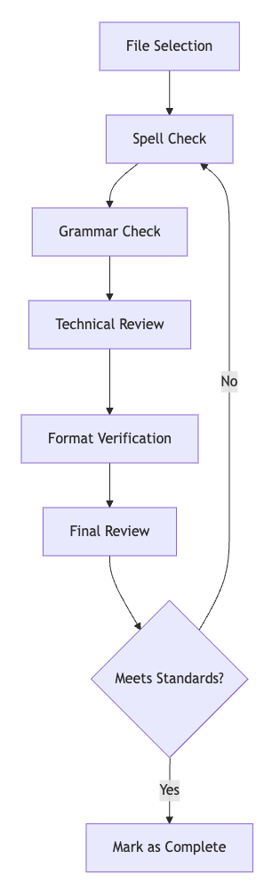

# [bmadcode/cursor-custom-agents-rules-generator: Maximize the potential of Cursor best practices for Automatic Rule and Custom Agent Generation and Agile Workflows](https://github.com/bmadcode/cursor-custom-agents-rules-generator)
	- ## [[My Notes]] on trying this workflow - [[2025-03-21 Fri]]
	  id:: 67dd428f-9c6b-4d20-ab14-188778b80b92
		- I prepared a [[Merge Request]] [Fix spelling errors by codekiln · Pull Request #27 · bmadcode/cursor-auto-rules-agile-workflow](https://github.com/bmadcode/cursor-auto-rules-agile-workflow/pull/27) into this repo to get to know the process. Here are my notes on the process. Similar to [[AI/Coding/Technique/Phased Planning/ai-coding dir]], this repo by [[Person/Brian Madison]] presents a system of [[CursorAI/Project Rules]] that implement an [[Agile]] workflow.
			- ### Workflow Review
				- #### Onboarding
					- I was initially a bit confused by the [introductory material in the root README.md](https://github.com/bmadcode/cursor-auto-rules-agile-workflow/blob/main/readme.md?plain=1#L3-L28), which contains important notices to new users before explaining what the repository does.
						- **Note** this does contain a great #Tip [[CursorAI/How To/update workbench.editorAssociations for mdc to prevent custom editor]]
					- Just skip down to the Overview for more information.
				- #### Installation
					- The root README.md presents two quick start options, [**BOTH** of which rely on](https://github.com/bmadcode/cursor-auto-rules-agile-workflow/blob/main/readme.md?plain=1#L45-L82) these installation instructions:
						- `git clone https://github.com/bmadcode/cursor-auto-rules-agile-workflow.git`
						- `cd cursor-auto-rules-agile-workflow`
						- `./apply-rules.sh /path/to/your/project`
					- The result of running this against your project:
						- **1**. Copy all template rules to your project's `.cursor/rules/` directory
						  2. Add documentation to `docs/workflow-rules.md`
						  3. Update `.gitignore` to protect "private" rules (individual developer cursor rules that begin with `_` by this project's conventions)
						  4. Preserve any existing rules in your project
					- After running `./apply-rules.sh`, the script will suggest next steps
						- > Next steps:
						- > 1. Review the documentation in docs/workflow-rules.md
							- *note, in the original repository, in the [docs/](https://github.com/bmadcode/cursor-auto-rules-agile-workflow/tree/main/docs) dir there is only [agile-readme.md](https://github.com/bmadcode/cursor-auto-rules-agile-workflow/blob/main/docs/agile-readme.md), but after running `./apply-rules`, `workflow-rules.md` does exist in the target repository. This file is [actually hard-coded in apply-rules.sh](https://github.com/bmadcode/cursor-auto-rules-agile-workflow/blob/main/apply-rules.sh#L45-L90)!*
						- > 2. Choose your preferred workflow approach
							- *for example, cursor rules (recommended) vs cursor notepads*
						- > 3. Enable Cursor Notepads if using the flexible workflow option
						- > 4. To start a new project, use xnotes/project-idea-prompt.md as a template
						     to craft your initial message to the AI agent
					- The generated [docs/workflow-rules.md](https://github.com/bmadcode/cursor-auto-rules-agile-workflow/blob/main/apply-rules.sh#L45-L90) in the target repository recommends
						- using [801-workflow-agile.mdc](https://github.com/bmadcode/cursor-auto-rules-agile-workflow/blob/main/xnotes/801-workflow-agile.mdc), which is in the `xnotes` directory
							- Since this is not the official project rules directory, one needs either to reference it directly, or to copy it into the `.cursor/rules` directory
						- using `901-prd.mdc`, `902-arch.mdc`, `903-story.mdc`,  which are not in the repository anywhere AFAICT
							- It's possible these are subsumed into the [three equivalent-ish templates in .cursor/templates](https://github.com/bmadcode/cursor-auto-rules-agile-workflow/tree/main/.cursor/templates), but that's not totally clear to me
				- #### [Overview](https://github.com/bmadcode/cursor-auto-rules-agile-workflow/blob/main/readme.md#overview)
					- This rule system has a few components. The two most highly visible in the core `README.md` are:
						- ##### Using the agent to author and update custom [[CursorAI/Project Rules]]
							- similar to [[Person/Geoffrey Huntley/Blog/25/02/You are using Cursor AI incorrectly...]], this repo presents a method of creating new cursor rules.
							- Each type of [[CursorAI/Project Rule]] has a template in `.cursor/templatess/*.md`
								- #Example #PRD template - [cursor-auto-rules-agile-workflow/.cursor/templates/template-prd.md at main](https://github.com/bmadcode/cursor-auto-rules-agile-workflow/blob/main/.cursor/templates/template-prd.md)
								- I like this method of **standardizing how cursor creates project rules**  by using **configurable templates**. This seems flexible and powerful.
						- ##### Conventions for organizing cursor project rules using a [numerical catalog](https://github.com/codekiln/cursor-auto-rules-agile-workflow/tree/main?tab=readme-ov-file#file-organization) and separating private and public rules
							- This reminds me of the [[Dewey Decimal System]]
								- `0XX`: Core rules and standards
								- `1XX`: Tool and MCP rules
								- `3XX`: Testing standards
								- `8XX`: Workflow rules
								- `9XX`: Templates
								- `1XXX`: Language-specific rules
								- `2XXX`: Framework/library rules
							- I believe I remember reading something in the [[CursorAI/Forum]] about people who tested to see if the agent prioritizes items in numerical order, but I can't seem to find the link.
					- The project structure includes a `docs` dir with a single file - [docs/agile-readme.md](https://github.com/bmadcode/cursor-auto-rules-agile-workflow/blob/main/docs/agile-readme.md). This is the [[Agile]] part that's most like my [[AI/Coding/Technique/Phased Planning/ai-coding dir]].
						- In my MR I used it or invoked it like this:
							- > I've just forked this repository and checked out a branch. I've noticed there are a lot of spelling errors. I'd like to use this as an opportunity to try out the agile workflow mentioned in @agile-readme.md. Can you suggest what my first step should be to start an Epic to fix spelling and grammar and Stories for each file?
							- **Note:** *in retrospect, I probably should have copied [801-workflow-agile.mdc](https://github.com/bmadcode/cursor-auto-rules-agile-workflow/blob/main/xnotes/801-workflow-agile.mdc) to my cursor project rules and used that ?*
						- The project rules guided the agent to create a directory structure like this:
							- [.ai](https://github.com/bmadcode/cursor-auto-rules-agile-workflow/tree/70d24a80da9d4520896189dad70b5e84be35d0ed/.ai)
								- a #PRD document [prd.md](https://github.com/bmadcode/cursor-auto-rules-agile-workflow/blob/70d24a80da9d4520896189dad70b5e84be35d0ed/.ai/prd.md), possible equivalent of [[AI/Coding/v0/File/1-TICKET-original-issue.md]] in my workflow
								- an [arch.md](https://github.com/bmadcode/cursor-auto-rules-agile-workflow/blob/70d24a80da9d4520896189dad70b5e84be35d0ed/.ai/arch.md), possible equivalent of [[AI/Coding/v0/File/2-TICKET-technical-specification.md]] which, for my pull request, contained an LLM-generated [[Mermaid Diagram]] that looked like this:
									- {:height 430, :width 122}
									- **Note:** I needed to install [[VSCode/Extension/Markdown Preview Mermaid Support]] to see it in a preview locally
									- I #[[❤️]] the idea of using mermaid in an [[Arch/itecture]] document
							- [epic-1/](https://github.com/bmadcode/cursor-auto-rules-agile-workflow/tree/70d24a80da9d4520896189dad70b5e84be35d0ed/.ai/epic-1)
								- [story-1.story.md](https://github.com/bmadcode/cursor-auto-rules-agile-workflow/blob/70d24a80da9d4520896189dad70b5e84be35d0ed/.ai/epic-1/story-1.story.md)
								- [story-2.story.md](https://github.com/bmadcode/cursor-auto-rules-agile-workflow/blob/70d24a80da9d4520896189dad70b5e84be35d0ed/.ai/epic-1/story-2.story.md)
								- [story-3.story.md](https://github.com/bmadcode/cursor-auto-rules-agile-workflow/blob/70d24a80da9d4520896189dad70b5e84be35d0ed/.ai/epic-1/story-3.story.md)
								- [story-4.story.md](https://github.com/bmadcode/cursor-auto-rules-agile-workflow/blob/70d24a80da9d4520896189dad70b5e84be35d0ed/.ai/epic-1/story-4.story.md)
						- ##### #Thoughts about the `.ai/epic-<N>/story-<M>.story.md` structure vs what I've been doing in [[AI/Coding/Technique/Phased Planning/ai-coding dir]]
							- I like the idea of keeping the stories as separate files. This part is different than the current version of my workflow; the prompts I've been using from [[Person/Harper Reed/Blog/25/02/My LLM codegen workflow atm]] end up producing two documents, each of which are broken up into 3-10 equivalent stages, each of which will end with a commit:
								- [[AI/Coding/v0/File/3-TICKET-staged-implementation-plan.md]]
								- [[AI/Coding/v0/File/4-TICKET-staged-implementation-checklist.md]]
							- Comparison of putting stages into separate files vs into one file
								- [[Brian Madison]]'s [template-story.md](https://github.com/bmadcode/cursor-auto-rules-agile-workflow/blob/main/.cursor/templates/template-story.md) does already include a task checklist as part of the story
									- keeping the stage checklist with the story may help LLMs not get out of sync. I've noticed that sometimes it forgets to update the checklist.
									- keeping the story as its own file may help reduce the context's that's needed. It's not always necessary to put the entire history of the current development effort into context.
								- I like the idea of using Epic vs Story, which may have more precedent in the LLM training data for planning than Phase and Stage, which were ideas invented for the purpose of describing how to do this to an LLM
							- I also like the idea of having both epics and stories, which aren't quite the same as stages and todos. stories already include groups of todos, so there's really a three level vs two level hierarchy here. That seems useful.
							- One thing I still like about my workflow vs the one described here is that there is a ticket scoping mechanism, so two people could potentially work on items at the same time. It's not as "Single Player" as [[Harper Reed]] says:
								- {{embed ((67b5d737-1411-48f4-ab3a-aa8512474565))}}
							- That said, I still think the "endgame" setup is to use MCP to store all this information directly in a ticketing system as per [[CursorAI/Idea/Proj Rules GitHub CLI AI SLDC/MCP/Github Action Reasoning Model Planner]]
					- The project structure also includes an `xnotes` directory which is intended to be used for drafting longer prompts to copy andpaste into [[CursorAI/Agent Mode]]. AFAICT this directory is only meant as a tempfile staging area for a human crafting prompts; it's **not critical to read and can be ignored**. Expand this node if you want more info.
					  collapsed:: true
						- this directory is added to [[CursorAI/.cursorindexingignore]] [here](https://github.com/codekiln/cursor-auto-rules-agile-workflow/blob/main/.cursorindexingignore) and **also** added to [[.cursorignore]] [here](https://github.com/codekiln/cursor-auto-rules-agile-workflow/blob/main/.cursorignore).
							- **Side-note**: I'm both relieved and dismayed to see others adding the same paths to both files. I've argued for better documentation on when people should use one vs the other in [[CursorAI/Forum/24/12/Questions on .gitignore, .cursorignore, .cursorban]] [here](https://forum.cursor.com/t/questions-on-gitignore-cursorignore-cursorban/34713/16?u=codekiln).
						- This directory contains a few things for an [[Agile]]-like workflow with project rules.
							- [xnotes/801-workflow-agile.mdc](https://github.com/bmadcode/cursor-auto-rules-agile-workflow/blob/main/xnotes/801-workflow-agile.mdc) is a cursor project rule which describes the relationship between files used in coding. AFAICT this isn't actually in use, because it's not in the right directory; perhaps it's a draft.
							- [xnotes/workflow-agile.md](https://github.com/bmadcode/cursor-auto-rules-agile-workflow/blob/main/xnotes/workflow-agile.md) looks like another take at the agile workflow. Again, this isn't in the proper cursor rules directory, so the only way to reference it is to at message it.
	- ## [[see-also]]
		- [[Person/Brian Madison/YouTube/25/02/Unlock Cursor AI Automatic Rule Generation]] which is a video overview of this