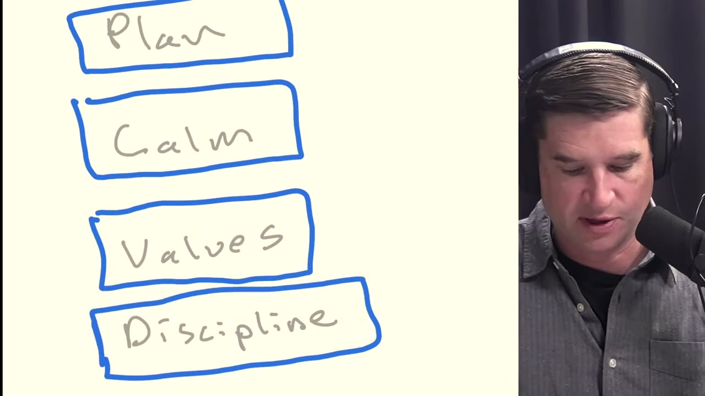
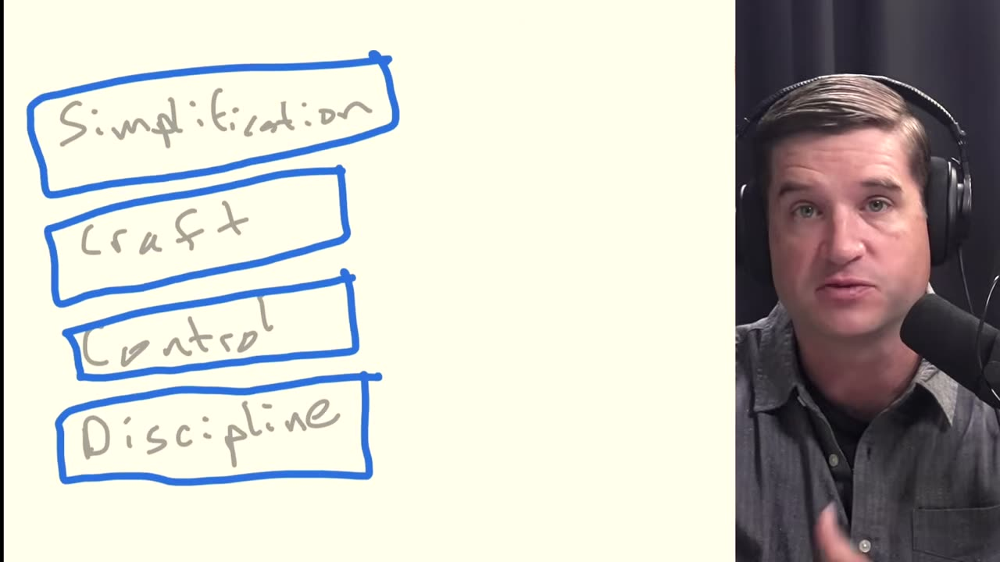
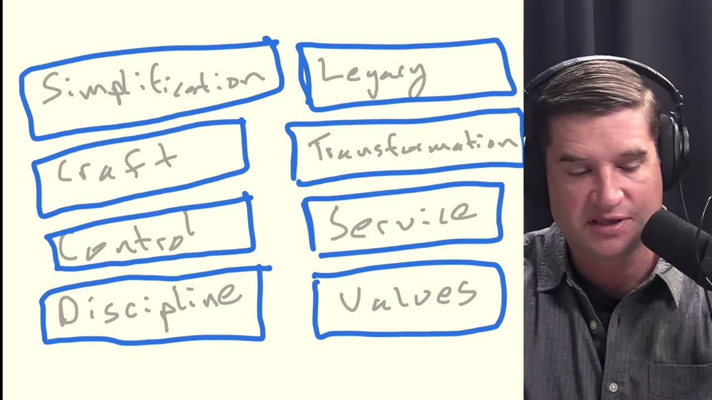
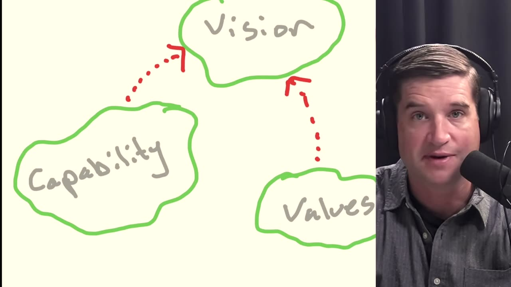
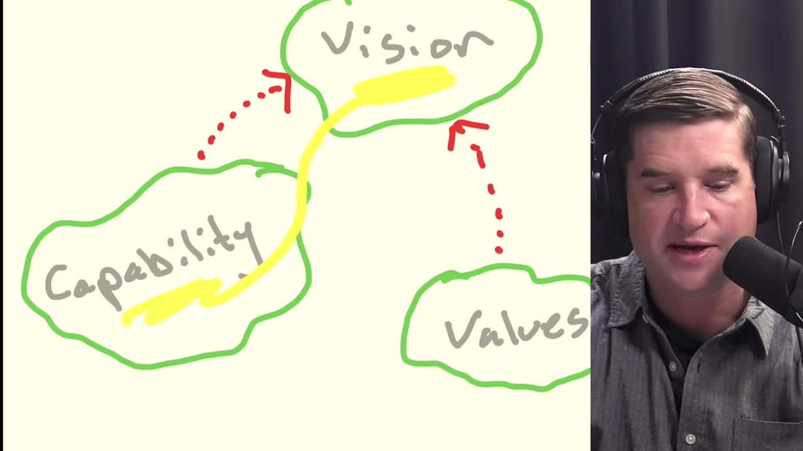
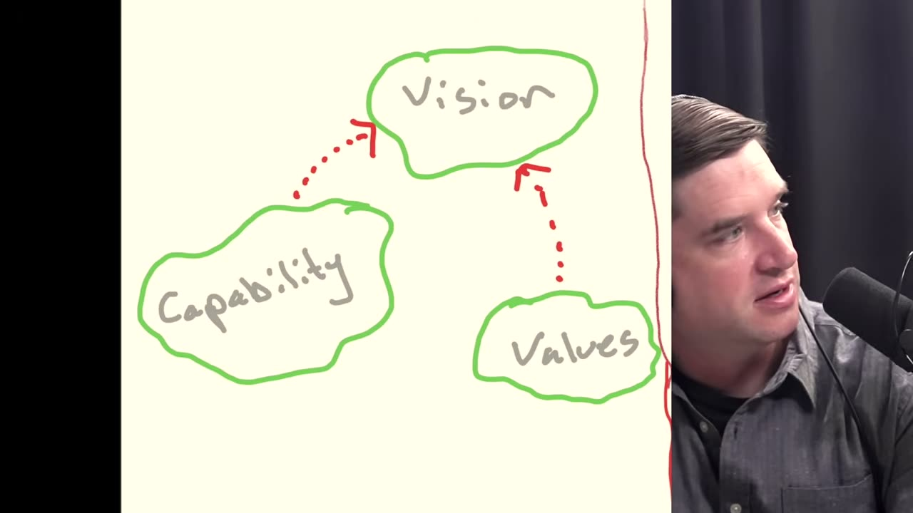
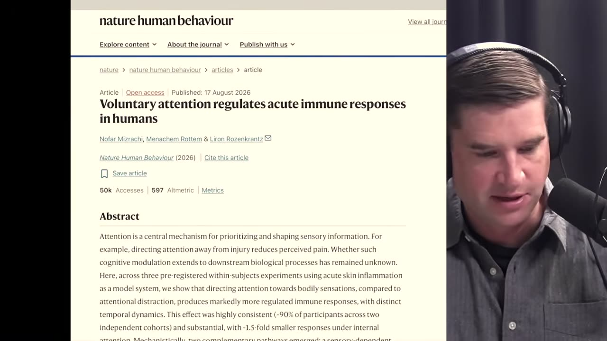
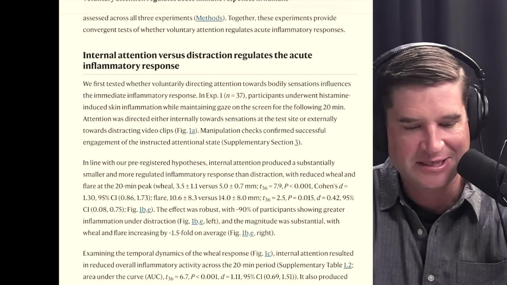

logseq-entity:: [[Logseq/Entity/Podcast/Episode]], [[Logseq/Entity/YouTube]]
created-by:: [[Person/Cal Newport]]
date-created:: 2026-08-31
logseq-created-time-year:: [[20/2/6]]

- # [Rethinking the Deep Life Stack (Again!) | Monday Advice](https://www.thedeeplife.com/podcasts/episodes/rethinking-the-deep-life-stack-again-monday-advice-2/)
	- An episode of [[Person/Cal Newport/Pod]], with Jesse Miller. On YouTube it is titled "How to Reinvent Your Life in 2026".
	- ## Overview
		- Cal Newport revisits the [[Person/Cal Newport/Deep Life/Stack]] he introduced in June 2023 and revised in November 2023, and replaces it with the Deep Life Map: three territories, Capability, Values and Vision, that you move among. He then walks through the chapter order of his book on the deep life, due in March.
		- Listener segments follow: too many interests and not enough time, a Nature Human Behaviour study on attention and inflammation, and a freelance musician who dislikes social media.
	- ## Sources
		- [Deep Questions episode page](https://www.thedeeplife.com/podcasts/episodes/rethinking-the-deep-life-stack-again-monday-advice-2/)
		- [YouTube recording](https://www.youtube.com/watch?v=xGkLUcwkEyo)
		- [Snipd episode](https://share.snipd.com/episode/a5ad5527-5a1b-446b-86fa-fcb0036e261e)
		- Transcript excerpts are Snipd's machine transcription, with a few misheard names corrected. Times are video seconds.
	- ## Video
		- {{video https://www.youtube.com/watch?v=xGkLUcwkEyo}}
			- ### The Deep Life Map
				- The map {{youtube-timestamp 1005}} replaces the stack. It has three territories, and you move among them in whatever order your situation needs.
					- **Capability** {{youtube-timestamp 1052}}: discipline, time management, and contemplation, meaning control of your mind and the ability to put your attention on targets you chose.
					- **Values** {{youtube-timestamp 1073}}: work out what matters to you and why, and keep rituals that reinforce it.
					- **Vision** {{youtube-timestamp 1083}}: a specific description of your ideal lifestyle, plus your plan for moving closer to it.
					- On the whiteboard, dotted arrows run from Capability to Vision and from Values to Vision. No arrow joins Capability and Values. Being more capable makes you better at carrying out the vision, and understanding your values shapes what goes into it {{youtube-timestamp 1098}}.
				- Where to start {{youtube-timestamp 1124}}
					- Start in the territory you lack.
						- Someone who does not have their act together starts in Capability, possibly for a year or more.
						- Someone organized and successful who does not know what it is for starts in Values {{youtube-timestamp 1153}}. Cal's example is a person in private equity making a lot of money; the work might be a philosophical system or returning to religion.
						- Someone with both in place goes to Vision, to define the lifestyle they want and the concrete practices and projects that move them toward it.
					- Expect to go back and forth {{youtube-timestamp 1178}}. When the vision feels disconnected, return to Values and update the vision. When a more ambitious vision runs into walls, return to Capability.
					- How long you spend in each territory depends on your circumstances. Each territory holds a collection of related topics rather than a fixed sequence; you choose the ones that matter {{youtube-timestamp 1212}}.
				- Find the missing territory {{youtube-timestamp 1249}}
					- When someone wants more from life, they are usually missing a whole territory, not a detailed checklist inside one.
					- Missing Vision is the most common problem {{youtube-timestamp 1258}}: betting that one big enough change will fix everything (a job, an award, fame, moving to the woods) instead of moving systematically toward a tested vision of the whole lifestyle. How you feel day to day comes from every part of your lifestyle, not from one change.
					- Missing Capability {{youtube-timestamp 1301}}: procrastinating, not managing obligations and time, too busy, or not busy but unable to get off the couch.
					- Missing Values {{youtube-timestamp 1324}}: no tested core, whether transcendent or intellectually rigorous, to supply motivation, aim you at things, and steer you around traps.
				- Process, not content {{youtube-timestamp 1359}}: the map does not say what your work, relationships, or spiritual life should be. It is a method for discovering that and acting on it.
				- The order to work in, from the chapter order of Cal's book {{youtube-timestamp 1451}}. The book comes out in March and is subtitled *A Structured Approach* {{youtube-timestamp 2145}}. It does not use the map metaphor {{youtube-timestamp 1394}}.
					- Lifestyle-centric planning, set against the "phase shift" model where one major change fixes everything {{youtube-timestamp 1478}}.
					  logseq.order-list-type:: number
					- Action-based insight: a notebook practice for building up, systematically, what actually matters to you {{youtube-timestamp 1506}}.
					  logseq.order-list-type:: number
					- An ideal lifestyle vision built from that insight, organized in buckets {{youtube-timestamp 1523}}.
					  logseq.order-list-type:: number
					- A plan for moving toward the vision: which changes to make, and practices and projects tied into daily and weekly planning {{youtube-timestamp 1541}}.
					  logseq.order-list-type:: number
					- A crash course in Capability, in three parts: controlling your time, discipline, and controlling your mind {{youtube-timestamp 1580}}. His goal: "I want you in a few months to be a capable human being."
					  logseq.order-list-type:: number
					- Values, placed last so it does not distract, then built into how you track the plan {{youtube-timestamp 1604}}.
					  logseq.order-list-type:: number
					- Vision takes three chapters, Capability one chapter in three parts, and Values one chapter {{youtube-timestamp 1679}}.
				- Why the stack was replaced
					- v1.0 (June 2023) {{youtube-timestamp 236}}: Discipline, Values, Calm, Plan, from bottom to top. Plan held lifestyle-centric planning; the layers beneath it were the work needed before a plan could succeed. Cal says "five layers" but names and draws four.
					- Over the summer of 2023, becoming more capable and planning each turned out to be more complicated than one layer {{youtube-timestamp 379}}, so v2.0 (November 2023) split it into two stacks worked in order {{youtube-timestamp 439}}:
						- Capability, bottom to top: Discipline, Control (which replaced Calm), Craft (career capital and deep work), Simplification (breathing room in the schedule and energy in reserve).
						- Transformation, bottom to top: Values, Service (serving other people), Transformation (making changes toward the ideal lifestyle), Legacy (one or two remarkable things people remember you by) {{youtube-timestamp 529}}.
					- What was wrong with v2.0 {{youtube-timestamp 647}}: two stacks of four items to work through in sequence was too complicated, and it did not allow for how different people's situations are. It also mixed content with process {{youtube-timestamp 672}}: Service, Legacy, career capital and deep work are things to have in a life, not a method for changing one.
			- ### {{youtube-timestamp 0}} Rethinking the Deep Life stack
				- {{youtube-timestamp 29}}
					- [[Person/Cal Newport]]
						- > I write a lot about the dangers of digital distractions and I came to realize that really the most effective strategy for putting down your screens is to make your analog life more interesting than your digital. ([Readwise](https://read.readwise.io/read/01m3vevw5qath2cgcq3xy9m4dw))
				- #### {{youtube-timestamp 214}} Why One Big Change Cannot Fix Your Life
					- Snipd: https://share.snipd.com/snip/49611710-1630-45e2-b12d-2482d497a222
					- The original Deep Life Stack treated discipline, values, calm, and planning as sequential layers for rebuilding a shallow or aimless life.
					- Its central premise was lifestyle-centric planning: improving an entire lifestyle works better than expecting one dramatic change to fix everything.
					- Transcript
					  collapsed:: true
						- [[Person/Cal Newport]]
							- {{youtube-timestamp 213}} All right, so I want to start with the original Deep Life Stack version 1.0. I'll walk you through it and explain what I had in mind, and then I'll explain what the issue was. We'll get to two, and then we'll get to my new idea. All right, so I'm going to actually, God help us all, Jesse, but I'm going to draw this on the screen.
							- {{youtube-timestamp 231}} So for those who are watching, you can see this. All right, so the Deep Life Stack, the first one was a collection of five layers that stacked on top of each other. All right. So the first layer, and I'll write this on here with my beautiful handwriting.
							- {{youtube-timestamp 247}} So we have this first layer of discipline. Above it was values. Let me write that on here. Above that calm. I actually had forgotten exactly what was on this stack from so long ago, Jesse.
							- {{youtube-timestamp 263}} So it was interesting to go back. And above that was plan. I'm going to make each of these within a nice box because we saw this as a stack. All right. So at the bottom of the stack, we had discipline. On top of that was values. On top of that was calm.
							- {{youtube-timestamp 279}} And on top of that was plan. And so the basic idea was up here where it says plan, that's the way we had been talking about the deep life up to that point. This is where you had a description of your ideal lifestyle broken into buckets to make sure that you're capturing a totality, a vision of your whole lifestyle.
							- {{youtube-timestamp 299}} This is my concept of lifestyle-centric planning, which had been in this show since its first episodes in 2020. This idea that one radical change is not going to fix everything. If you want a better life, you have to fix your lifestyle. All the aspects of your life to on a regular basis yield you better results as opposed to hoping one change fixes.
							- {{youtube-timestamp 318}} That's all we've been talking about before the Deep Life stack came along. And that was all in this new, in the Deep Life stack was all captured at the top in plan. The big insight of the stack is, oh, there's a lot of other work that's necessary before you're going to succeed in figuring out what should go into your plan or actually succeed in executing It.
							- {{youtube-timestamp 333}} And so the way I talked about it in June of 2023 is, let's start by actually just getting your discipline higher, make you into someone who feels like you're capable of doing hard things That are optional. Then I said, let's get your value straight because how are you going to really figure out what you want in your life if you don't know what you care about?
							- {{youtube-timestamp 350}} Calm was my term I used to capture everything you might think about as like time management or organization, right? How do you actually get control of your schedule and obligations? Because if you can't keep your arms around all you have to do, then you're not going to get things done you want to. And then the plan was on top of it.
							- {{youtube-timestamp 365}} All right. So that was the idea of the original Deep Life Stack is that, hey, we forgot all of this part. But that is a key part when you actually want to change your life.
				- #### {{youtube-timestamp 216}} Lifestyle Planning Requires More Than One Radical Change
					- Snipd: https://share.snipd.com/snip/029aabbc-c592-4418-9b04-ef29867025d0
					- Cal Newport argues that improving life requires fixing the entire lifestyle, not relying on one transformative change.
					- Lifestyle-centric planning breaks an ideal life into buckets to capture the whole vision and produce better ongoing results.
					- Transcript
					  collapsed:: true
						- [[Person/Cal Newport]]
							- {{youtube-timestamp 217}} I'll walk you through it and explain what I had in mind, and then I'll explain what the issue was. We'll get to two, and then we'll get to my new idea. All right, so I'm going to actually, God help us all, Jesse, but I'm going to draw this on the screen. So for those who are watching, you can see this.
							- {{youtube-timestamp 233}} All right, so the Deep Life Stack, the first one was a collection of five layers that stacked on top of each other. All right. So the first layer, and I'll write this on here with my beautiful handwriting. So we have this first layer of discipline.
							- {{youtube-timestamp 250}} Above it was values. Let me write that on here. Above that calm. I actually had forgotten exactly what was on this stack from so long ago, Jesse. So it was interesting to go back. And above that was plan.
							- {{youtube-timestamp 266}} I'm going to make each of these within a nice box because we saw this as a stack. All right. So at the bottom of the stack, we had discipline. On top of that was values. On top of that was calm. And on top of that was plan.
							- {{youtube-timestamp 281}} And so the basic idea was up here where it says plan, that's the way we had been talking about the deep life up to that point. This is where you had a description of your ideal lifestyle broken into buckets to make sure that you're capturing a totality, a vision of your whole lifestyle.
				- #### {{youtube-timestamp 290}} The Deep Life Requires More Than A Plan
					- Snipd: https://share.snipd.com/snip/74499378-2d7f-465c-9fd3-49d796a3db48
					- A fulfilling life requires discipline, clear values, and calm before planning can produce meaningful change.
					- Newport says lifestyle improvements come from managing every aspect of life, not hoping one radical change fixes everything.
					- Transcript
					  collapsed:: true
						- [[Person/Cal Newport]]
							- {{youtube-timestamp 290}} This is where you had a description of your ideal lifestyle broken into buckets to make sure that you're capturing a totality, a vision of your whole lifestyle. This is my concept of lifestyle-centric planning, which had been in this show since its first episodes in 2020. This idea that one radical change is not going to fix everything.
							- {{youtube-timestamp 307}} If you want a better life, you have to fix your lifestyle. All the aspects of your life to on a regular basis yield you better results as opposed to hoping one change fixes. That's all we've been talking about before the Deep Life stack came along. And that was all in this new, in the Deep Life stack was all captured at the top in plan.
							- {{youtube-timestamp 325}} The big insight of the stack is, oh, there's a lot of other work that's necessary before you're going to succeed in figuring out what should go into your plan or actually succeed in executing It. And so the way I talked about it in June of 2023 is, let's start by actually just getting your discipline higher, make you into someone who feels like you're capable of doing hard things That are optional.
							- {{youtube-timestamp 344}} Then I said, let's get your value straight because how are you going to really figure out what you want in your life if you don't know what you care about? Calm was my term I used to capture everything you might think about as like time management or organization, right? How do you actually get control of your schedule and obligations?
							- {{youtube-timestamp 359}} Because if you can't keep your arms around all you have to do, then you're not going to get things done you want to. And then the plan was on top of it. All right. So that was the idea of the original Deep Life Stack is that, hey, we forgot all of this part. But that is a key part when you actually want to change your life.
				- {{youtube-timestamp 360}}
					- 
						- Whiteboard: four blue boxes stacked vertically. Top to bottom: **Plan**, **Calm**, **Values**, **Discipline**.
						- Four layers are drawn and named. The spoken intro at {{youtube-timestamp 236}} calls it "a collection of five layers".
						- How the board was built: at 4:00 only "Discipline" is written. By 4:30 all four boxes are up and "Plan" is circled in yellow. At about 5:30 a yellow tick marks "Values".
				- #### {{youtube-timestamp 378}} The Deep Life Stack Became Too Complicated
					- Snipd: https://share.snipd.com/snip/82fb9529-2d2c-42da-926c-8f44162df610
					- Stack 2.0 became too complicated by separating capability from transformation and adding concepts such as craft, service, transformation, and legacy.
					- Cal realized it confused process with content by implying that service or a remarkable legacy belonged in everyone’s deep life.
					- Transcript
					  collapsed:: true
						- [[Person/Cal Newport]]
							- {{youtube-timestamp 379}} All right. So what was the problem? What was the problem with that way of thinking about constructing your life? Well, as the summer went on, I realized, oh, there's two separate things here. There's this becoming more capable piece.
							- {{youtube-timestamp 396}} And that's actually really more complicated I was giving it credit. And then the planning is more complicated than just like, okay, now figure out your life. And so as I began to think more about it, I split the stack into two, right?
							- {{youtube-timestamp 413}} Let's have a separate stack for capability versus a separate stack for how you actually then like make the transformations once you're ready all right this one's complicated but let's Go back to the screen here and i'll show you what i had in mind all right so for this for this next one for version 2.0 this is where things got complicated over, we had the first stack, which I called phase one stack, the one you would navigate first.
							- {{youtube-timestamp 442}} Discipline at the bottom. Then I had control. I'll explain each of these in a second. On top of that, I had craft. And on top of that, I had simplification. Simplification.
							- {{youtube-timestamp 458}} All right. So this was stack one. Let me put boxes around all this. All right. I said you start here, stage one. You navigate this stack to get capable, get ready for actually making major changes in your life. All right. So I said you want to start there.
							- {{youtube-timestamp 474}} Discipline, you would start with discipline like we said before. This is where just you get used to the idea of doing hard things that are optional. And then control took the place of what I used to call calm. I was like, now you want to get control of your obligations and time. And then I was like, maybe I really want to integrate in here my thoughts about career capital, deep work, like how do you actually work in a way that's going to be effective?
							- {{youtube-timestamp 492}} How do you build useful things with your mind, right? That this would be useful just to have that tool in your toolbox before you try to make big transformations. And then I had the simplification piece on here, simplifying your life so you don't have too much going on. So you have breathing room in your schedule and you have reserves in your energy to actually pursue changes.
							- {{youtube-timestamp 509}} And so I called that whole thing stage one. And you would work your way through that stack. And when you were done with that, you would move over to a second stack. And this is a stack that was dedicated to actually transforming your life.
							- {{youtube-timestamp 524}} And this got more complicated. I'm going to write the things here and then we'll go through them each. I had values at the bottom, then service. And again, this is from November, 2023. Then I had a word that's not going to fit.
							- {{youtube-timestamp 541}} Look at that. Transformation. Jeez. So we can already see the problem I had with this is these words were too big. You're really good at navigating the Notability, though. Well, I teach with it. All right. Transformation. And then legacy.
							- {{youtube-timestamp 557}} All right. So let's go through those, right? So we had, and this is, man, things got complicated. All right. Values was at the bottom of the second stack. Man, it's getting complicated, Jesse. Now you can see the problem why I'm simplifying. I'm going to have 3.0. On the second stack, the first layer was values, right?
							- {{youtube-timestamp 574}} So figure out first and foremost, when you're trying to transform your life, what actually matters to you. Then introduce service. I was on a kick then like that. You have to be serving other people in any notion of a deep life. Transformation is where you would actually start making changes to your life to move it closer to an ideal lifestyle.
							- {{youtube-timestamp 592}} And then legacy was, okay, after you're able to do that, you choose one area or one or two places to really make a move to do something remarkable, something that people are going to remember You by. Because I felt like that would be – that's a common piece when you hear stories about lives that are deep.
							- {{youtube-timestamp 608}} It's like they did this thing that was like really remarkable. Can you believe this person did it? All right. So this was the Deep Life Stack 2.0. You had to first navigate this capability stack that had a lot of pieces. And then you could navigate this transformation stack, which itself had a lot of pieces, and somehow this would all come together.
							- {{youtube-timestamp 625}} And that's really what you needed to create a deep life. All right. So the problem with that, clearly this is someone who's in the early stages of working on a book or I have all of these ideas on brainstorming that seem relevant to the task at hand of cultivating A deep life, and I put them all into this vision.
							- {{youtube-timestamp 644}} The problem is it's too complicated. That's problem number one, right? It's too complicated. Two different stacks you have to execute sequentially, each of which has four different items in it. This is getting too cute, right? This is getting too like in the weeds, not acknowledging the variety that we might have of different people, you know, their experience and what they're trying to do.
							- {{youtube-timestamp 667}} It felt like I was getting too in the weeds. And if we bring this back up again, Jesse, I'll show you a couple other problems. I was mixing in specificity with technique. And in general, my approach to the deep life and the whole idea of the book I have coming out is I'm not going to tell you what should be in your life to make it deep.
							- {{youtube-timestamp 682}} I don't know that. I'm going to give you a method for how do people successfully transform their lives. Well, the deep life stack 2.0, I mixed those up. Like, look at this service. That's not a general component, a general strategy to successfully transform your life. It's a specific thing I'm saying you should have in your life to be deep.
							- {{youtube-timestamp 699}} So I was violating that process versus content barrier that I actually thought was important for talking about it. Legacy. I was on a kick back then that said, hey, deep lives should have some remarkable piece to it, something you do that really reflected your values in a way that people would literally remark About.
							- {{youtube-timestamp 716}} But that's not necessarily necessary. I came across many examples of deep lives. You don't need that. Right. So that was getting, again, I think it was getting too specific, less process, more content, which I thought was an issue. And same thing over on the capability, you know, career capital, deep work, maybe, maybe that's relevant.
							- {{youtube-timestamp 736}} Maybe it's not, you know, I, so it just like it was too complicated and I was mixing too much content with process.
				- {{youtube-timestamp 480}}
					- 
						- One column of four blue boxes. Top to bottom: **Simplification**, **Craft**, **Control**, **Discipline**.
						- The board has no title. Cal calls this the "phase one stack" and later the capability stack.
				- {{youtube-timestamp 600}}
					- 
						- Two columns of four blue boxes, with no titles and no arrows between them.
						- Left column, top to bottom: **Simplification**, **Craft**, **Control**, **Discipline**.
						- Right column, top to bottom: **Legacy**, **Transformation**, **Service**, **Values**. "Transformation" runs past the right edge of its box.
						- The left stack is worked through first, then the right. This board stays up until about 12:00 while Cal lists what was wrong with v2.0.
				- #### {{youtube-timestamp 965}} The Deep Life Map Replaces Rigid Life Stacks
					- Snipd: https://share.snipd.com/snip/f429b9a2-79be-4e46-9598-cbf217ee35e0
					- Cal replaced the stack with a map containing capability, values, and vision territories that people navigate in different orders.
					- Progress is circuitous: ambitious visions can expose capability gaps, while improved values can require revising the vision.
					- Transcript
					  collapsed:: true
						- [[Person/Cal Newport]]
							- {{youtube-timestamp 965}} All right, so now two and a half years later, can we do better? So how do I think about the deep life stack today after I've finished a whole book about it? All right, so here's how my thinking has evolved.
							- {{youtube-timestamp 980}} I have moved away from a stack, disappointment to all my computer science friends who deal with stack data structures. And I imagine if we're going to have a core diagram of a tool for transforming your life, I imagine it now more like a map that you navigate.
							- {{youtube-timestamp 1001}} So we're going from the deep life stack to a deep life map. All right? And this metaphor is going to make sense in a second. So what is on this map? There's three different territories, right? This is the way I think about it.
							- {{youtube-timestamp 1018}} So over here, we'll have the territory related to capability. Over here, we'll have a territory related to values. And over here up top, I'm going to have a territory related to vision.
							- {{youtube-timestamp 1037}} I'll kind'll draw these. These are territories. Okay. These are three different territories that are relevant to transforming your life into something deep. The capability territory is where you get things like discipline.
							- {{youtube-timestamp 1056}} It's where you get things like time management. It's where you get things like contemplation. How do you actually control your mind, focus on things, put your mind's eye on targets that you have chosen, whether they're internal or external. The becoming a more capable human being that is sort of a theme through a lot of my thinking about the deep life.
							- {{youtube-timestamp 1071}} I see that now as like its own territory. There's a separate territory for values where you figure out what's important to you and have rituals in your life to reinforce that, right? So this is where you're making sure that you understand what matters to you and why. And vision is what captures all the specific description of what your ideal lifestyle is plus your plan for how to move closer to it.
							- {{youtube-timestamp 1092}} Now, if we go back to this diagram here for a second, Jesse, the way I see it is capability helps you with your vision. The more capable you are, the more successful you'll be implementing your vision. Values also feeds in to your vision.
							- {{youtube-timestamp 1108}} The better you understand your values, the more they'll be reflecting what you decide to put into your vision as well. And the reason why I call this a map is what I came to understand is that you're going to wander through these territories. And depending on where you are, that journey might look a little bit different.
							- {{youtube-timestamp 1124}} Some people really don't have their act together. So any sort of attempt to make major changes to their life is going to fizzle. So really, they're going to start in this capability territory, and they're going to spend maybe a lot of time in there. I mean, I think for some people, this could be a year plus of just sort of getting your act together before maybe then they'll wander over the vision.
							- {{youtube-timestamp 1143}} Other people, they're like, I don't know what I'm all about. I got my act together. I'm doing really well. I'm organized. I get after it, but I don't know why I'm whatever. I'm in private equity, making a lot of money and don't know what to do with it. So you're like, I got to really get my values together.
							- {{youtube-timestamp 1158}} And maybe that's going to mean some sort of philosophical system or reintegrating religion into your life. And that could be a territory you're going to journey in for a while. For other people, that's all in place. They're like, great, let me just get to this vision territories where I need to spend some time and figure out. So what do I want my life to look at?
							- {{youtube-timestamp 1173}} And what are my concrete practices and projects for getting closer to that? Right. The key thing is there's a lot of moving back and forth. It's the other thing I came to understand is maybe you spend some time here. You go up here. You're in this land for a while. You're making some changes. It feels a little bit disconnected. So you wander down here.
							- {{youtube-timestamp 1188}} Spend some more time with my values. Updates those visions. Kind of going fine. As your vision gets more ambitious, you're hitting up against some walls. Now you go and spend some more time back in capability. Then you come back to it. It's a circuitous journey, right, that you might move back and forth between these things. And the amount of time you spend in each of these things will depend on your particular circumstances.
							- {{youtube-timestamp 1206}} And I don't have necessarily this sort of like very clear stack in each of these either. I have like a collection of related topics for some of these. And then you can decide which of those are important or not.
				- #### {{youtube-timestamp 1040}} The Deep Life Is a Map Through Three Territories
					- Snipd: https://share.snipd.com/snip/e4f40e29-28e2-4c39-92d2-91f9596ad46c
					- Cal Newport replaces his rigid Deep Life Stack with a map of capability, values, and vision.
					- Capability and values feed vision, while people may begin by spending a year getting their act together.
					- Transcript
					  collapsed:: true
						- [[Person/Cal Newport]]
							- {{youtube-timestamp 1040}} These are territories. Okay. These are three different territories that are relevant to transforming your life into something deep. The capability territory is where you get things like discipline.
							- {{youtube-timestamp 1056}} It's where you get things like time management. It's where you get things like contemplation. How do you actually control your mind, focus on things, put your mind's eye on targets that you have chosen, whether they're internal or external. The becoming a more capable human being that is sort of a theme through a lot of my thinking about the deep life.
							- {{youtube-timestamp 1071}} I see that now as like its own territory. There's a separate territory for values where you figure out what's important to you and have rituals in your life to reinforce that, right? So this is where you're making sure that you understand what matters to you and why. And vision is what captures all the specific description of what your ideal lifestyle is plus your plan for how to move closer to it.
							- {{youtube-timestamp 1092}} Now, if we go back to this diagram here for a second, Jesse, the way I see it is capability helps you with your vision. The more capable you are, the more successful you'll be implementing your vision. Values also feeds in to your vision.
							- {{youtube-timestamp 1108}} The better you understand your values, the more they'll be reflecting what you decide to put into your vision as well. And the reason why I call this a map is what I came to understand is that you're going to wander through these territories. And depending on where you are, that journey might look a little bit different.
							- {{youtube-timestamp 1124}} Some people really don't have their act together.
				- {{youtube-timestamp 1140}}
					- 
						- Three green hand-drawn regions with grey labels: **Vision** at the top, **Capability** at lower left, **Values** at lower right. The webcam inset hides the right edge of Values.
						- Red dotted arrows run from Capability to Vision and from Values to Vision, with the arrowheads at Vision. No arrow joins Capability and Values.
						- How the board was built: at 17:30 the three words are written with no outlines. By 18:30 the regions are outlined. The arrows are in place by 19:00.
				- #### {{youtube-timestamp 1167}} The Deep Life Requires A Flexible Map
					- Snipd: https://share.snipd.com/snip/8fd9edc3-af18-4efd-af1a-576e5ab58740
					- Cal Newport’s deep life map links capability, values, and vision, with people moving among them as circumstances and ambitions change.
					- Problems often arise when someone lacks a territory, especially vision, and expects one dramatic change to fix everything.
					- Transcript
					  collapsed:: true
						- [[Person/Cal Newport]]
							- {{youtube-timestamp 1167}} They're like, great, let me just get to this vision territories where I need to spend some time and figure out. So what do I want my life to look at? And what are my concrete practices and projects for getting closer to that? Right. The key thing is there's a lot of moving back and forth. It's the other thing I came to understand is maybe you spend some time here.
							- {{youtube-timestamp 1182}} You go up here. You're in this land for a while. You're making some changes. It feels a little bit disconnected. So you wander down here. Spend some more time with my values. Updates those visions. Kind of going fine. As your vision gets more ambitious, you're hitting up against some walls. Now you go and spend some more time back in capability. Then you come back to it.
							- {{youtube-timestamp 1198}} It's a circuitous journey, right, that you might move back and forth between these things. And the amount of time you spend in each of these things will depend on your particular circumstances. And I don't have necessarily this sort of like very clear stack in each of these either. I have like a collection of related topics for some of these.
							- {{youtube-timestamp 1214}} And then you can decide which of those are important or not. So this is probably how, this is how I would think about the deep life today. Now I'll tell you the book I wrote that's coming out in March actually has an incredibly detailed kind of vision game plan for how to navigate these territories in like a very systematic Way.
							- {{youtube-timestamp 1231}} But at this point, I think the main idea is these are the components that go into a deep life. And almost always where you have problems, where someone wants something more, they're on the screen all day because their life outside their screen is lacking and they want that life outside of their screen to be better.
							- {{youtube-timestamp 1246}} Almost always when you find someone who wants something more, they're lacking some of these territories on their conceptual map. Right? And we see this all the time.
				- {{youtube-timestamp 1170}}
					- 
						- The same map, with a yellow highlighter stroke running from inside Capability up into Vision while Cal describes moving back and forth between territories.
				- #### {{youtube-timestamp 1237}} Diagnose Your Missing Deep Life Territory
					- Snipd: https://share.snipd.com/snip/19cf46d9-06d4-4a22-b502-521d247f605b
					- Diagnose which Deep Life Map territory is missing instead of searching for one life-changing intervention.
					- Build capability, clarify values, and create a comprehensive lifestyle vision with concrete practices and projects.
					- Transcript
					  collapsed:: true
						- [[Person/Cal Newport]]
							- {{youtube-timestamp 1236}} And almost always where you have problems, where someone wants something more, they're on the screen all day because their life outside their screen is lacking and they want that life outside of their screen to be better. Almost always when you find someone who wants something more, they're lacking some of these territories on their conceptual map.
							- {{youtube-timestamp 1253}} Right? And we see this all the time. I often see people who are not doing the vision thing right. That's probably the biggest issue people have. Instead of having a tested vision of an ideal lifestyle they're systematically moving towards, they subscribe to the idea of if I just make one big enough, impressive, attention-catching Enough change, everything will be better.
							- {{youtube-timestamp 1273}} So that's often a trap people have. If I could just get this job, if I could just win this award, if I could just be famous, if I could just do this one thing that's really big, if I could move to the woods, everything will fall In place. So they're lacking the vision area.
							- {{youtube-timestamp 1290}} No, no, no. You need to understand your whole lifestyle because your day-to subjective state is determined by all the aspects of your lifestyle, not the consequence of one major change. Some people are really good at the vision thing, but the capability thing is lacking. And it's like, I don't know. I'm running around.
							- {{youtube-timestamp 1306}} I procrastinate. I don't manage my obligations in time well. I never have time to get anything done. I'm too busy. I'm not busy at all, but I can't get off the couch. I'm just playing video games, right? And so when you miss out this, nothing really happens. And then this, we don't talk about values as much, but we should.
							- {{youtube-timestamp 1322}} Having some sort of tested core, either transcendent or intellectually rigorous that you use to understand what's important to you and how you want to direct your life makes everything Else much easier. It gives you the motivation for it and helps you aim towards things and around traps. So usually where there's an issue, it's they're missing one of these areas, not that they don't have the exact detailed list for what to do in each of these areas.
							- {{youtube-timestamp 1343}} So I think the deep life map is a better way of thinking about shifting towards a deep life than these increasingly complicated deep life stacks. And a key thing about this, and this is a key thing in the way I think about this in my book, is that none of this is prescriptive of content.
							- {{youtube-timestamp 1360}} None of this is telling you this is what should be in your life. You need to make sure that you have a mix of this, this, and this. Your work should be like this. Your relationships should be like this. This should be like your spiritual life. That's for you to discover. Okay, how do you discover it and how do you actually make actions?
							- {{youtube-timestamp 1375}} And I think something like this map gives us a better way of thinking about how you actually move towards a deeper life.
				- #### {{youtube-timestamp 1478}} Build A Deep Life Through Sequential Planning
					- Snipd: https://share.snipd.com/snip/e909ea89-d997-4e3d-9da6-56ab7dc3dd25
					- Start with lifestyle-centric planning, systematically discover what matters, turn it into an ideal lifestyle vision, and then create a concrete plan.
					- Strengthen capability through time control, discipline, and mind control, then integrate a tested values framework.
					- Transcript
					  collapsed:: true
						- [[Person/Cal Newport]]
							- {{youtube-timestamp 1478}} And the way it goes now, as I open the book, I believe the first chapter is explaining this idea of lifestyle-centric planning, which is at the core of how I think about transforming your Life. And we've been talking this way since 2020 and about how this sort of phase shift model of like one major change will fix everything, why that doesn't work and why fixing the lifestyle And working backwards from that is what's going to work. So we sort of set the stage.
							- {{youtube-timestamp 1495}} Then I get really detailed about how do you figure out what you're actually looking for in your life right that would go into the vision part of the map here but i get into a uh i call it action-based Insight and i actually get into like specifically here's the notebook you have here's what you're writing down here's what you're going to go do like you're going to build out insight Systematically about what actually matters to you in your life.
							- {{youtube-timestamp 1519}} Then in the next chapter, we transform that into a lifestyle vision, ideal lifestyle vision. What goes into it? What format? What do we mean by buckets? What do you actually have in it? How do you build an actual useful, comprehensive, ideal lifestyle vision?
							- {{youtube-timestamp 1537}} Then get into the next chapter is, okay, now that you have that vision, how do you construct your plan for how you're going to move your life closer to it? That's like where we really get into the weeds of the fun stuff, where you figure out like actual decisions to make and strategies to follow. What changes should I do or not? How do I assess some different types of changes to think about?
							- {{youtube-timestamp 1554}} And so it's then how do you make that plan? So like those first four chapters are just bringing you through step by step to where you're finally going to end up with a insight driven vision of your ideal lifestyle with a concrete Plan for starting to make progress towards it.
							- {{youtube-timestamp 1573}} Of this map. So with that all established, because I want to just get right into it. Like, here's the core idea. Let's build this thing out. And like, that's kind of the core of the book. Then comes capability. I was like, okay, now that we know all that, I'm going to go over a crash course for becoming a more capable human being.
							- {{youtube-timestamp 1588}} If you're already super capable, maybe you only need parts of this. If you're a mess, spend time because I break it into three different things to look at and get it very concrete. Like here's how to crash course. I want you in a few months to be a capable human being. And then after that is the what about God chapter, the values chapter, the values region.
							- {{youtube-timestamp 1607}} Like okay, but what about values? Let's add that okay, this is why this would be very important. Let's now update the way that we're keeping track of this to explicitly integrate values and here's how to think about then why it's important. So it's like the idea, here's my approach versus other approaches one two three three three chapters of just implementing it like let's get right into it you end up with a plan and a vision And then stepping back and saying okay if you need the brush up on just being organized and disciplined and being able to control your mind.
							- {{youtube-timestamp 1638}} Cal Newport in the weeds, just advice, advice, advice, advice. What about values? Let's put that at the very end because I don't want to distract you with that, but this is at the end, you're going to want to integrate this in to really make this full.
				- #### {{youtube-timestamp 1754}} How To Build A Lifestyle You Actually Want
					- Snipd: https://share.snipd.com/snip/190a04f2-fd26-4642-9228-9eb50aa0346c
					- Cal Newport argues that advice books often prescribe ideal ingredients without explaining how to discover and describe the lifestyle you want.
					- His forthcoming planning section turns that vision into practices and projects integrated into daily and weekly planning.
					- Transcript
					  collapsed:: true
						- [[Person/Cal Newport]]
							- {{youtube-timestamp 1753}} Core idea number one. Core idea number two, you need a deep life you make all the other stuff i talk about make sense like those will probably be like two core ideas right like why am i writing about the deep life Because all the other stuff technology criticism and i do none of it's going to work or it all works much better if you can also make an analog life that's so interesting that you don't Want to look at tiktok all day right idea number two lifestyle-centric planning versus the phase shift is way to do it.
							- {{youtube-timestamp 1779}} All right, so then how do we execute that? I think, yeah, I'll come back to these three things. You have to be capable of human. You need some sort of foundation of values. And visioning is an art. The book is like it's not obvious how to build a vision of your lifestyle and a plan to get there. We always just sort of skip that part.
							- {{youtube-timestamp 1794}} Like, hey, here's the things. I don't know. I think so many of these books are like here are the five things you need in your life. And I'm going to talk about scientific studies for each. And studies show that if you have like six good friends versus three, that you'll get 1.7 extra years on your average longevity.
							- {{youtube-timestamp 1810}} And, you know, social psych research on motivational centers show that if your work has these aspects, then you're going to enjoy it more than that. So make sure that your work has this or that. And no one ever gets into the mechanics of like, but how do you figure out what you want? What does that mean? What's like a good description of what you want?
							- {{youtube-timestamp 1826}} I wrote a whole book that said, don't just follow your passion's bad idea. So what should you be aiming for? What is a lifestyle? What goes into that? Why is that better than just making like one-off changes? Why are you going to end up happier that way? How do you actually describe it? How do you make a plan?
				- {{youtube-timestamp 1920}}
					- 
						- The map from 19:00, scaled down so all of Values is visible: Vision at the top, Capability at lower left, Values at lower right, arrows from Capability and from Values into Vision. The thin red vertical line at the right is the edge of the board.
				- #### {{youtube-timestamp 1951}} Cal Newport’s Model For A Thinking Book
					- Snipd: https://share.snipd.com/snip/4ccfd533-5b49-4488-aaa9-8a2a71e335b3
					- Cal Newport wants to connect a philosophical case for cognitive fitness with practical ways to strengthen thinking.
					- He models the approach on [[Person/Michael Pollan]]’s *In Defense of Food*, which pairs cultural critique with simple guidance like eating mostly plants.
					- Transcript
					  collapsed:: true
						- Jesse Miller
							- {{youtube-timestamp 1950}} Like the thinking book, is it going to be structured or is it more open-ended? In defense of thinking? Yeah. What do you think? I mean, I'm still in the stage now. Actually, there's so many times that people ask you questions and I ask you questions, I don't know. What do I think? I would assume it's going to be structured.
							- {{youtube-timestamp 1967}} Yeah. But I don't know how. It seems to be like, well, I guess a life is a pretty good thing.
						- [[Person/Cal Newport]]
							- {{youtube-timestamp 1970}} I think it's going to be practical and philosophical. So I haven't quite figured that out yet. It'll probably be closer. So for those who don't know about my, it's not a book I've sold yet. I'm just saying my idea for the book I want to write next is on cognitive fitness. I want to call it In Defense of Thinking. I basically expand in detail the general argument I made in that splashy New York times piece from last winter.
							- {{youtube-timestamp 1992}} And I want to make the case for cognitive fitness. I want to make the case for thinking. I mean, I have all these notes on this. But like what I mean by thinking and how it's at the core of like everything we value as modern humans. And that it's not something that we want to lose and it's something that we should practice and get better at like we do with our health both institutionally and individually.
							- {{youtube-timestamp 2014}} And then I guess get very practical about what that means. I mean, I really have Michael Pollan. I went back and reread In Defense of Food, you know, a few months ago because that's my model. In Defense of Food was like he's making his philosophical argument about how food culture has gone awry and why we should care about it.
							- {{youtube-timestamp 2030}} And then also got practical about how do we do that? How as an individual can we care more about food? And that was his like eat less, mostly plants.
			- ### {{youtube-timestamp 2287}} Too many interests and not enough time
				- #### {{youtube-timestamp 2290}} Use Sequentiality To Master More Skills
					- Snipd: https://share.snipd.com/snip/2b19410e-4d5c-4057-b4bb-674a37722a52
					- Choose only a small number of pursuits to master and use sequentiality to develop additional interests across different seasons.
					- Concurrently pursuing five skills creates logistical overhead and “log jams,” often slowing total progress compared with focusing deeply on one.
					- Transcript
					  collapsed:: true
						- Jesse Miller
							- {{youtube-timestamp 2290}} Our first message is from Vincent who has too many interests and not enough time. Too many interests and not enough time. All right. So let's see what Vincent said here.
						- [[Person/Cal Newport]]
							- {{youtube-timestamp 2299}} Vincent said, I have been thinking seriously about your ideas on deep work and the deliberate construction of a working life. If you had to give one principle to a technically trained person with many legitimate interests who wants to become exceptionally capable over the next decade, what would it be?
							- {{youtube-timestamp 2314}} All right, and I think Vincent like elaborated like a long list of things he was interested in. So, I mean, I'd like to go getting attitude here. You know, I'm willing to do the work. I want to get better at things. I want to have career capital. There's so much stuff I can be good at. I want to be good as much as possible. Typically my, my advice here is the do less, do better.
							- {{youtube-timestamp 2331}} You can only really be focused on a very small number of things at a time that you really want to get good at. And that's okay. Just take a small number of things you get really good at, can open up all sorts of really interesting opportunities and give you a lot of meaning in your life.
							- {{youtube-timestamp 2346}} It's not necessarily better to be good at five things versus two. That difference is minor, and maybe it's even worse to be really good at five things because they're crowding each other out in a way that's frustrating. There is, however, a giant difference between being good at zero things versus one.
							- {{youtube-timestamp 2362}} So having mastery in your life versus not makes your life much better. Having more things that you have mastery on than less doesn't necessarily make your life that much better. So I'd say that number one. Number two, you've got to leverage the power of sequentiality.
							- {{youtube-timestamp 2377}} You're focusing on this for a while, you get good at it. Then you pick up another skill that takes another few years. In the short term, that seems interminable. But over the period of like a decade, you might look back and say, actually, yeah, there's this thing I do professionally, I'm really good at. And I know a lot about jazz music.
							- {{youtube-timestamp 2393}} And I've become a pretty adept guitar player and I'm really into vintage cars. These things can add up different seasons of your life where you're having the joy of learning about something new.
							- {{youtube-timestamp 2408}} Over time, you look like one of these sort of renaissance men. Like, wow, you have all these things you do and know. You didn't sit down with a list of five. I'm going to work on all these concurrently to try to get to it one at a time. So sequentiality can also add up over time to a lot of impressive things.
							- {{youtube-timestamp 2426}} But I really don't, I guess what I'm trying to get away from here is you should not be seriously pursuing lots of things, be them personal or professional or both concurrently. It is stressful. It slows down your progress and you can log jam and log jam is this effect.
							- {{youtube-timestamp 2443}} Like I talk about slow productivity where you cannot just time doesn't scale or parallelize neatly when it comes to task. Right? So it's not just a case of I have five skills. Each of them is going to take me a year.
							- {{youtube-timestamp 2458}} I worked on it by itself to master. So I could either do one after another in five years or work on all five for five years and end up being good at all five of them. You can't necessarily rearrange time that way. When you work on too many things concurrently, you get log jams, which is where the overhead of these things adds up to the point where it's hard to actually make legitimate progress On any of them and you slow down your overall pace, right?
							- {{youtube-timestamp 2484}} So like often the best way to learn something is to have it be one of the few things that you're really focusing on. And then moving on later to the next thing, the move into the next thing, it's actually the total time to learn all those things will be less than if you try to do them all together because You want to avoid sort of log jamming effects.
				- #### {{youtube-timestamp 2502}} Two Core Skills Created Many Natural Branches
					- Snipd: https://share.snipd.com/snip/55ec8795-f81d-4286-9fe3-fd59d7c6bdff
					- Cal focused for more than two decades on computer science and writing rather than pursuing a long list of goals simultaneously.
					- His podcast and media work emerged as natural branches from those core skills, rather than separate ambitions planned from the start.
					- Transcript
					  collapsed:: true
						- [[Person/Cal Newport]]
							- {{youtube-timestamp 2503}} Do less. Do those things really well. Let things take time. Add things slowly over time. I mean, professionally, I just did a podcast interview this weekend. Well, don't figure who I really admire. I guess I don't like to announce podcast things until they actually come out but it'll be out soon um and we were talking uh it was not rogan it was someone who was um let's say a little bit More intellectually distinguished in some senses i'll just leave it at that uh and civically distinguished um but we were talking about this uh in this interview we're talking a little Bit about me and i was like yeah i decided now 20 almost 25 years ago i mean i was like a sophomore in college.
							- {{youtube-timestamp 2541}} I was like, here's the things I'm going to get good at. It's like computer science and writing. I'm still working on that. Like, those are the things I've continued to like, continue to try to get better at. And like, that's been basically it. I've been doing that for over two decades now.
							- {{youtube-timestamp 2556}} And that's great. I've gotten pretty good at it. It's caused a lot of interesting things. And you have these little offshoots when you get better at things like this podcast. The podcast is coming directly out of my writing and academic work. These are the ideas I'm reflecting to, but also to be a writer for 20 years.
							- {{youtube-timestamp 2572}} One of the things you get really good at over time is talking about your books because I've been doing radio and podcasts at a very regular clip since roughly like 2014 when this really Started taking off. I'm like 12 years into that now. And so something like this podcast sort of emerges as a natural, slowly evolving side thread of this main thrust.
							- {{youtube-timestamp 2593}} So sometimes just doing a small number of things really well, it takes a really long time. It's very rewarding and it has its own little offshoots along the way that themselves can be like very impressive but weren't something that you set out from scratch to do.
			- ### {{youtube-timestamp 2849}} Voluntary attention regulates acute immune responses in humans
				- Article: [Voluntary attention regulates acute immune responses in humans](https://www.nature.com/articles/s41562-026-02541-1)
				- {{youtube-timestamp 2880}}
					- 
						- Nature Human Behaviour, open access, published 17 August 2026: "Voluntary attention regulates acute immune responses in humans" by Nofar Mizrachi, Menachem Rottem and Liron Rozenkrantz.
						- The abstract on screen: across three pre-registered within-subjects experiments using acute skin inflammation, directing attention towards bodily sensations produced markedly more regulated immune responses than distraction. The effect held for about 90% of participants across two independent cohorts, with responses about 1.5-fold smaller under internal attention.
				- #### {{youtube-timestamp 2895}} Attention Can Regulate More Than Thought
					- Snipd: https://share.snipd.com/snip/df9fa341-f6e4-4861-abca-d1b52b8d4939
					- A study found that directing attention toward inflammation produced a smaller, more regulated immune response than watching distracting videos.
					- Cal connects this finding to cognitive fitness: attention influences bodily regulation, self-reflection, knowledge work, and anxiety.
					- Transcript
					  collapsed:: true
						- [[Person/Cal Newport]]
							- {{youtube-timestamp 2895}} It's from Nature Human Behavior. I have it here on the screen. The title is Voluntary Attention Regulates Acute Immune Responses in Humans. I hadn't seen it, but I did read it ahead of time.
							- {{youtube-timestamp 2910}} So I'm going to try to skip forward here. There's a key paragraph that, okay, so I guess this paragraph is sort of the key to this. So it says, We first tested whether voluntarily directing attention towards bodily sensations influences the immediate inflammatory response.
							- {{youtube-timestamp 2931}} In experiment one, participants underwent histamine-induced skin inflammation while maintaining gaze on the screen for the following 20 minutes. Attention was directed either internally towards sensations at the test site or externally towards distracting video clips.
							- {{youtube-timestamp 2947}} All right, let's stop there for a second, Jesse, just so we understand the setup of this experiment. They were saying, we are going to cause literal inflammation. They prick their skin with stuff that causes it to inflame, like they get big bumps, like a bruise. And then we're going to manipulate your attention for 20 minutes after you literally have an inflammation sort of immune response that we've induced somewhere on your arm.
							- {{youtube-timestamp 2970}} And if I understand this correctly, one group was being distracted, watched like interesting video clips or this or that. And another was told to attune specifically towards what they were feeling in their arm, like the inflammation they're thinking about what is happening, paying attention to the actual Inflammation in their arm.
							- {{youtube-timestamp 2991}} All right. So let's see what actually happened here. In line with our pre-registered hypotheses, internal attention, so paying attention to what's happening on your arm, produced a substantially smaller and more regulated inflammatory Response than distraction.
							- {{youtube-timestamp 3007}} All right, that's interesting. So what they're saying here, Jesse, is that you could actually control physical inflammation in your body by just paying attention. If I'm paying attention there, I can actually make it die down with no other physical intervention versus if I'm distracted elsewhere.
							- {{youtube-timestamp 3024}} That's a cool finding. What's the broader idea there that might be important to what we talk about? I mean, I think this dovetails with cognitive fitness in the sense that it is underlying the criticalness of attention, right?
							- {{youtube-timestamp 3039}} Attention is this incredibly powerful thing. Our brains are what defines us as a species is also our brains are at the core of a huge part of our economy right now because of intensive knowledge labor that requires brains to add value To information and being able to attend. So to take the mind's eye in your brain and turn it towards one topic towards another, be it your body, reflections about yourself, a problem you're trying to solve, or a situation that You're trying to get through, is like one of the most powerful things that we as a species can do.
							- {{youtube-timestamp 3073}} We can change like our immune responses, just like our ability to reflect on ourselves and our lives and make sense of things that are happening to us can really change our sense of self And moderate things like anxiety responses or stress about the future or what's happening or what's going on.
							- {{youtube-timestamp 3088}} So our attention is an incredibly powerful tool, just like you might say your cardiovascular fitness is really important because it has all these other impacts on parts of your life In the physical domain. And yet we don't think about it at all. We take it for granted. We don't train it. And we poison it with all sorts of things that makes us bad at paying attention.
				- #### {{youtube-timestamp 2895}} Attention May Regulate Inflammation
					- Snipd: https://share.snipd.com/snip/a2079a41-7cea-4c99-a527-804744c93bfd
					- Researchers induced skin inflammation, then directed participants’ attention either toward bodily sensations or distracting videos for 20 minutes.
					- The experiment tests whether consciously noticing an immune response changes its immediate intensity.
					- Transcript
					  collapsed:: true
						- [[Person/Cal Newport]]
							- {{youtube-timestamp 2897}} I have it here on the screen. The title is Voluntary Attention Regulates Acute Immune Responses in Humans. I hadn't seen it, but I did read it ahead of time. So I'm going to try to skip forward here.
							- {{youtube-timestamp 2912}} There's a key paragraph that, okay, so I guess this paragraph is sort of the key to this. So it says, We first tested whether voluntarily directing attention towards bodily sensations influences the immediate inflammatory response.
							- {{youtube-timestamp 2931}} In experiment one, participants underwent histamine-induced skin inflammation while maintaining gaze on the screen for the following 20 minutes. Attention was directed either internally towards sensations at the test site or externally towards distracting video clips.
							- {{youtube-timestamp 2947}} All right, let's stop there for a second, Jesse, just so we understand the setup of this experiment. They were saying, we are going to cause literal inflammation. They prick their skin with stuff that causes it to inflame, like they get big bumps, like a bruise. And then we're going to manipulate your attention for 20 minutes after you literally have an inflammation sort of immune response that we've induced somewhere on your arm.
				- {{youtube-timestamp 2910}}
					- 
						- Section heading on screen: "Internal attention versus distraction regulates the acute inflammatory response".
						- Experiment 1 had 37 participants. At the 20-minute peak, the wheal measured 3.5 ± 1.1 mm under internal attention against 5.0 ± 0.7 mm under distraction (t36 = 7.9, P < 0.001, Cohen's d = 1.30). The flare measured 10.6 ± 8.3 mm against 14.0 ± 8.0 mm (t36 = 2.5, P = 0.015, d = 0.42).
						- About 90% of participants showed more inflammation under distraction, and wheal and flare were about 1.5-fold larger on average. Over the whole 20 minutes, the area under the curve also favoured internal attention (t36 = 6.7, P < 0.001, d = 1.11).
				- #### {{youtube-timestamp 2917}} Attention Can Regulate Physical Inflammation
					- Snipd: https://share.snipd.com/snip/2557286a-eb34-4019-8b9e-99e072a3f03f
					- Directing attention toward bodily sensations produced a smaller, more regulated inflammatory response than distraction.
					- Participants compared focusing on arm inflammation with watching distracting video clips after histamine-induced skin irritation.
					- Transcript
					  collapsed:: true
						- [[Person/Cal Newport]]
							- {{youtube-timestamp 2919}} So it says, We first tested whether voluntarily directing attention towards bodily sensations influences the immediate inflammatory response. In experiment one, participants underwent histamine-induced skin inflammation while maintaining gaze on the screen for the following 20 minutes.
							- {{youtube-timestamp 2940}} Attention was directed either internally towards sensations at the test site or externally towards distracting video clips. All right, let's stop there for a second, Jesse, just so we understand the setup of this experiment. They were saying, we are going to cause literal inflammation. They prick their skin with stuff that causes it to inflame, like they get big bumps, like a bruise.
							- {{youtube-timestamp 2961}} And then we're going to manipulate your attention for 20 minutes after you literally have an inflammation sort of immune response that we've induced somewhere on your arm. And if I understand this correctly, one group was being distracted, watched like interesting video clips or this or that.
							- {{youtube-timestamp 2977}} And another was told to attune specifically towards what they were feeling in their arm, like the inflammation they're thinking about what is happening, paying attention to the actual Inflammation in their arm. All right. So let's see what actually happened here.
							- {{youtube-timestamp 2993}} In line with our pre-registered hypotheses, internal attention, so paying attention to what's happening on your arm, produced a substantially smaller and more regulated inflammatory Response than distraction. All right, that's interesting.
							- {{youtube-timestamp 3008}} So what they're saying here, Jesse, is that you could actually control physical inflammation in your body by just paying attention.
				- #### {{youtube-timestamp 2991}} Attention Can Regulate Inflammation
					- Snipd: https://share.snipd.com/snip/44a8b097-5158-4d5d-96d7-8b0b6630ec8f
					- Voluntarily directing attention toward bodily sensations produced a smaller, more regulated inflammatory response than distraction.
					- The finding illustrates attention’s broader power to influence immune responses, self-reflection, anxiety, and stress.
					- Transcript
					  collapsed:: true
						- [[Person/Cal Newport]]
							- {{youtube-timestamp 2991}} All right. So let's see what actually happened here. In line with our pre-registered hypotheses, internal attention, so paying attention to what's happening on your arm, produced a substantially smaller and more regulated inflammatory Response than distraction.
							- {{youtube-timestamp 3007}} All right, that's interesting. So what they're saying here, Jesse, is that you could actually control physical inflammation in your body by just paying attention. If I'm paying attention there, I can actually make it die down with no other physical intervention versus if I'm distracted elsewhere.
							- {{youtube-timestamp 3024}} That's a cool finding. What's the broader idea there that might be important to what we talk about? I mean, I think this dovetails with cognitive fitness in the sense that it is underlying the criticalness of attention, right?
							- {{youtube-timestamp 3039}} Attention is this incredibly powerful thing. Our brains are what defines us as a species is also our brains are at the core of a huge part of our economy right now because of intensive knowledge labor that requires brains to add value To information and being able to attend. So to take the mind's eye in your brain and turn it towards one topic towards another, be it your body, reflections about yourself, a problem you're trying to solve, or a situation that You're trying to get through, is like one of the most powerful things that we as a species can do.
							- {{youtube-timestamp 3073}} We can change like our immune responses, just like our ability to reflect on ourselves and our lives and make sense of things that are happening to us can really change our sense of self And moderate things like anxiety responses or stress about the future or what's happening or what's going on.
				- #### {{youtube-timestamp 3126}} AI Can Make Knowledge Work Even More Distracting
					- Snipd: https://share.snipd.com/snip/903b88e4-7392-466c-a0d4-8f6ec00609cf
					- Cal Newport argues that attention—not automated busyness—is what creates value in knowledge work.
					- Managers are hypercharging low-value tasks like orchestrating AI agents while neglecting uninterrupted focus.
					- Transcript
					  collapsed:: true
						- [[Person/Cal Newport]]
							- {{youtube-timestamp 3126}} Like it's terrible for our ability to actually pay attention. And then in work, it's even worse because there's a dollar and cents result. Like the better I can control my mind, the more literal value I can create for my organization if I'm in a knowledge work company.
							- {{youtube-timestamp 3142}} And yet almost everything we build out about knowledge work completely makes us difficult to pay attention, makes it much harder to pay attention, makes our mind weaker. For decades, I've written books about this. It's email, it's Slack. It's this sort of constant overflow of meetings where the last thing we're prioritizing is the human brain and giving it the time and space to actually focus on something and create Value.
							- {{youtube-timestamp 3163}} Now, AI is coming along. You have all these managers that don't know an LLM from a reinforcement learning policy network from a robot. Like, I don't know. They just sort of see this all as vaguely AI. They're reading all these LinkedIn posts about people orchestrating their agents to orchestrate agents and getting in 19 seconds, getting done what used to take them roughly six Centuries, right?
							- {{youtube-timestamp 3183}} Like just, they're reading all this stuff and it's like, we're an AI first company. And like, what are they doing is they're making this attention issue even worse because they're like, let's, let's take the thing that doesn't require attention, the kind of busyness Stuff and let's hypercharge it. So you can spend all of your time, this orchestrating AI things, doing busy work. No one ever comes in and says, but your ability to pay attention without contact shifts is what ultimately creates the value.
							- {{youtube-timestamp 3204}} Not your ability to automatically turn a phone transcript into a PowerPoint that could be summarized by someone else's bot and added to the calendar. It's focusing on things where the value is produced.
				- #### {{youtube-timestamp 3213}} Attention Is The Most Neglected Business Capability
					- Snipd: https://share.snipd.com/snip/e135a66d-c3c5-4a8b-938f-a25bf5fba1dd
					- Businesses hypercharge AI-driven busywork while ignoring the attention that produces value in knowledge work.
					- Cal compares it to training an Olympic team badly, even making athletes smoke for advertising money.
					- Transcript
					  collapsed:: true
						- [[Person/Cal Newport]]
							- {{youtube-timestamp 3212}} It's focusing on things where the value is produced. It's knowledge work. So we don't think about attention at all. So again, if we go to a physical analogy, it'd be like if I was trying to run the, you know, an Olympic team for my country and I didn't care at all about nutrition or exercise and all the others.
							- {{youtube-timestamp 3228}} I was like, no, I really care about like our uniforms. I want to make sure that like, we have like a really cool, like coordinated way that we come in when, when we show up on the opening ceremonies, March. And, and I, I, you know, care about our marketing materials. And I was like, oh, but I, I'm not even thinking at all about not only am I not thinking at all about exercise and nutrition, but I have you doing things that are making you out of shape.
							- {{youtube-timestamp 3249}} I have you smoking cigarettes because I want the Pall Mall ad, you know, Hey, we should get more ad money. You should do cigarette ads. You all should be smokers. Now. Like I'm doing things that are actively making you worth at the sport. That's what we're doing in business now by not caring at all about the power of attention and in fact creating things that makes attention harder to actually apply.
							- {{youtube-timestamp 3266}} So I think that's what I take out of that. Beyond it's kind of a cool mind over body type of situation. Attention is powerful. It's one of the most powerful forces we have. It's the smartest species to ever live.
						- Jesse Miller
							- {{youtube-timestamp 3279}} And we completely take it for granted. So that's what I come away from. They talk about it in bodybuilding too. Like really focusing on muscles. Like really doing the curl.
						- [[Person/Cal Newport]]
							- {{youtube-timestamp 3290}} Mind, body, whatever. If you're actually really thinking about the muscle fibers contracting, you get... Like the whole time. Yeah, you get a bigger response. To do, but...
			- ### {{youtube-timestamp 3334}} A freelance musician and social media
				- #### {{youtube-timestamp 3341}} Use Social Media Without Living On It
					- Snipd: https://share.snipd.com/snip/c2ffef19-58b2-4188-bbe9-7d37499e2494
					- Musicians can avoid consuming social media while still using it through scheduled one-way posting from a computer or delegated publishing.
					- Cal recommends relentlessly building an email list because it may matter more than social followers for announcing performances.
					- Transcript
					  collapsed:: true
						- [[Person/Cal Newport]]
							- {{youtube-timestamp 3342}} Alright, so this comes from Juliet. And let's see here. Juliet says, I despise social media. Always have done. But I'm a freelance musician. I feel like I need socials for work. Ticket sales PR is almost exclusively on socials these days and funding promoters, agents, labels really take into account your social following.
							- {{youtube-timestamp 3365}} Yeah, it's a tricky one. We've talked about this before, but let's revisit it because there's a few different things going on here. One is, let's just start with this. When it comes to things like performers, there is a bit of a chicken and an egg type of issue where a lot of performers or writers or this or that will say, I need a lot of social followers In order to sell tickets and people know when my shows are.
							- {{youtube-timestamp 3388}} So how do I do that? And when I look at more successful acts, they had big social followings. Ergo hoc, post hoc, propter hoc. The big social media followings is why they're more successful. The reality is often, well, they have big social followings because they are really good and people really like them and they like to come to their shows.
							- {{youtube-timestamp 3405}} And so they're more likely now to follow them. And then, yes, then it helps them find out about future shows. But the being so good they couldn't be ignored was like the critical piece to that, right? So you don't want to miss that piece. You want to do what you do really well. I don't know the music world as well as I know the book world.
							- {{youtube-timestamp 3420}} But in the book world, you hear this all the time from authors. The reason why I can't get a book deal is I just don't think my socials are what they're looking for. Meanwhile, if you talk to book editors, they're desperate for stuff they can publish. They're desperate for good stuff. They have a deal flow pipeline they need to keep full and they actually cannot find enough books where it's like, this is a really good book by a talented writer.
							- {{youtube-timestamp 3443}} I can assure you in the world of writing, they're not like, wow, this is a killer idea. This is a great book. This is really smartly done. Nah, nah, the Instagram followers aren't what we would like. We're not going to take this deal. They're like, oh my God, we found a good one, right? So it's probably, this is also kind of true in music as well.
							- {{youtube-timestamp 3460}} Be really good. Be really good. People need good musicians. They want to sign people that have talent, that are doing something original that could break out. They could be real. So that's got to be core. All right. Putting that aside, how do you then integrate with the world of social if you despise it?
							- {{youtube-timestamp 3476}} Well, if we're going to be more clear here, like Juliet, it's not that you despise social media You probably despise consuming social media. It makes you feel bad and it's distracting. So don't do it. You can be a one direction social media user, you putting things out without having to be someone who takes things in or lives on social media, right?
							- {{youtube-timestamp 3495}} There's a couple different things you can do here. I have a couple ideas I'm going to give out. All right. And I actually have an example we can show in a second. I actually don't know how to get there, Jesse. Well, you can figure it out. All right. So here's my idea as I put down here, Juliet.
							- {{youtube-timestamp 3511}} Number one, fix posting schedule and algorithms. What you post about, when you post about, when you post it and what it looks like. Figure out that algorithm, have a posting schedule, do it from your computer or have someone do it for you. So it's like twice a week, I put out one of these type of posts.
							- {{youtube-timestamp 3528}} They go out, they look like this. I put them out on these days. I write them in Google Docs. Someone else puts them out or I just go onto the web interface and do them. I'm not on there consuming other social media. I'm not interacting with other people on social media. Two, as a musician, your mailing list is probably more important than your social.
							- {{youtube-timestamp 3544}} So you just need to be relentless about that on your performances. You already know this, but make it dead easy for people to sign up for your mailing list and give them a reason to do so. Hey, if you want to know about like my upcoming releases, this or that just, you know, juliet.com/mailing.
				- #### {{youtube-timestamp 3499}} Build a One-Way Social Media Presence
					- Snipd: https://share.snipd.com/snip/bd694eb5-bafd-4168-96f9-c6db93914c39
					- Musicians can use social media without consuming it by posting on a fixed schedule through a computer or delegate.
					- Build a mailing list relentlessly and create a repeatable, non-transactional format that showcases your skills.
					- Transcript
					  collapsed:: true
						- [[Person/Cal Newport]]
							- {{youtube-timestamp 3499}} I have a couple ideas I'm going to give out. All right. And I actually have an example we can show in a second. I actually don't know how to get there, Jesse. Well, you can figure it out. All right. So here's my idea as I put down here, Juliet. Number one, fix posting schedule and algorithms.
							- {{youtube-timestamp 3515}} What you post about, when you post about, when you post it and what it looks like. Figure out that algorithm, have a posting schedule, do it from your computer or have someone do it for you. So it's like twice a week, I put out one of these type of posts. They go out, they look like this. I put them out on these days.
							- {{youtube-timestamp 3530}} I write them in Google Docs. Someone else puts them out or I just go onto the web interface and do them. I'm not on there consuming other social media. I'm not interacting with other people on social media. Two, as a musician, your mailing list is probably more important than your social. So you just need to be relentless about that on your performances.
							- {{youtube-timestamp 3546}} You already know this, but make it dead easy for people to sign up for your mailing list and give them a reason to do so. Hey, if you want to know about like my upcoming releases, this or that just, you know, juliet.com/mailing. Like you just have like a simple name to say to them, um, and be relentless about slowly building that up because that'll be more important than socials.
							- {{youtube-timestamp 3566}} And then three have a non-transactional repeatable social format, right? So the idea here is don't just use your social accounts to post about your upcoming shows. Cause if you're already famous, no one cares. Why are they following that? So what's nice is to have a non-transactional repeatable social format, something you post on a regular basis that's not transactional where you're going to be interacting with other People about it.
				- #### {{youtube-timestamp 3564}} Ryan Holiday Built A Low-Contact Social Feed
					- Snipd: https://share.snipd.com/snip/ed63a961-118c-44fb-abc4-6c87f572406c
					- Cal recommends a repeatable, non-transactional format that gives audiences a reason to follow beyond show announcements.
					- Ryan Holiday’s feed illustrates the model with stoic quotes, podcast clips, and essays published without requiring him to browse X.
					- Transcript
					  collapsed:: true
						- [[Person/Cal Newport]]
							- {{youtube-timestamp 3566}} And then three have a non-transactional repeatable social format, right? So the idea here is don't just use your social accounts to post about your upcoming shows. Cause if you're already famous, no one cares. Why are they following that? So what's nice is to have a non-transactional repeatable social format, something you post on a regular basis that's not transactional where you're going to be interacting with other People about it.
							- {{youtube-timestamp 3589}} It's one way. It fits you and your brand and it's interesting. So if you're a musician, you find a thing, like I have this weekly post or every other day I post about this, uh, that leverages my skills, musicians, interesting to people, but not interactive, Right?
							- {{youtube-timestamp 3607}} Like favorite lyric or something. It's like a, a one sentence of a lyric and you like talk about why that's like a perfect lyric or, you know, it's album reviews or, you know, there's some authors that do like what I'm reading. And like I just read this passage and it kind of lets people into like the life of this writer and this thinking life or whatever or pictures from the road.
							- {{youtube-timestamp 3628}} But anyway, something that you do regularly. That's repeatable. That fits into like what you can offer and it's interesting to a crowd and like gives your social channel a reason to exist. None of this requires you to be on social media a lot, consuming it and being overwhelmed by it. I often point to Ryan Holiday as like a great example of this repeatable non-transactional format where, you know, if you look at his feed, he has a backbone of like stoic quotes.
							- {{youtube-timestamp 3652}} Which I think he just writes out in advance or in a Google Docs. Someone just takes them out and puts them on there. But that's like a heartbeat of like little doses of stoicism. And then it will be, and he doesn't do this, is as he releases essays or articles on his various channels, there'll be like a version of it tweeted on there as well.
							- {{youtube-timestamp 3670}} Or if he's doing events, that'll be on there as well. He's never on Twitter. He's never on X. But you have a reason to maybe follow it because you like the stoic quotes or you like the, the, the YouTube videos reposted there once a week or whatever. And it gives you a dose of what you like about Ryan without social media having any impact on his life.
							- {{youtube-timestamp 3687}} So that's probably the way, uh, Juliet that you should think about that. How do we have Ryan up here? Okay. Let's look at Ryan real quick. Let's see if I'm actually right about this. Is it all going to be him just like arguing? Like him been arguments about Trump?
							- {{youtube-timestamp 3704}} Yeah, okay. So like what do we have here? We have a stoic quote. Then we have a clip from his podcast. Then we have an essay. Then we have a stoic quote. Then we have a clip from his podcast.
							- {{youtube-timestamp 3720}} Then we have a stoic quote. Then we have a clip from his podcast. Then we have a stoic quote. Then we have a clip from his podcast. I think we're starting this, and then we have an essay. I think we're starting to see there's a pattern here, which makes a lot of sense. Stoic quote backdrop, clip from every podcast episode that comes out and then when his weekly essay comes out on this might be from the Daily Stoic takes one of his weekly essays from His mailing list and puts one of those on there as well.
							- {{youtube-timestamp 3748}} And so you have like a kind of variety of content that all fits this theme of like I want stoic motivation and none of it is him actually probably having to touch this platform at all.
				- {{youtube-timestamp 3690}}
					- On screen: Ryan Holiday's X profile (@RyanHoliday, about 1M followers), scrolled while Cal reads out the pattern of its posts.
				- #### {{youtube-timestamp 3703}} Build A Social Presence Without Living Online
					- Snipd: https://share.snipd.com/snip/b987e13c-fe09-49a3-b6f9-00536e72a3aa
					- Ryan Holiday’s feed uses repeatable Stoic quotes, podcast clips, and essays to give followers value without constant platform engagement.
					- The themed variety creates a reliable reason to follow while leaving the creator largely untouched by social media.
					- Transcript
					  collapsed:: true
						- [[Person/Cal Newport]]
							- {{youtube-timestamp 3704}} Yeah, okay. So like what do we have here? We have a stoic quote. Then we have a clip from his podcast. Then we have an essay. Then we have a stoic quote. Then we have a clip from his podcast.
							- {{youtube-timestamp 3720}} Then we have a stoic quote. Then we have a clip from his podcast. Then we have a stoic quote. Then we have a clip from his podcast. I think we're starting this, and then we have an essay. I think we're starting to see there's a pattern here, which makes a lot of sense. Stoic quote backdrop, clip from every podcast episode that comes out and then when his weekly essay comes out on this might be from the Daily Stoic takes one of his weekly essays from His mailing list and puts one of those on there as well.
							- {{youtube-timestamp 3748}} And so you have like a kind of variety of content that all fits this theme of like I want stoic motivation and none of it is him actually probably having to touch this platform at all. So that might be a way to think about it.
						- Jesse Miller
							- {{youtube-timestamp 3759}} When you started your response to this question about the constant need to put out material, it started to make me think of the Acquired episode with Disney, and they were talking about Disney Plus and how they started Disney Plus and they did all this content, and they were trying to compete with Netflix, and it didn't necessarily become like the high quality content That Disney always had.
							- {{youtube-timestamp 3784}} Interesting. So they were talking about that but then at the same time this is part two.
						- [[Person/Cal Newport]]
							- {{youtube-timestamp 3789}} This is part two of the acquired Disney episode which by the way I don't know if I've ever been more excited to listen to a podcast it's then I am to listen to hours long.
			- ### {{youtube-timestamp 4148}} What Cal is up to
				- #### {{youtube-timestamp 4148}} Cal Bought Original Haunted Mansion Drawings
					- Snipd: https://share.snipd.com/snip/377d3766-0ce7-4de0-a4d8-fde5507fa18f
					- Cal won seven original Haunted Mansion planning drawings attributed largely to Imagineer Mark Davis at an online auction.
					- The four-figure purchase felt risky because in-room bidders routinely exhausted internet bidders’ maximum offers before adding another ten percent.
					- Transcript
					  collapsed:: true
						- [[Person/Cal Newport]]
							- {{youtube-timestamp 4150}} That speaking of disney this should bring us to our third segment of the show what cal's up to um because i have a disney related edition of deeper crazy which we haven't played recently. But for those who don't know, it's a game Jesse and I play on the show sometimes where I talk about something I did when we try to discover if it's deep or if it's crazy.
							- {{youtube-timestamp 4171}} Most of the time I say deep. You do usually say deep. I don't know if our audience always agrees with you or not, but okay. I've got one for you. I got one for you. I got it in my mind a couple weeks ago that as part of the renovation that one day will happen, I think it'll happen soon now that the summer's over.
							- {{youtube-timestamp 4187}} I was just traveling too much for the studio here or the producing whatever, Maker Lab part of our studios here. As part of the renovation, I was like, what I really want, I do want something Disney related. But as you know, I'm a fan of the business of Disney. I'm a fan of the engineering of Disney.
							- {{youtube-timestamp 4203}} I'm a fan of the vision of Disney. I'm not really a super fan of the content itself, right? So I'm not a like, I need a Moana poster. You know what I mean? Like I'm not a consumer of Disney content. I'm a consumer of Disney as a person and company and how it runs and the people involved.
							- {{youtube-timestamp 4221}} That's what's interesting to me. So I was like, here's what I really want. I want artifacts from the original Disneyland Imagineering. I want something where one of the names, Imagineer names I know, something they produced as part of trying to figure out how to build Disneyland.
							- {{youtube-timestamp 4243}} As it turned out, there was a big auction last week of someone, some longtime employee's collection. I think he died. His family was auctioning off his collection of all this Disney stuff. And included in this auction was various sketches.
							- {{youtube-timestamp 4258}} And the ones I cared about were attributed to Marc Davis, the Imagineer, planning sketches for the Haunted Mansion at Disneyland.
						- Jesse Miller
							- {{youtube-timestamp 4267}} Oh, deep for sure. Yeah. That looked awesome in there.
						- [[Person/Cal Newport]]
							- {{youtube-timestamp 4271}} So I participated in an auction and won a set of those drawings. It's kind of an absurd amount of money. That's the thing you have to factor in when you say deep or crazy how much i'm just going to say it's there's it's it's in four digits not five i would have thought it was four digits okay
						- Jesse Miller
							- {{youtube-timestamp 4288}} Yeah i would have crazy i thought everybody nobody's gonna thought it was going to be five hundred dollars can i tell you why it was nerve-wracking so i have it it's great a collection
						- [[Person/Cal Newport]]
							- {{youtube-timestamp 4296}} Of seven pictures um attributed to Marc Davis who So not all of them are, but most of them are. Davis does more of the comic-style Imagineering drawing that defines the sort of non-scary elements of the Haunted Mansion and the Pirates of the Caribbean.
							- {{youtube-timestamp 4311}} So it's just kind of famous drawing. Was nerve wracking because so the way this works is this is it's a live auction. It was in, you know, but you can participate from the Internet and there's different ways to do it. But one way you can the main way to participate from the Internet is in advance.
							- {{youtube-timestamp 4326}} You say, here's my maximum bid and it will then they will like someone on the phones will then automatically not just jump to your maximum bid, but like it will bid on your behalf until It gets to your maximum and then it'll stop.
							- {{youtube-timestamp 4341}} So if you watch the auction live, it was people in the room and they were bidding with paddles. And then they were kind of like, okay, on the internet, we have a bid or whatever, like coming from the phones or whatever. And I was watching these auctions as the day went on. And it was always, here's why I got nervous.
							- {{youtube-timestamp 4356}} It was always the same thing, is people in the room are so savvy. They basically just assume that the internet bid set the market. And so they would just like one person in the room would just sort of keep bidding to see if there's an internet bid response.
							- {{youtube-timestamp 4371}} And they'd go until the internet bid stopped. And then the people in the room were like, okay, that's the market. There's no more internet bids. And then they would go 10% more. And then the people who really wanted it, they'd be like, okay, I'm okay at that price point. And then there'd be a little bit more bidding in the room. And it was always someone in the room got it.
							- {{youtube-timestamp 4386}} They would always just exhaust the internet bids. And then there would be a little battle. And I was like, oh man, they're doing this every single time. But then I tuned it into mine and it got about two-thirds of the way to my max bid. And it was like going once, going twice.
							- {{youtube-timestamp 4403}} But you could have always adjusted your max bid too, right? Yeah, but everything I was seeing was they were – the people in the room would just wait until – which probably means I paid too much for it. You got it. Yeah, but actually it was okay because there was a better batch of drawings and a worse batch of drawings.
							- {{youtube-timestamp 4420}} And what I paid came right in the middle of what was paid for those two. So I think it was okay. The thing I saw that went the highest, so I mean I just tuned in and out, but there's something that went, it was like over $25,000 when I was looking at one of these bids. You know what it was?
							- {{youtube-timestamp 4435}} The things that were really going for a lot were attraction posts, the original attraction posters. So like a haunted mansion silkscreen poster that they had put up in the park in 1960-whatever.
							- {{youtube-timestamp 4451}} A Matterhorn bobsled poster, because I guess they have posters in the parks. If you can get one from the original, those were going for 20 plus thousand dollars.
				- {{youtube-timestamp 4479}}
					- On screen: the cover of *An Inside Job* by Daniel Silva.
				- {{youtube-timestamp 4658}}
					- On screen: the cover of *Three Years in Wonderland: The Disney Brothers, C. V. Wood, and the Making of the Great American Theme Park* by Todd James Pierce. The captions give the author as "Tom James Pierce".
