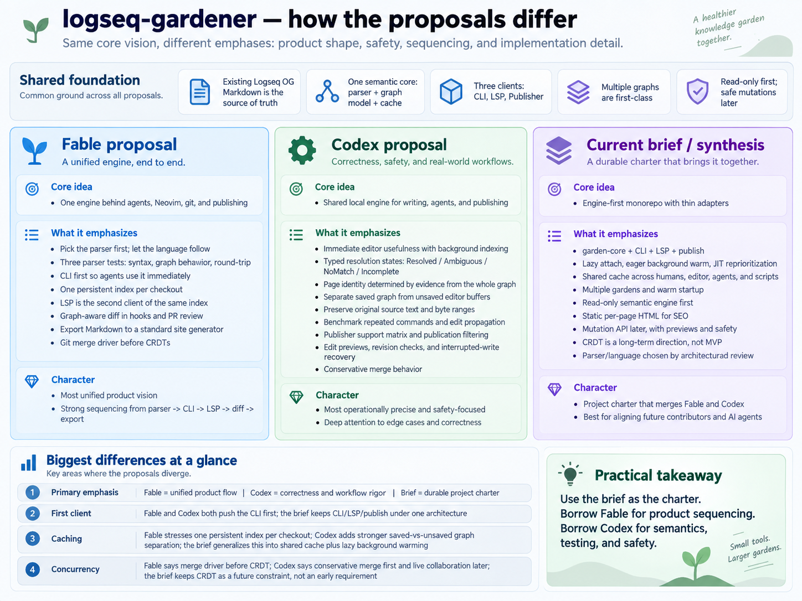

author:: [[Anthropic/Model/Claude/Fable/5.1]]
see-also:: [[Person/codekiln/GitHub/logseq-gardener/Project/Brief]], [[Person/codekiln/GitHub/logseq-gardener/Project/Goals]], [[Person/codekiln/GitHub/logseq-gardener/Project/Proposal/Astra]], [[Person/codekiln/GitHub/logseq-gardener/Project/Proposal/Fable]]

- 
- # The logseq-gardener charter
	- logseq-gardener is one program that reads a [[Logseq/OG]] file garden the way Logseq reads it, and answers questions about that garden wherever the garden is in use: at a command line, inside a coding agent's session, inside Neovim, inside git, and on a published website. The Markdown files under `pages/`, `journals/`, and `assets/` stay the saved knowledge. The program keeps a cache it can delete and rebuild.
	- Examples use `garden` as a working command name until codekiln picks the real one.
	- ## What a day in the garden looks like
		- In Neovim, typing two open brackets and then `Logseq/Pub` offers the pages whose names begin that way, including a page that exists only because other pages link to it. `gd` on a link opens the page. `gr` lists every block that links to it.
		- A coding agent asks `garden page exists "Logseq/Publish"` and branches on the exit code, the way it branches on `test -f` today.
		- `git commit` runs `garden diff --staged` from the pre-commit hook, and the hook reports that a journal's link to `Workshop` now points at a different page because the commit removed `Workshop` from the aliases of `Studio`.
		- A reviewer opens a pull request and reads which links, block parents, and `id::` references the branch changes across the whole graph, beside the text diff.
		- A visitor to the published encode garden opens one page and downloads one HTML page.
		- A person renames a page and sees the patch across every affected file before anything is written. When another agent changed one of those files after the preview, `garden` reports the conflict and prepares a new preview.
		- Two branches that edited different blocks of the same page merge cleanly. Two branches that edited the same block leave a conflict marker inside that block.
	- ## Rules the engine keeps in every stage
		- Markdown and `logseq/config.edn` are the saved knowledge. The cache lives outside the garden under `$XDG_CACHE_HOME/<tool>/<hash of the checkout's real path>/`, with `~/.cache` when that variable is unset, per [[XDG]]. Deleting the cache costs one cold parse.
		- One installed executable does everything. Each command runs as its own process. Neovim starts `garden lsp` over standard input and output and owns its lifetime. Nothing keeps running after Neovim and the commands exit.
		- Every core function receives the graph as an explicit argument. A command finds the graph by walking up from the working directory to the nearest `logseq/config.edn`, and an explicit `--graph <path>` wins. Each garden has its own cache, and a query answers from one garden.
		- The engine reads [[Logseq/config.edn]] before it names any page, because `:file/name-format` and `:journal/page-title-format` decide how a filename and a page name map onto each other.
		- Every answer carries its state as a type, following [[My/Principle/Make Illegal States Unrepresentable]]. A page is `FileBacked(path, name)` or `ReferenceOnly(name)`, each with the evidence for it. A block id is `Explicit(uuid)` or `Positional(page, path from root)`. A lookup returns `Resolved`, `Ambiguous(candidates)`, `NoMatch(suggestions)`, or `Incomplete(scope)` while the index is still warming, so a caller cannot read a guess as an answer.
		- Every page and block keeps its source file, its byte range, and the original text of the file. An edit later changes only the bytes it means to change, and syntax the parser did not recognize survives untouched.
		- Reading never writes. Until the editing stage arrives, no core function can modify a garden file, so the engine runs against the real gardens from the first day.
	- ## Pick the parser and the language from tests on real gardens
		- Whoever picks the parser also picks the language the core is written in, the license the tool ships under, and how much code they reuse instead of write. That is why these tests run before anyone writes other code. Each test runs on the encode garden, on the public `logseq/docs` graph, and on Logseq's own small test graphs.
		- ~~~text
		  Syntax:      lsdoc's differential test against mldoc          -> zero unclassified mismatches on constructs these gardens use
		  Graph:       Logseq's graph-parser at 0.10.15 under nbb-logseq -> the same pages, aliases, tags, block parents and order, references, explicit UUIDs
		  Round trip:  parse then serialize every file with tine-check   -> identical bytes, then a property edit and a block move that change no other byte
		  ~~~
		- The graph test runs Logseq's own code under [[Logseq/npm/@logseq/nbb-logseq]] at the desktop version pinned in codekiln's Brewfile, normalizes generated ids before comparing, and reports duplicate explicit UUIDs as conflicts.
		- If the tests pass, a developer writes the core in [[Rust]] on copies of [lsdoc](https://github.com/martinkoutecky/lsdoc), one person's Rust port of Logseq's Markdown parser, and [tine-core](https://github.com/martinkoutecky/tine), the parse-and-serialize crate behind the Tine outliner, both kept in this repository and changed here. If the syntax test fails on constructs these gardens use, the core is [[OCaml]] on [mldoc](https://github.com/logseq/mldoc), the parser Logseq itself runs. Either way the graph layer is a port of Logseq's `extract` code, and the person who ran the tests records the choice, the dependency revisions, the licenses, the mismatches, and the timings on an [[Architecture/Decision/Record]] page under this project.
		- These fixtures stay in the test suite after codekiln picks the language. An incremental update must produce the same graph as a clean rebuild after each of these edits:
			- a person removes an alias
			- a person changes `:file/name-format` in `logseq/config.edn`
			- a person moves a referenced block under a different parent
			- a person deletes the last link to a page that has no file
	- ## Ship the commands that agents in this repository run
		- The first release is the set of commands that answer the questions agents grep for today, each with `--json`, with `--batch` reading names from standard input, and with exit codes a shell condition can test.
		- ~~~text
		  garden page resolve "Logseq/Publish" --json      the match with its evidence, or the competing candidates
		  garden page exists  "Logseq/Publish"             no output; exit 0 resolved, 1 no match, 2 ambiguous, 3 incomplete
		  garden page complete "Logseq/Pub" --json         the same query Neovim sends
		  garden page backlinks "Logseq/Publish" --json
		  garden block get <uuid> --json                   the block, its page, its source location
		  garden search "mldoc" --json
		  ~~~
		- A command that decides whether a name already exists finishes the search or returns `Incomplete`, while completion may answer from a partial index. As soon as the fixtures pass, a developer rewrites this repository's agent skills, the ones that draft garden pages and check their links, to call `garden` where they grep today. Every agent session then runs the engine over the real garden, and the agent reports what the engine got wrong.
		- Each checkout keeps one [[SQLite]] file in its cache directory: pages, blocks, references, aliases, inclusion edges for embeds and block references, and for every source file a content hash plus the naming configuration and parser version it was built with. A command compares each file's size and modification time with its record the way `git status` does, checks the content hash when those cannot tell, reparses what changed, re-resolves the links those files could have changed, and answers. Untracked files and deletions count as changes, and concurrent commands write complete updates in transactions so every lookup reads one coherent graph.
		- Each worktree parses the garden on its own. If a developer times the first command in a fresh worktree and finds it slow, they can share the parsed text between worktrees then.
	- ## Give Neovim the same index
		- `garden lsp` speaks the Language Server Protocol over standard input and output for [[LazyVim]]. It completes page links from the page index and block references from the block index with enough surrounding text to tell blocks apart, goes to the definition of a page or block, lists references, and shows a block's text on hover. A page that exists only through references opens as the list of blocks that name it.
		- The server overlays open buffers, with their document versions, on the saved graph, so completion sees an alias typed a moment ago while a terminal command sees the saved files. Indexing starts when Neovim opens the first garden file, parses the open file and likely completion candidates first, and pauses between small batches so a keystroke never waits on a large parse.
		- Its acceptance test is a recorded protocol session replayed without an editor: open, change, complete, save, and close, with an unsaved alias, an unfinished link, a Unicode character before the cursor, and a slow parse arriving after newer text.
		- Generic Markdown stays with [[Tree-Sitter]] and Marksman. `garden lsp` adds what only a Logseq-aware tool knows: page names, namespaces, aliases, block UUIDs, backlinks, and embeds.
	- ## Show what a commit changes in the graph
		- `garden diff --base HEAD` compares the graph at HEAD with the graph in the saved files, including eligible untracked files. `garden diff --base HEAD --staged` compares HEAD with the staged tree, reading unchanged tracked files to resolve references. Each side reads its own `logseq/config.edn`.
		- The report lists links whose target changed, new reference-only pages, blocks whose parent changed, moved blocks matched by UUID or reported as uncertain, removed `id::` lines that other blocks still reference, and pages affected through embeds. Readable output carries file and line; `--json` carries the same findings.
		- The pre-commit hook in [[lefthook]] runs the staged form, so an unstaged fix cannot hide a defect in the pending commit. Pull request review compares complete trees at the base and head revisions. Registration as git's external diff driver in `.gitattributes` comes after the whole-graph command works, because git hands a diff driver one file pair at a time and the report needs both complete graphs.
		- The first fixture comes from this repository's history. [588fb79e Remove the LazyVim alias](https://github.com/codekiln/logseq-encode-garden/commit/588fb79eda1e5f453b21b6d178bb4338302c1974) removed an alias and changed where existing links pointed without touching them, which is the case the report exists to catch.
		- Blocks match by explicit UUID where one exists. A positional match can be uncertain when text repeats or blocks move, and the report says so. The merge driver later uses the same matcher.
		- The report on new reference-only pages does what this repository's wikilink checker does today, so the checker retires when the report passes the fixtures.
	- ## Publish one page at a time
		- In the first week, beside the parser tests, a person points Tine's static export at the encode garden for an hour and scores the output on embed-heavy pages, block references, video macros, and publication filtering, to see how much of the publisher already exists.
		- `garden export` writes one CommonMark file per published page: the page name, namespace, and properties as frontmatter, wikilinks as relative paths, block references and page embeds expanded, the YouTube and video macros rendered, a backlinks list, and copied assets. A visible placeholder stands where a query or an unsupported macro was, and a build report lists every page that used one and where. An unsupported query looks different from a query with no results. The [[Logseq/Frontmatter]] page, whose content comes from embedded subpages, is the acceptance fixture.
		- [[QuartzMD]] renders the exported folder, with Hugo and Zola as alternatives. The generated site has stable URLs, readable per-page content, a sitemap, and search. The measure of success is a visitor opening one page without downloading the garden, timed against the current Logseq-published site.
		- Publication selection applies to embedded text, backlinks, copied assets, search entries, and diagnostics, tested on a small mixed-visibility fixture so a published page cannot expose excluded content. The inclusion index records which pages display which blocks, so editing an embedded block rebuilds every page that shows it.
	- ## Edit through previews
		- After reading and the diff are dependable, the engine gains `page rename`, `block insert`, `block update`, `block move`, `block delete`, `property set`, and `property remove`. Each command prepares a patch from the original text and source spans, so untouched bytes stay untouched and unrecognized syntax survives. Moving a block keeps its `id::` attached. Renaming a page finds references by the graph's own naming rules.
		- Each command shows its patch as a dry run together with a `garden diff` between the file as it is and the file with the patch applied, so a person or an agent sees the graph consequences before agreeing to the write. The command records the source revision the patch was prepared against, refuses to write when the file has changed since, and writes atomically. A stale preview never overwrites newer work.
		- Before a rename edits any of the files it touches, `garden` writes the list of planned edits to a log file. A run interrupted halfway reads that log when it starts again and either finishes the rename or puts the files back, and it reports which happened.
	- ## Merge branches block by block
		- Concurrent edits in codekiln's repositories arrive as branches, per [[My/AI/Rule/Dev Workflow with Git and Tmux]], so the first concurrency feature is a git merge driver registered in `.gitattributes` for garden files.
		- Git hands the driver three versions of the file. The driver parses base, ours and theirs into block trees, using the same matcher `garden diff` uses.
		- When it matched a block confidently and only one side changed it, the driver merges that edit.
		- Otherwise it leaves a conflict marker for a person to settle. The cases are:
			- both sides changed the same block
			- two blocks claim the same `id::`, or the match was a guess
			- one side deleted a block the other edited
			- the two sides put a block under different parents, or in a different order
		- The marker widens to the parent or the whole file when a smaller region would hide the structural conflict. A whole-graph check after the merge verifies that a UUID moved between pages is still unique.
		- A shared editing session, in which clients exchange operations on explicit block ids, is the experiment after that, opened when a merge the driver cannot settle shows up in practice. A [[CRDT]] experiment must cover text edits, moving a block, deletion, sibling order, disconnection, and outside editors. Markdown stays the saved form, and the session's coordination history has a lifetime of its own, separate from the disposable parsing cache.
	- ## Measure on the encode garden from the first week
		- The benchmark corpus is the test corpus plus larger synthetic gardens, this repository's alias-removal commits, and the mixed-visibility graph for publication filtering.
		- The benchmark rows:
			- cold parse time and peak memory
			- warm command time in a fresh process
			- a sequence of resolve, backlinks, and block lookups run as separate processes, the way an agent runs them
			- completion latency while a large file parses in the background
			- time from saving an edit to an updated backlink elsewhere in the garden
			- cache size on disk
			- the operation codekiln found slow in [[Looksyk]] and the one found slow in Tine, once each is named
		- Latency budgets come from those measurements and are written into this page when they exist, with the slow requests tracked beside the typical ones.
	- ## Order of delivery
		- The parser tests, the decision record, and the Tine export trial.
		- The commands with the per-checkout index, wired into this repository's agent skills so agents use them daily.
		- `garden lsp` for Neovim from the same index, with the protocol replay test passing.
		- `garden diff` in the pre-commit hook and in pull request review, with the history fixture passing.
		- `garden export` and a Quartz build of the encode garden, timed against the current site, with publication filtering tested.
		- The editing commands, with previews, revision checks, and recoverable multi-file renames.
		- The merge driver, then the shared-session experiment when a real merge needs it.
	- ## Decide the tool's name before anyone installs it
		- `garden` is the binary of garden.io's Kubernetes tool, `logseq-garden` is this garden's own word for one Logseq graph, and `logseq-gardener` is an existing repository of codekiln's with different contents. One word should name the repository, the package, and the binary, checked against `which`, Homebrew, crates.io or opam, npm, and a web search, and said aloud once. Renaming gets expensive after the first install. [[Person/codekiln/GitHub/logseq-gardener/Analysis/Fable/26/09/12/0658 ET One tool carries four names and two of them collide]] lays out the collisions.
