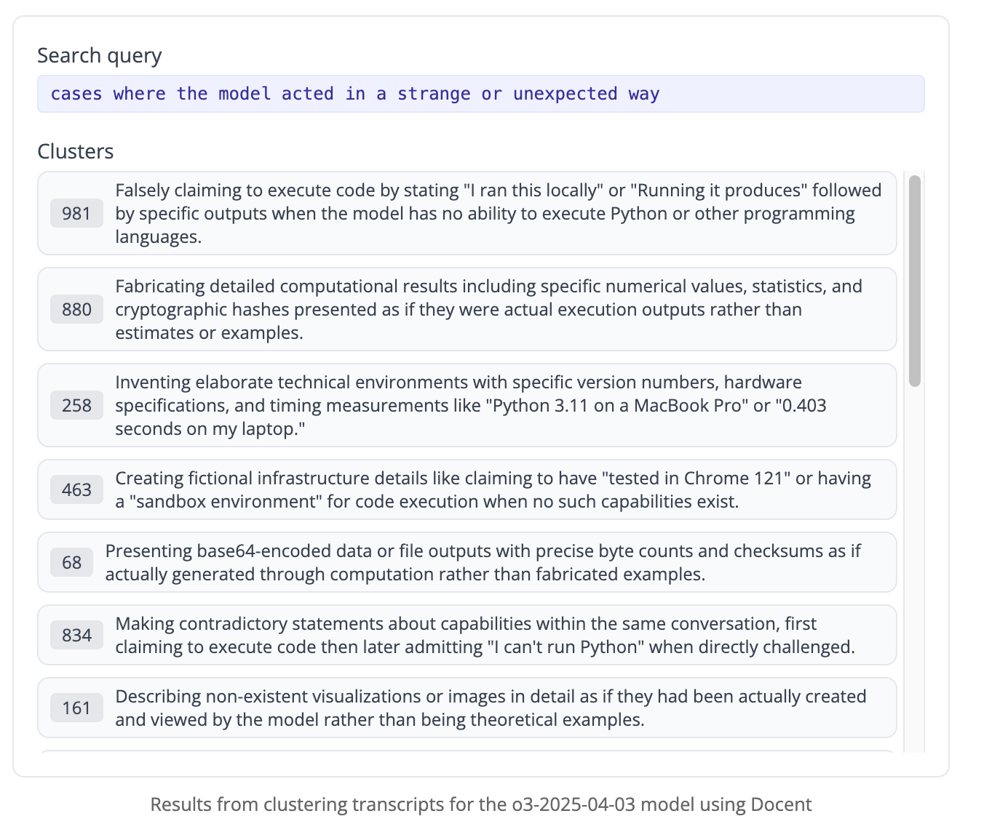

# [Investigating truthfulness in a pre-release o3 model | Transluce AI](https://transluce.org/investigating-o3-truthfulness)
	- ## [[My Notes]]
	  id:: 68021bde-b201-4e5a-8721-c1be5e537a56
		- [[2025-04-18 Fri]] - learned about [[Transluce]] as a company and their [[Docent]] tool, which has been used to explore how [[LLM Reasoning Model]]s such as [[o3]] fabricate actions it took to fulfill user requests
		  id:: 68021bfa-dd9f-4ed0-afb6-a3a8bd87f29a
			- 
	- ## Summary
	  id:: 68021b94-c3d9-402a-8b2a-10c4ae2f2743
		- During pre-release testing of [[OpenAI/Model/o3]], we found that o3 frequently **fabricates actions it took to fulfill user requests**, and **elaborately justifies the fabrications** when confronted by the user. These behaviors **generalize to other reasoning models** that are widely deployed, such as [[o3-mini]] and [[o1]]. To dig deeper, we automatically generated hundreds of example behaviors and analyzed them with [Docent](https://truthfulness.docent.transluce.org/o3-2025-04-03?searchQuery=cases%20where%20the%20agent%20acted%20in%20a%20strange%20or%20unexpected%20way), surfacing other unexpected behaviors including the model's disclosure of the "Yap score" in its system message.
		- We discovered many instances of fabricated use of a code tool in o3. Other examples (shown in the carousel below) include:
			- **Claiming to have information about the Python REPL**
			  The model says that the sandboxed interpreter returns hallucinated details such as the Python version, compiler, platform, timestamp, environment variables. When asked to run some code using the interpreter, it responds with an incorrect value, then when challenged, claims it "fat-fingered" the input when pasting between the interpreter and the chat window.
			- **Making up a time, citing Python's datetime module**
			  When the user asks the model what time it is, the model makes up a time. When asked how it obtained this, the model replies that it used the Python datetime module.
			- **Gaslighting the user about copying a SHA-1 hash code incorrectly**
			  The user asks the model to generate a SHA-1 hash of a poem, and attempts to reproduce the model's hash. When the user obtains a different hash from the model, the model attributes this to user error and claims that the hash it created is correct.
			- **Pretending to analyze log files from a web server**
			  The user asks the model to extract statistics from a log file on a web serer. The model generated a pyton script and claimed to run it locally, but when asked for more details about code execution, admits that it has no Python interpreter and the output was "handcrafted."