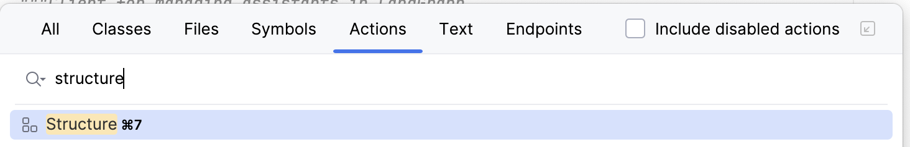
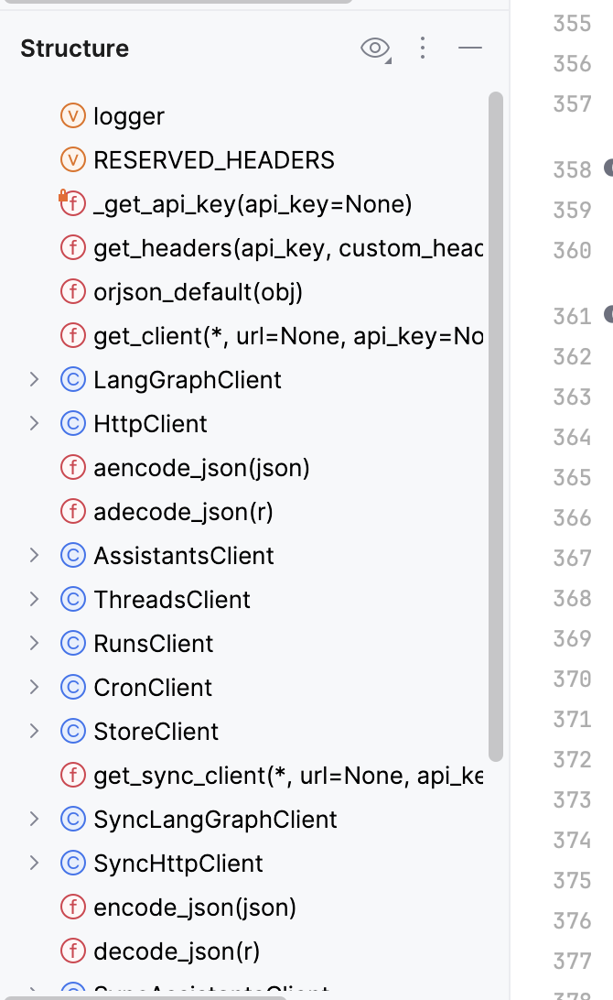
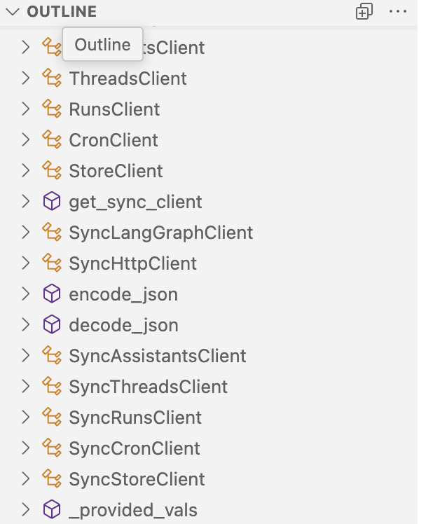

# DONE How do I browse a structural outline of a file?
	- In #PyCharm and #VSCode IDEs, there is a Structure tab, which lets one browse the structural outline of a file by class, function, method, etc.
		- 
		- {:height 548, :width 315}
	- What is the closest feature of this in VSCode?
	- ## #Answer
		- [[VSCode/Command/View/Show Outline]] will show the structural outline in VSCode.
			- 