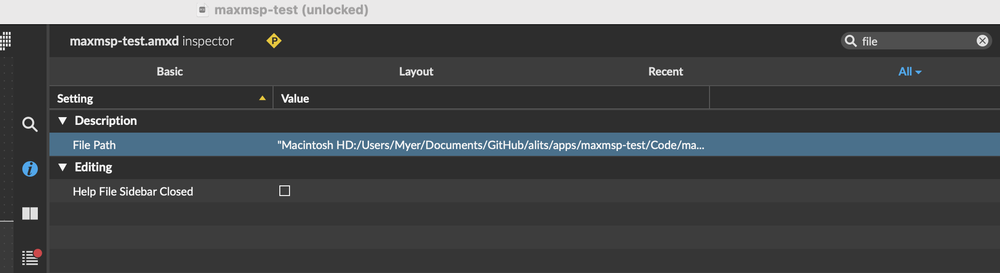

# DONE How do I see the full length value of a Max Patcher inspector property?
	- 
	- copy and paste doesn't **look** like it does anything, but here it actually does work to copy the value:
		- ```json
		  {
		  	"attributes" : 	{
		  		"filepath" : [ "Macintosh HD:/Users/Me/Documents/GitHub/alits/apps/maxmsp-test/Code/maxmsp-test.amxd" ]
		  	}
		  
		  }
		  ```